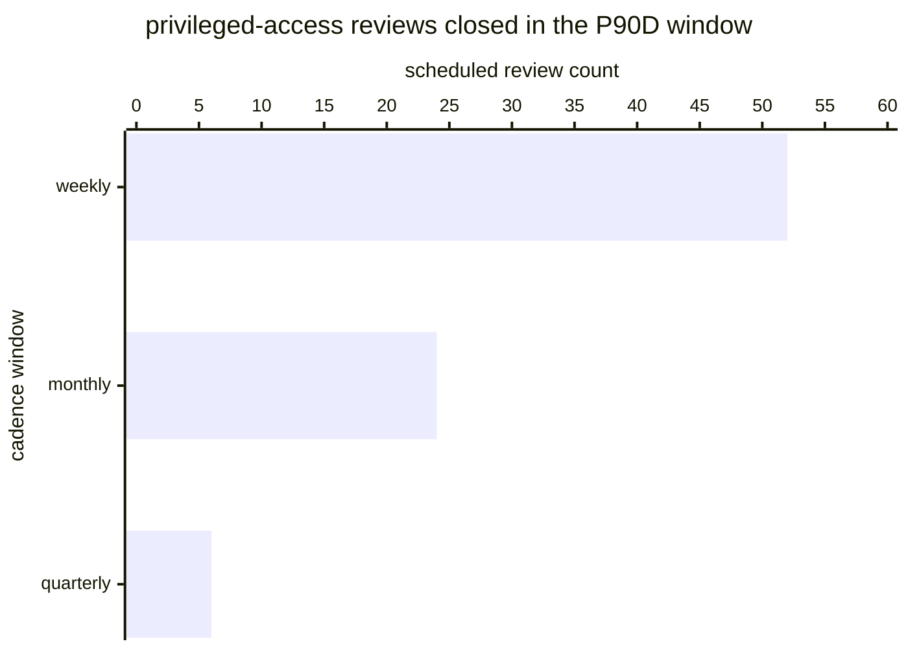

# Reference visualisation — `kri.access_review_completion_rate@v1`

This is the committed reference-visualisation artifact for the
privileged-access-review completion rate KRI. It exists so the G-04
catalog definition-of-done (a *committed* reference visualisation,
not a narrated one) is closed; downstream compile targets (n8n /
Temporal / LangGraph) read the same metric YAML and render the
executable form in their own dashboard surface. The artifact here is
the contract for the chart shape, not the executable chart.

## Chart kind

Two-panel composition. The headline panel is a single ratio-headline
gauge reading the on-time completion ratio `|T| / |S|` — the share of
scheduled privileged-access reviews closed on or before the review-due
timestamp with an explicit recertify-or-revoke decision on every
in-scope binding, over the total scheduled-review population in the
evaluation window. The drill-down panel is a stacked bar chart, one
bar per cadence-window slice (weekly / monthly / quarterly), plotting
on-time-completed versus overdue-or-incomplete counts so operators can
see which cadence band pulled the aggregate ratio away from target.
Because the KRI is `higher_is_better`, a rising value is the healthy
signal that the operator's access-review cadence lane is closing
reviews inside the declared window.

- **Headline (ratio):** `|T| / |S|` across in-scope scheduled reviews
  in the window; the figure operators read first.
- **Drill-down x-axis:** cadence-window slice (`weekly`, `monthly`,
  `quarterly`) matching the operator's declared cadence policy.
- **Drill-down y-axis:** review count, stacked (`on_time_completed`
  on the bottom, `overdue_or_incomplete` on the top).
- **Threshold overlay:** horizontal lines on the headline gauge at
  the `warn` (0.90), `high` (0.80) and `breach` (0.60) ratio bounds
  — because the KRI is `higher_is_better`, all three bounds sit
  *below* the target and a value below any line lands inside the
  corresponding band.
- **Headline annotation:** the overall `|T| / |S|` ratio with the
  threshold band it falls in.

## Reference rendering (Mermaid)

The mermaid block below is the canonical reference rendering — small
enough to live in-tree and renderable directly on the public repo
surface. The numeric values are illustrative; the compile target is
the source of truth for the executable form against operator data.

Reading the bars in this illustrative rendering (assume the on-time
counts sit at weekly=49, monthly=20, quarterly=5 against the totals
above, giving `|T|=74` and `|S|=82`):

| cadence window | scheduled | on_time_completed | overdue_or_incomplete | per-slice ratio | reading                       |
|----------------|-----------|-------------------|------------------------|-----------------|-------------------------------|
| weekly         | 52        | 49                | 3                      | 0.942           | above warn bound              |
| monthly        | 24        | 20                | 4                      | 0.833           | below warn bound              |
| quarterly      | 6         | 5                 | 1                      | 0.833           | below warn bound              |

The headline `|T| / |S|` figure here is `74/82 = 0.902` — just above
the `warn` bound (0.90) so the KRI reads healthy for this snapshot; a
drift downward toward 0.90 would drop the reading into the warn band,
and the drill-down names the monthly and quarterly cadence windows as
the two slices pulling the aggregate ratio down.

## Threshold band reference

| name      | comparator | value (ratio) | severity  |
|-----------|------------|---------------|-----------|
| warn      | <          | 0.90          | warn      |
| high      | <          | 0.80          | high      |
| breach    | <          | 0.60          | critical  |

The bands match the `thresholds` array on
`access_review_completion_rate.yaml`; the catalog entry is the
source of truth, this file is the visualisation surface.

## OCSF source-data shape

The chart's underlying observations are derived from the operator's
privileged-access-review record store, bound on the SecOps-NG side
via the `control.privileged_access_review@v1` cross-reference — the
catalog entry attests the shape of the review record (a scheduled
review with a review-due timestamp, a closed_at timestamp, and a
per-binding recertify-or-revoke decision set) without binding to a
vendor-specific IGA or GRC product object. Complementary OCSF
`Account Change` (`class_uid: 3001`) events name the binding scope
observed on the operator's identity source; the binding lives at
`content/telemetry/telemetry.ocsf.account_change@v1.json` and is
back-referenced from the metric YAML's `telemetry_refs[]`.

## Operator override

Operators are expected to render this metric in their own dashboard
idiom — the catalog reference rendering above is the contract for
the chart shape (on-time-completion headline gauge with `warn` /
`high` / `breach` bounds, per-cadence-window stacked bar drill-down),
not the visual style. The compile target is the source of truth for
the executable form.
