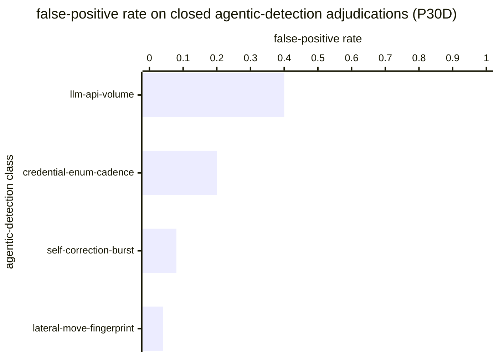

# Reference visualisation — `kri.agentic_false_positive_rate@v1`

This is the committed reference-visualisation artifact for the
agentic-detection false-positive-rate KRI. It exists so the G-04
catalog definition-of-done (a *committed* reference visualisation,
not a narrated one) is closed; downstream compile targets (n8n /
Temporal / LangGraph) read the same metric YAML and render the
executable form in their own dashboard surface. The artifact here is
the contract for the chart shape, not the executable chart.

## Chart kind

Two-panel composition. The headline panel is a single gauge-style
horizontal bar reading the false-positive rate `FP / (FP + TP)`
across closed adjudications of agentic-adversary-class detection
firings inside the evaluation window. The drill-down panel is a
horizontal bar chart, one bar per agentic-detection class that
produced closed adjudications, plotting the per-class false-positive
rate so operators can see which agentic-tradecraft signatures drove
the headline reading. Because the KRI is `lower_is_better`, a value
near zero is healthy and a rising value is the leading signal that
the containment loop is being asked to act on benign firings.

- **Headline (ratio):** `FP / (FP + TP)` across closed agentic-
  detection adjudications in the window.
- **Drill-down x-axis:** class-scoped `FP_C / (FP_C + TP_C)` per
  agentic-detection class.
- **Drill-down y-axis:** one row per agentic-detection class with at
  least one closed adjudication in the window; sorted descending so
  the classes pulling the headline upwards sit at the top — the
  classes the detection-engineering programme tunes next.
- **Threshold overlay:** horizontal lines on the headline gauge at
  the `warn` (0.1), `high` (0.25), and `breach` (0.5) ratio bounds.
- **Headline annotation:** the overall `FP / (FP + TP)` ratio with
  the threshold band it falls in.

## Reference rendering (Mermaid)

The mermaid block below is the canonical reference rendering — small
enough to live in-tree and renderable directly on the public repo
surface. The numeric values are illustrative; the compile target is
the source of truth for the executable form against operator data.



Reading the bars in this illustrative rendering (assume the four
classes collectively contributed `FP + TP = 100` closed adjudications
in the window in proportions matching the bar values):

| agentic-detection class      | FP rate | reading                                          |
|------------------------------|---------|--------------------------------------------------|
| llm-api-volume               | 0.40    | inside `high` band (>0.25) — tune first          |
| credential-enum-cadence      | 0.20    | inside `warn` band (>0.1, ≤0.25)                 |
| self-correction-burst        | 0.08    | at target — clear of warn band                   |
| lateral-move-fingerprint     | 0.04    | below target — healthy                           |

The headline `FP / (FP + TP)` figure here is `(0.40·30 + 0.20·25 + 0.08·25 + 0.04·20) / 100
= (12 + 5 + 2 + 0.8) / 100 = 19.8 / 100 = 0.198` — inside the `warn`
band, above the target floor but well below the `breach` bound. That
value is what the catalog aggregation `measurement.aggregation: ratio`
resolves to for this snapshot.

## Threshold band reference

| name      | comparator | value (ratio) | severity  |
|-----------|------------|---------------|-----------|
| warn      | >          | 0.1           | warn      |
| high      | >          | 0.25          | high      |
| breach    | >          | 0.5           | critical  |

The bands match the `thresholds` array on
`agentic_false_positive_rate.yaml`; the catalog entry is the source
of truth, this file is the visualisation surface.

## OCSF source-data shape

The chart's underlying observations are derived from the OCSF
`Detection Finding` meta-events (`class_uid: 2004`) the operator's
SIEM emits when agentic-adversary-class rules fire, joined against the
closed dispositions the operator's case-management surface stamps on
the same OCSF class at closure. `disposition_id` encodes the
false-positive / true-positive axis; firings whose disposition remains
unset at evaluation time are excluded per the formula so the KRI does
not flap during triage backlogs. The binding lives at
`content/telemetry/telemetry.ocsf.detection_finding@v1.json` and is
back-referenced from the metric YAML's `telemetry_refs[]` and from
the `agentic_detection_firings` / `triage_dispositions`
`measurement.inputs[].telemetry_ref`.

### OCSF source-data example (`class_uid: 2004`)

Illustrative OCSF Detection Finding record shape at closed
adjudication, the record the metric formula reads to compute
`FP / (FP + TP)`. Field names follow OCSF 1.x; the shape is the
contract for what the case-management surface stamps at close, not
a vendor-specific case-management envelope.

```yaml
# One closed-adjudication observed as a Detection Finding (2004)
# record with disposition_id encoding the FP / TP axis. The metric
# reads FP from records whose disposition_id names false-positive
# and TP from those naming true-positive, over agentic-tradecraft
# in-window firings; unset dispositions are excluded per the formula.
metadata:
  version: "1.3.0"
  product:
    vendor_name: "<operator's case-management surface>"
class_uid: 2004                            # Detection Finding
class_name: "Detection Finding"
category_uid: 2                            # Findings category
type_uid: 200402                           # Detection Finding: Update (close)
activity_id: 2                             # Update
severity_id: 4                             # High (at firing)
time: 1783609200                           # close-adjudication time
disposition_id: 2                          # False Positive (OCSF disposition)
finding_info:
  uid: "df-2026-07-09-000042"              # firing identity carried at close
  title: "Anomalous LLM API call volume — false positive on closure"
  types:
    - "agentic-tradecraft"                 # class scope: contributes to FP+TP
    - "llm-api-volume"                     # per-class drill-down bucket
  analytic:
    uid: "analytic.agentic.llm_api_volume@v1"
    name: "LLM API volume anomaly"
    type_id: 3                             # Behavioral
```

## Cross-regime regulatory anchors

The KRI's false-positive-rate reading on the agentic-tradecraft
class is durable across the three EU regimes an operator carries
at once:

- **NIS2 Art. 21(2)(a)** — policies on risk analysis and information
  system security. The signal-quality basis for the agentic-adversary
  case set: a rising FP rate is the leading signal that the operator's
  risk-analysis surface is misclassifying benign workloads as
  agentic-adversary firings.
- **NIS2 Art. 21(2)(b)** — incident-handling capability. The KRI is
  the triage-quality read on agentic-tradecraft firings: containment
  actions (session revocation, IdP disable, micro-segmentation cut)
  driven by high-FP firings amplify blast radius against innocent
  workloads.
- **EU AI Act Art. 15** — accuracy, robustness and cybersecurity of
  high-risk AI systems. The FP rate is a first-class accuracy signal
  on classifier surfaces the operator deploys against agentic
  tradecraft.
- **DORA Art. 16** — simplified ICT risk management framework. The
  KRI is the residual-risk read on containment actions driven by
  agentic-tradecraft detections at financial entities.

The catalog entry stays regime-neutral (one reading, four
regime-scoped uses); the `external_refs[]` on the YAML enumerate the
anchors so operators can lift the KRI into a regime-scoped variant
without translating the measurement.

## Operator override

Operators are expected to render this metric in their own dashboard
idiom — the catalog reference rendering above is the contract for
the chart shape (FP-rate headline gauge with warn / high / breach
bounds, per-agentic-detection-class drill-down bar chart), not the
visual style. The compile target is the source of truth for the
executable form against operator data.
