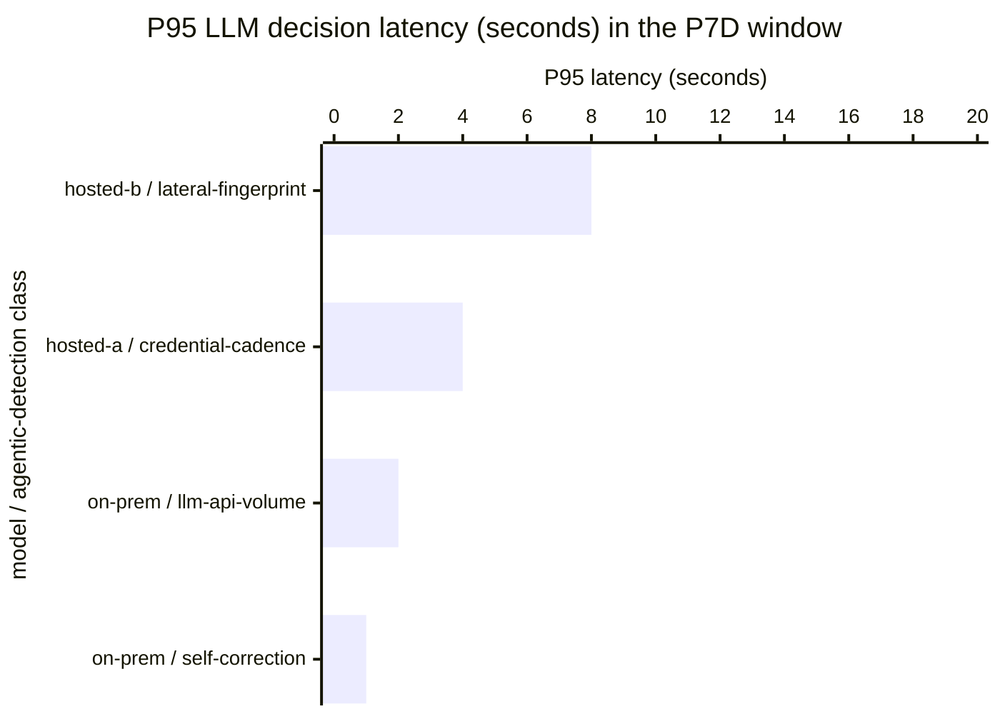

# Reference visualisation — `kri.agentic_model_decision_latency_seconds@v1`

This is the committed reference-visualisation artifact for the
agentic-response LLM decision-latency KRI. It exists so the G-04
catalog definition-of-done (a *committed* reference visualisation,
not a narrated one) is closed; downstream compile targets (n8n /
Temporal / LangGraph) read the same metric YAML and render the
executable form in their own dashboard surface. The artifact here is
the contract for the chart shape, not the executable chart.

## Chart kind

Two-panel composition. The headline panel is a single P95-latency
gauge reading the tail-latency figure (in seconds) of LLM / agentic-
model inference decisions executed at the ingest step across the
evaluation window. The drill-down panel is a horizontal bar chart,
one bar per model / agentic-detection-class pair that emitted
decisions in the window, plotting the per-pair P95 latency so
operators can see which model surface or detection class pulled the
headline P95 up. Because the KRI is `lower_is_better`, a rising value
is the leading signal that the sub-minute self-correction window
against the machine-speed adversary is narrowing.

- **Headline (P95 latency, seconds):** the 95th-percentile latency
  across all LLM-decision events in the window.
- **Drill-down x-axis:** P95 latency (seconds) per model / agentic-
  detection-class pair.
- **Drill-down y-axis:** one row per pair with at least one closed
  inference decision in the window; sorted descending so the pair
  pulling the headline upwards sits at the top.
- **Threshold overlay:** vertical lines at the `warn` (2s), `high`
  (5s), and `breach` (15s) bounds, drawn across the drill-down bar
  chart and marked on the headline gauge so the operator reads the
  band the P95 sits in without arithmetic.
- **Headline annotation:** the P95 figure with the threshold band it
  falls in.

## Reference rendering (Mermaid)

The mermaid block below is the canonical reference rendering — small
enough to live in-tree and renderable directly on the public repo
surface. The numeric values are illustrative; the compile target is
the source of truth for the executable form against operator data.

Reading the bars in this illustrative rendering:

| model / class pair                  | P95 (s) | reading                                        |
|-------------------------------------|---------|------------------------------------------------|
| hosted-b / lateral-fingerprint      | 8       | inside `high` band (>5s) — tail contributor    |
| hosted-a / credential-cadence       | 4       | inside `warn` band (>2s, ≤5s)                  |
| on-prem / llm-api-volume            | 2       | at target — clear of warn band                 |
| on-prem / self-correction           | 1       | below target — healthy                         |

The headline P95 aggregate across the full population lands near the
top-of-list pair — the illustrative snapshot reads `8s`, inside the
`high` band and above the 5s bound but well below the 15s statutory-
adjacent breach line. That value is what the catalog aggregation
`measurement.aggregation: p95` resolves to for this snapshot.

## Threshold band reference

| name      | comparator | value (seconds) | severity |
|-----------|------------|-----------------|----------|
| warn      | >          | 2               | warn     |
| high      | >          | 5               | high     |
| breach    | >          | 15              | critical |

The bands match the `thresholds` array on
`agentic_model_decision_latency_seconds.yaml`; the catalog entry is
the source of truth, this file is the visualisation surface.

## OCSF source-data shape

The chart's underlying observations are derived from the OCSF
`API Activity` events (`class_uid: 6003`) the operator's model-serving
surface emits at request and response boundary. `start_time` and
`time` carry the request- and response-side timestamps the formula
subtracts to compute per-decision latency; `disposition_id` encodes
inference-completion vs. error status so errored inferences are
excluded per the formula. The binding lives at
`content/telemetry/telemetry.ocsf.api_activity@v1.json` and is
back-referenced from the metric YAML's `telemetry_refs[]` and from
the `request_time` / `response_time`
`measurement.inputs[].telemetry_ref`. Note the smallest natural unit
in the SecOps-NG metrics schema is `seconds`; operators typically read
this at sub-second granularity on their dashboard by scaling the
rendered value for display (compile target's responsibility), and the
P95 aggregate here is invariant under that rescale.

## Operator override

Operators are expected to render this metric in their own dashboard
idiom — the catalog reference rendering above is the contract for
the chart shape (P95 headline gauge with warn / high / breach
overlays, per-model / per-class drill-down bar chart), not the visual
style. The compile target is the source of truth for the executable
form against operator data.
