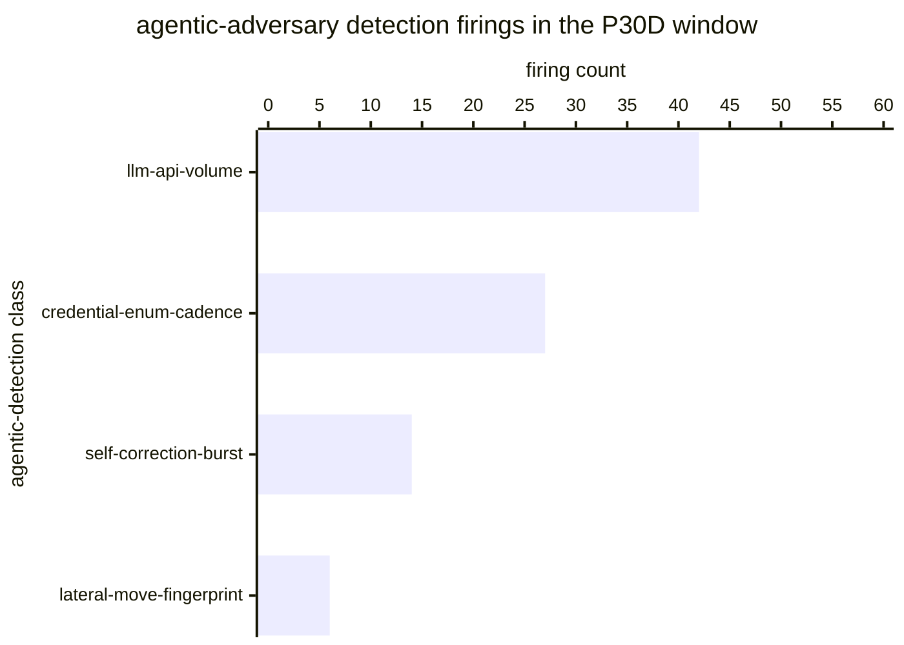

# Reference visualisation — `kpi.agentic_threat_detection_rate@v1`

This is the committed reference-visualisation artifact for the
agentic-threat detection-rate KPI. It exists so the G-04 catalog
definition-of-done (a *committed* reference visualisation, not a
narrated one) is closed; downstream compile targets (n8n / Temporal /
LangGraph) read the same metric YAML and render the executable form in
their own dashboard surface. The artifact here is the contract for the
chart shape, not the executable chart.

## Chart kind

Two-panel composition. The headline panel is a single gauge-style
horizontal bar reading the agentic-share ratio `|A| / |F|` — the share
of detection firings in the evaluation window classed as agentic-
adversary detections over the total firing population. The drill-down
panel is a horizontal bar chart, one bar per agentic-detection class
that fired inside the window, plotting the per-class firing count so
operators can see which agentic-tradecraft signatures drove the
headline reading. Because the KPI is `higher_is_better`, a rising
value is the healthy signal that the detection-engineering programme
is closing coverage on autonomous / agentic tradecraft.

- **Headline (ratio):** `|A| / |F|` across in-scope firings in the
  window; the figure operators read first.
- **Drill-down x-axis:** agentic-detection-class firing count in the
  window.
- **Drill-down y-axis:** one row per agentic-detection class with at
  least one firing in the window, labelled by detection-class stable
  id; sorted descending so the classes that pulled the headline
  upwards sit at the top.
- **Threshold overlay:** horizontal lines on the headline gauge at
  the `warn` (0.05) and `breach` (0.01) ratio bounds — because the
  KPI is `higher_is_better`, both bounds sit *below* the target and
  a value below either line lands inside the corresponding band.
- **Headline annotation:** the overall `|A| / |F|` ratio with the
  threshold band it falls in.

## Reference rendering (Mermaid)

The mermaid block below is the canonical reference rendering — small
enough to live in-tree and renderable directly on the public repo
surface. The numeric values are illustrative; the compile target is
the source of truth for the executable form against operator data.



Reading the bars in this illustrative rendering (assume `|F| = 1600`
total detection firings in the window across the operator's entire
inventory):

| agentic-detection class      | firings | share of `|F|` | reading                       |
|------------------------------|---------|----------------|-------------------------------|
| llm-api-volume               | 42      | 0.026          | dominant contributor          |
| credential-enum-cadence      | 27      | 0.017          | secondary contributor         |
| self-correction-burst        | 14      | 0.009          | tail class                    |
| lateral-move-fingerprint     | 6       | 0.004          | tail class                    |

The headline `|A| / |F|` figure here is `(42+27+14+6) / 1600 = 89/1600 = 0.056` —
just above the `warn` bound (0.05) so the KPI reads healthy for this
snapshot; a drift downward toward 0.05 would drop the reading into the
warn band and a drift below 0.01 into the breach band.

## Threshold band reference

| name      | comparator | value (ratio) | severity  |
|-----------|------------|---------------|-----------|
| warn      | <          | 0.05          | warn      |
| breach    | <          | 0.01          | high      |

The bands match the `thresholds` array on
`agentic_threat_detection_rate.yaml`; the catalog entry is the source
of truth, this file is the visualisation surface.

## OCSF source-data shape

The chart's underlying observations are derived from the OCSF
`Detection Finding` meta-events (`class_uid: 2004`) the operator's
SIEM emits when rules fire. The agentic-adversary class marker is
carried on the finding's `category_uid` / class field per the
operator's detection-catalog scoping — the catalog entry binds to
the OCSF class shape, not to a vendor-specific rule object. The
binding lives at
`content/telemetry/telemetry.ocsf.detection_finding@v1.json` and is
back-referenced from the metric YAML's `telemetry_refs[]` and from
the `detection_firings` / `agentic_class_marker`
`measurement.inputs[].telemetry_ref`.

### OCSF source-data example (`class_uid: 2004`)

Illustrative OCSF Detection Finding record shape the metric formula
reads. Field names follow OCSF 1.x; the shape is the contract for
what the SIEM emits at agentic-tradecraft rule match, not a
vendor-specific rule object.

```yaml
# One firing observed as a Detection Finding (2004) record.
# The metric reads |A| from records whose category_uid names an
# agentic-tradecraft class; |F| from all in-window records.
metadata:
  version: "1.3.0"
  product:
    vendor_name: "<operator's SIEM>"
class_uid: 2004                            # Detection Finding
class_name: "Detection Finding"
category_uid: 2                            # Findings category
type_uid: 200401                           # Detection Finding: Create
activity_id: 1                             # Create
severity_id: 4                             # High
time: 1783600000                           # firing time (window scope)
finding_info:
  uid: "df-2026-07-09-000042"              # firing identity
  title: "Anomalous LLM API call volume"
  types:
    - "agentic-tradecraft"                 # class marker read by |A|
    - "llm-api-volume"                     # per-class drill-down bucket
  analytic:
    uid: "analytic.agentic.llm_api_volume@v1"
    name: "LLM API volume anomaly"
    type_id: 3                             # Behavioral
observables:
  - name: "principal.user.name"
    type_id: 21
    value: "svc-agent-42"
```

## Cross-regime regulatory anchors

The KPI's detect-pillar coverage reading is durable across the three
EU regimes an essential or important operator carries at once:

- **NIS2 Art. 21(2)(a)** — policies on risk analysis and information
  system security. A rising agentic-adversary share of the detection
  population is the leading signal that the operator's risk basis
  actually covers the machine-speed adversary case set, not just the
  classical rule-based one.
- **NIS2 Art. 21(2)(b)** — incident-handling capability. The KPI reads
  how much of the detect pillar is scoped at agentic tradecraft, i.e.
  the case set that stresses the incident-handling loop's timing.
- **EU AI Act Art. 6 & Annex III** — for operators deploying
  high-risk AI systems (or whose customers do), the same KPI reads
  the detection surface around those deployments and is the durable
  operability signal that agentic-tradecraft coverage is being held.
- **DORA Art. 16** — for financial entities under the simplified ICT
  risk-management framework, the KPI is the detect-pillar reading on
  ICT-related incidents targeting agentic-decision surfaces.

The catalog entry stays regime-neutral (one reading, three
regime-scoped uses); the `external_refs[]` on the YAML enumerate the
anchors so operators can lift the KPI into a regime-scoped variant
without translating the measurement.

## Operator override

Operators are expected to render this metric in their own dashboard
idiom — the catalog reference rendering above is the contract for
the chart shape (agentic-share headline gauge with `warn` / `breach`
bounds, per-agentic-detection-class drill-down bar chart), not the
visual style. The compile target is the source of truth for the
executable form.
