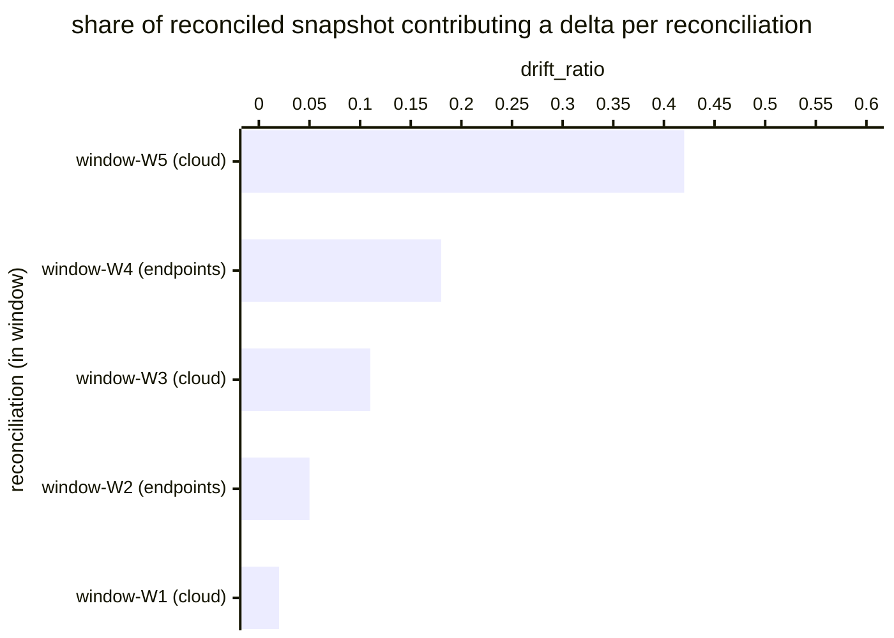

# Reference visualisation — `kri.asset_inventory_drift@v1`

This is the committed reference-visualisation artifact for the
asset-inventory-drift KRI. It exists so the G-04 catalog
definition-of-done (a *committed* reference visualisation, not a
narrated one) is closed; downstream compile targets (n8n / Temporal /
LangGraph) read the same metric YAML and render the executable form
in their own dashboard surface. The artifact here is the contract for
the chart shape, not the executable chart.

## Chart kind

Two-panel composition. The headline panel is a single gauge-style
horizontal bar reading the mean drift ratio across asset_management
reconciliations in the evaluation window — the per-window
`|delta_set| / max(|snapshot|, 1)` averaged across all reconciliations
that emitted an asset-inventory-delta evidence record. The drill-down
panel is a horizontal bar chart, one bar per reconciliation in the
window, plotting `drift_ratio` — the share of the reconciled snapshot
that contributed a delta against the previous documented snapshot.
Slicing by `snapshot_window` (the reconciliation window identifier on
the evidence artifact) is the canonical drill-down dimension because
operators usually carry a per-cohort reconciliation cadence and the
indicator surfaces which cohort is drifting hardest.

- **Headline (ratio):** the mean of per-reconciliation drift ratios
  across the evaluation window. This is the figure operators read
  first. Because the KRI is `lower_is_better`, a value near zero is
  healthy and a rising value is the risk signal.
- **Drill-down x-axis:** `drift_ratio` — per-reconciliation delta
  share computed as `|delta_set| / max(|snapshot|, 1)`. Larger bars
  are reconciliations contributing more drift to the mean.
- **Drill-down y-axis:** one row per reconciliation in the window,
  labelled by `snapshot_window` and `snapshot_id` short prefix;
  sorted descending so the noisiest reconciliations sit at the top —
  the cohorts pulling the indicator off zero hardest.
- **Threshold overlays:** horizontal lines at the `warn` (0.05),
  `breach` (0.20), and `critical` (0.50) ratio values, drawn on a
  companion ratio gauge / axis next to the bar chart, so the
  operator reads the band the overall mean sits in without
  arithmetic.

## Reference rendering (Mermaid)

The mermaid block below is the canonical reference rendering — small
enough to live in-tree and renderable directly on the public repo
surface. The numeric values are illustrative; the compile target is
the source of truth for the executable form against operator data.

Reading the bars in this illustrative rendering:

| reconciliation (cohort)   | drift_ratio | band     | reading                                                                |
|---------------------------|-------------|----------|------------------------------------------------------------------------|
| window-W5 (cloud)         | 0.42        | breach   | 42% of the cloud snapshot drifted — heaviest single contribution       |
| window-W4 (endpoints)     | 0.18        | warn     | 18% of the endpoint snapshot drifted — inside warn band                |
| window-W3 (cloud)         | 0.11        | warn     | 11% of the cloud snapshot drifted — inside warn band                   |
| window-W2 (endpoints)     | 0.05        | warn     | 5% of the endpoint snapshot drifted — at the warn floor                |
| window-W1 (cloud)         | 0.02        | healthy  | 2% of the cloud snapshot drifted — healthy steady-state                |

With five reconciliations averaging `(0.42 + 0.18 + 0.11 + 0.05 + 0.02) / 5 = 0.156`,
the headline drift ratio resolves to `0.156` — inside the warn band,
below the breach floor. That value is what the catalog aggregation
`measurement.aggregation: mean` resolves to for this snapshot.

## Threshold band reference

| name     | comparator | value (ratio) | severity |
|----------|------------|---------------|----------|
| warn     | >          | 0.05          | warn     |
| breach   | >          | 0.20          | high     |
| critical | >          | 0.50          | critical |

The bands match the `thresholds` array on
`asset_inventory_drift.yaml`; the catalog entry is the source of
truth, this file is the visualisation surface. The catalog target
(`target.value: 0.05`, `comparator: "<="`) is the community-recommended
starting point for the unscoped baseline; operators set scoped
variants per asset cohort under their reconciliation programme.

## OCSF source-data shape

The chart's underlying observations are derived from the
asset_management reconciliation evidence stream rather than a direct
OCSF event class. Each reconciliation within the evaluation window
contributes one `drift_ratio` sample computed against the
`measurement.inputs` declared on `asset_inventory_drift.yaml`:

- **delta_set** — per-asset delta set emitted by the compute-delta
  step transition declared on the catalog entry's
  `measurement.inputs.delta_set.playbook_step`:
  - `playbook.asset_management@v1`
    `action--80000000-0000-4000-8000-000000000004` — compute-delta
    step on the asset_management playbook.
- **snapshot_id** — reconciled operator-authoritative snapshot id
  emitted by the reconcile step transition declared on the catalog
  entry's `measurement.inputs.snapshot_id.playbook_step`:
  - `playbook.asset_management@v1`
    `action--80000000-0000-4000-8000-000000000003` — reconcile step
  on the asset_management playbook.
- Both inputs are durably pinned on the JSON-native asset-inventory-
  delta evidence artifact the capture-evidence step emits
  (schemas/evidence/inventory.schema.json, stream = `inventory`); the
  consumer reads the artifact, takes `|delta_set|` for the numerator
  and the reconciled snapshot cardinality keyed on `snapshot_id` for
  the denominator.

The catalog entry deliberately does not pin a single OCSF telemetry
binding at the unscoped baseline: the reconciliation evidence stream
is itself the binding shape and is carried in the JSON-native
evidence artifact rather than via an OCSF event class. The deferral
is named honestly — the playbook step transitions are the bindings,
not an OCSF class. The asset_management ingest step emits an OCSF API
Activity event per source pull (`telemetry.ocsf.api_activity@v1`)
that the operator's telemetry pipeline may correlate against, but the
indicator itself reads the evidence record.

The reference rendering above remains shape-valid: it reads one delta
set and one snapshot id per reconciliation, computes the per-window
ratio, and averages across reconciliations, regardless of which
inventory sources the operator's compile target consulted.

## Operator override

Operators are expected to render this metric in their own dashboard
idiom — the catalog reference rendering above is the contract for the
chart shape (mean drift-ratio headline, per-reconciliation drill-down
sliced by snapshot window, warn / breach / critical band overlays on
the companion ratio axis), not the visual style. The compile target
is the source of truth for the executable form.
