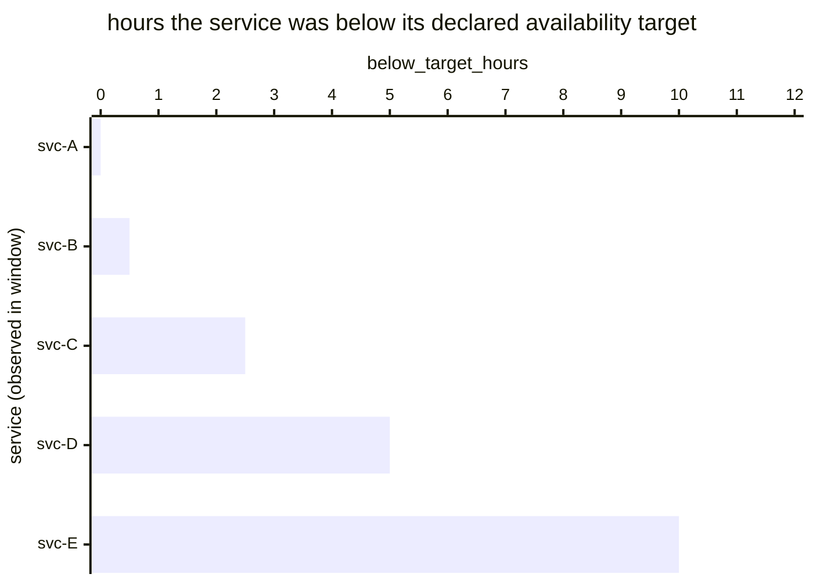

# Reference visualisation — `kri.availability_below_target_exposure@v1`

This is the committed reference-visualisation artifact for the
availability-below-target exposure KRI — the residual-risk counterpart
to `kpi.service_availability_rate@v1` anchoring the risk-management-
measures limb of NIS2 Art. 21(2)(e) and the ICT-supported business-
function-continuity limb of DORA Art. 8. It exists so the G-04 catalog
definition-of-done (a *committed* reference visualisation, not a
narrated one) is closed; downstream compile targets (n8n / Temporal /
LangGraph) read the same metric YAML and render the executable form in
their own dashboard surface. The artifact here is the contract for the
chart shape, not the executable chart.

## Chart kind

Two-panel composition. The headline panel is a count card reading the
total below-target exposure (`hours`) accumulated across in-scope
services in the evaluation window, plotted against the catalog `warn`
/ `high` / `breach` threshold bands (> 1h / > 4h / > 8h). Direction is
`lower_is_better`: rising below-target exposure is the leading signal
that the operator's continuity posture is drifting below its declared
availability envelope. The drill-down panel is a horizontal bar chart,
one bar per in-scope service, plotting the below-target exposure hours
accumulated by that service across the window.

- **Headline (sum):** the total below-target exposure hours across
  in-scope services in the window. This is the figure the operator's
  continuity surface reads first — the aggregate residual-risk
  reading.
- **Drill-down x-axis:** below-target exposure hours per service.
  Lower values are better; zero means the service stayed above its
  declared availability target throughout the window.
- **Drill-down y-axis:** one row per in-scope service observed in
  the window, labelled by service identifier; sorted descending so
  the services carrying the largest exposure (and any breaches) sit
  at the top — the cases that lift the aggregate.
- **Threshold overlay (drill-down):** three vertical lines at 1h
  (warn), 4h (high), and 8h (breach). Bars right of the 8h line are
  continuity-posture breaches and should surface on the operator's
  continuity-register review.

## Reference rendering (Mermaid)

The mermaid block below is the canonical reference rendering — small
enough to live in-tree and renderable directly on the public repo
surface. The numeric values are illustrative; the compile target is
the source of truth for the executable form against operator data.

Reading the bars in this illustrative rendering:

| service | below_target_hours | band     | reading                                                                 |
|---------|--------------------|----------|-------------------------------------------------------------------------|
| svc-A   | 0.0                | ok       | stayed above the declared availability target throughout the window     |
| svc-B   | 0.5                | ok       | brief dips but under 1h aggregate                                       |
| svc-C   | 2.5                | warn     | above 1h — leading signal                                               |
| svc-D   | 5.0                | high     | above 4h — meaningful residual exposure                                 |
| svc-E   | 10.0               | breach   | above 8h — continuity-posture breach, register review required          |

With one breach in the window the aggregate resolves to `18.0` hours
of below-target exposure across the portfolio — inside the `breach`
band (`> 8`). That value is what the catalog aggregation
`measurement.aggregation: sum` resolves to for this snapshot.

## Threshold band reference

| name   | comparator | value | severity |
|--------|------------|-------|----------|
| warn   | >          | 1     | warn     |
| high   | >          | 4     | high     |
| breach | >          | 8     | critical |

The bands match the `thresholds` array on
`availability_below_target_exposure.yaml`; the catalog entry is the
source of truth, this file is the visualisation surface. The catalog
carries no `target` field — the residual-risk reading is exposure to
be minimised, not a bounded objective; operators MAY tighten the band
thresholds against their own service-criticality tiering.

## OCSF source-data shape

The chart's underlying observations are derived from the operator's
uptime-monitoring surface for in-scope services. Each health-probe
observation contributes one below-target sample computed from the
inputs declared in `availability_below_target_exposure.yaml`'s
`measurement.inputs`:

- `probe_success` — health-probe observation emitted by the
  operator's uptime-monitoring surface for the in-scope service.
  Bound to `telemetry.ocsf.compliance_finding@v1` field `status_id`
  on the service-availability observation event.
- `observation_timestamp` — timestamp of the availability
  observation used to slot the observed rate into the evaluation
  window. Bound to `telemetry.ocsf.compliance_finding@v1` field
  `time` on the service-availability observation event.
- `declared_availability_target` — availability target declared by
  the operator on the in-scope service's continuity register. Bound
  to `telemetry.ocsf.compliance_finding@v1` field
  `metadata.correlation_uid` on the service-availability observation
  event as a reference field linking the observation to the register
  entry that declares the target.

The below-target exposure that drives the headline is
`sum(below_target_hours)` across services, with planned-maintenance
windows excluded per the formula.

## Operator override

Operators are expected to render this metric in their own dashboard
idiom — the catalog reference rendering above is the contract for
the chart shape (headline count card, per-service horizontal bars,
three exposure-threshold overlays), not the visual style. The compile
target is the source of truth for the executable form.
