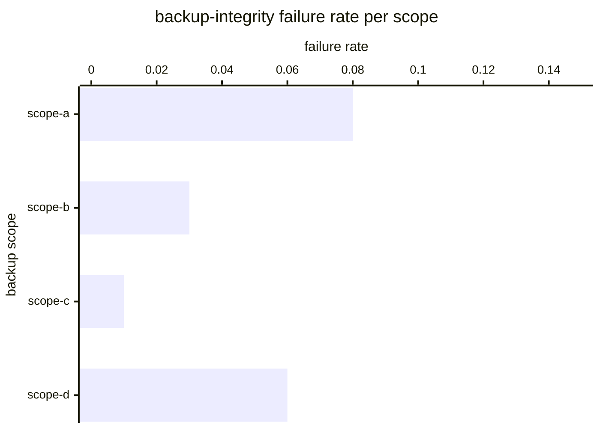

# Reference visualisation — `kri.backup_integrity_failure_rate@v1`

This is the committed reference-visualisation artifact for the
backup integrity failure rate KRI anchoring NIS2 Art. 21(2)(c)
business-continuity, backup-management and disaster-recovery
arrangements and DORA Art. 12 backup / restoration policies and
procedures. It exists so the G-04 catalog definition-of-done (a
*committed* reference visualisation, not a narrated one) is closed;
downstream compile targets (n8n / Temporal / LangGraph) read the
same metric YAML and render the executable form in their own
dashboard surface. The artifact here is the contract for the chart
shape, not the executable chart.

## Chart kind

Two-panel composition. The headline panel is a ratio-headline gauge
reading the backup-integrity failure ratio
(`failure_rate = |F| / max(|E|, 1)`) across the rolling 30-day
evaluation window, plotted against the catalog `warn` / `high` /
`breach` threshold bands (≥ 0.02 / ≥ 0.05 / ≥ 0.10). Direction is
`lower_is_better`: rising values indicate the backup surface is
drifting away from a recoverable state, which is the failure mode
the tested-restore-drill clauses under NIS2 Art. 21(2)(c) and DORA
Art. 12 surface. The drill-down panel is a horizontal bar chart,
one bar per backup scope, plotting the failure rate for that scope
in the same rolling window.

- **Headline (ratio):** aggregate backup-integrity failure rate
  across all backup-verify jobs that reached the
  validate-backup-integrity step in the rolling 30-day window.
  This is the figure the operator's backup-review surface reads
  first — the ambient failure-rate reading against the community-
  baseline < 0.02 target.
- **Drill-down x-axis:** per-scope failure rate for the
  backup-verify jobs observed in each backup scope over the same
  30-day window. Lower values are better; the x-axis is the ratio
  range 0 → 1.
- **Drill-down y-axis:** one row per backup scope observed in the
  window (in-scope services / systems as declared on the
  operator's backup-catalogue). Sorted descending by failure rate
  so the worst-performing scopes surface at the top and the
  reviewer's eye lands on the actionable rows first.
- **Threshold overlay (headline):** three vertical lines at 0.02
  (warn), 0.05 (high), and 0.10 (breach). A headline reading at
  or above 0.02 warns the operator's backup lane; a reading at or
  above 0.05 is high-severity and at or above 0.10 is a critical
  breach against the NIS2 Art. 21(2)(c) tested-restore-drill
  floor. A count-shaped view of the same failure population lives
  on the sibling `kri.backup_integrity_failures@v1` for operators
  whose backup-scope population is small enough that a single
  failure is the actionable event.

## Reference rendering (Mermaid)

The mermaid block below is the canonical reference rendering — small
enough to live in-tree and renderable directly on the public repo
surface. The numeric values are illustrative; the compile target is
the source of truth for the executable form against operator data.

## Reading the chart

Two operator loops matter here. The first is the aggregate-drift
loop: the headline gauge reads whether the backup-verify surface
is producing an ambient failure rate that stays below the ≥ 0.02
warn band. A headline reading above the warn threshold picks up on
the operator's backup-review surface as a signal that the backup
apparatus is drifting away from a recoverable state, regardless
of whether any individual failure has been remediated. The second
is the per-scope loop: the drill-down surfaces which backup scopes
carry the failure rate — one scope drifting can pull the headline
into warn while sibling scopes remain clean, and the per-scope
view is where the operator's remediation attention lands. Both
loops are non-destructive readings on the backup-verify
attestation stream — they do not require firing a restore drill,
only reading the OCSF File System Activity records the
backup_recovery playbook already emits per verify attempt.

## Complementarity with siblings

- **`kri.backup_integrity_failures@v1` (count, sibling).** Same
  OCSF class binding (File System Activity), same playbook step,
  different unit shape. The count sibling anchors warn / breach
  on absolute occurrence (≥ 1 / ≥ 3) and is the right signal for
  small backup-scope populations. This ratio KRI is the right
  signal for larger populations where a single failure is
  expected background and the failure rate itself is the drift
  reading. Operators generally read both.
- **`kpi.backup_integrity_pass_rate@v1` (pass-side, sibling).**
  Higher-is-better ratio on the same population; complementary
  reading of the same event stream. The pass-rate KPI reads
  operator-side confidence in the backup lane; this failure-rate
  KRI reads reviewer-side residual risk on the same lane.

## Regulatory anchor recap

- **NIS2 Art. 21(2)(c)** — the tested-restore-drill limb of the
  business-continuity, backup-management, disaster-recovery and
  crisis-management arrangement obligation. Rising failure-rate
  readings are the signal reviewers pick up when the operator's
  backup surface is drifting away from a recoverable state.
- **DORA Art. 12** — backup policies and procedures, restoration
  and recovery procedures and methods; the residual-risk lane on
  the backup apparatus is exactly what this KRI reads.
- **NIST SP 800-53 Rev. 5 CP-9(1)** — System Backup | Testing for
  Reliability and Integrity; the reliability-and-integrity limb
  aligns against the ratio-shaped failure reading here.
- **MITRE D3FEND D3-FH** — File Hashing; the defensive technique
  the validate-backup-integrity step is anchored on.
- **ISO/IEC 27004:2016** — the measurement-guidance standard the
  catalog aligns against for KPI / KRI definition rigour.

## Cross-links

- Sibling KPI (same PR): `kpi.bcp_exercise_completion_rate@v1`.
- Count-shape sibling: `kri.backup_integrity_failures@v1`.
- Pass-side sibling: `kpi.backup_integrity_pass_rate@v1`.
- Playbook binding: `playbook.backup_recovery@v1` step
  `action--50000000-0000-4000-8000-000000000003`
  (validate-backup-integrity).
