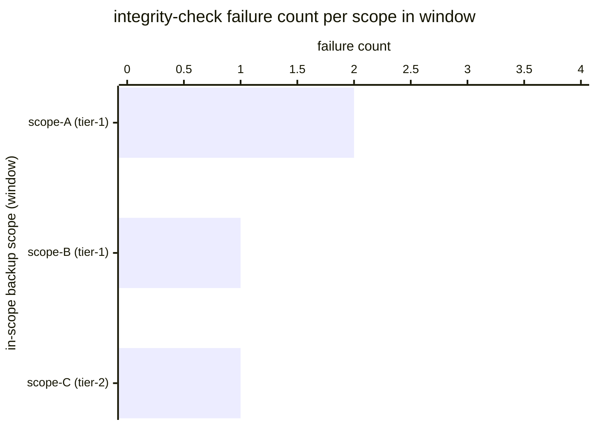

# Reference visualisation — `kri.backup_integrity_failures@v1`

This is the committed reference-visualisation artifact for the
backup-integrity-failures KRI. It exists so the G-04 catalog
definition-of-done (a *committed* reference visualisation, not a
narrated one) is closed; downstream compile targets (n8n / Temporal /
LangGraph) read the same metric YAML and render the executable form in
their own dashboard surface. The artifact here is the contract for the
chart shape, not the executable chart.

## Chart kind

Two-panel composition. The headline panel is a single counter card
reading the total `count` of backup-integrity-check failures observed
on the backup_recovery playbook validate-backup-integrity step during
the evaluation window. The drill-down panel is a horizontal bar chart,
one bar per in-scope backup scope that raised at least one integrity
failure in the window, plotting the per-scope failure count so the
operator can see which scopes are drifting away from a recoverable
state. Slicing by backup scope is the canonical drill-down dimension.

- **Headline (count):** the `count` aggregate across integrity-check
  observations in the window. Because the KRI is `lower_is_better`,
  zero is healthy and any positive value is the backup-integrity-erosion
  signal.
- **Drill-down x-axis:** per-scope failure count, sorted descending
  so the scope with the largest number of failures sits at the top.
- **Drill-down y-axis:** one row per backup scope with at least one
  failure in the window, labelled by the scope id and RPO/RTO tier.
- **Threshold overlay (headline):** the warn (>= 1) and breach (>= 3)
  bands the catalog declares — the headline card colour-cues on those
  bands so operators see the risk posture at a glance.

## Reference rendering (Mermaid)

The mermaid block below is the canonical reference rendering — small
enough to live in-tree and renderable directly on the public repo
surface. The numeric values are illustrative; the compile target is
the source of truth for the executable form against operator data.

Reading the bars in this illustrative rendering:

| scope (tier)      | failures | reading                                                          |
|-------------------|----------|------------------------------------------------------------------|
| scope-A (tier-1)  | 2        | two integrity failures — checksum mismatch on the tier-1 chain   |
| scope-B (tier-1)  | 1        | one integrity failure — key-availability gap on the KMS surface  |
| scope-C (tier-2)  | 1        | one integrity failure — manifest mismatch against scope catalogue|

With four integrity failures across three scopes, the headline `count`
resolves to `4` in this snapshot. That value is what the catalog
aggregation `measurement.aggregation: count` resolves to for this
snapshot — above the warn band (>= 1) and above the breach band
(>= 3).

## Threshold band reference

The catalog entry at `backup_integrity_failures.yaml` declares warn
(>= 1) and breach (>= 3) bands at the unscoped baseline; operators
under scoped programmes tighten these bands in their compile-target
configuration. The catalog YAML at
`content/metrics/backup_integrity_failures.yaml` remains the source of
truth for the indicator shape; this file is the visualisation surface.

## OCSF source-data shape

The chart's underlying observations are derived from the operator's
backup_recovery execution stream. Each execution that reaches the
validate-backup-integrity step contributes one integrity-check outcome
sample against the `measurement.inputs` declared on
`backup_integrity_failures.yaml`:

- **integrity_ok** — boolean outcome of the validate-backup-integrity
  step of the backup_recovery playbook. Bound to the playbook step
  declared on the catalog entry's `playbook_refs`:
  - `playbook.backup_recovery@v1`
    `action--50000000-0000-4000-8000-000000000003` — validate-backup-
    integrity step (D3-FH File Hashing anchor).

The OCSF source-data shape is File System Activity (class_uid 1001):
the validate-backup-integrity step hashes the candidate backup and
matches the result against the documented integrity baseline, emitting
one File System Activity record per verification attempt with the
integrity outcome carried on the same event (`activity_id` transitions
for the hash / read operation, matched-hash file payload on
`file.hashes`). D3FEND anchors the same class shape on the
ransomware_containment backup-verification step, so the integrity
discipline is named consistently across both halves of the operator's
continuity surface.

## Operator override

Operators are expected to render this metric in their own dashboard
idiom — the catalog reference rendering above is the contract for the
chart shape (count headline with warn / breach cueing, per-scope
failure-count drill-down), not the visual style. The compile target is
the source of truth for the executable form.
