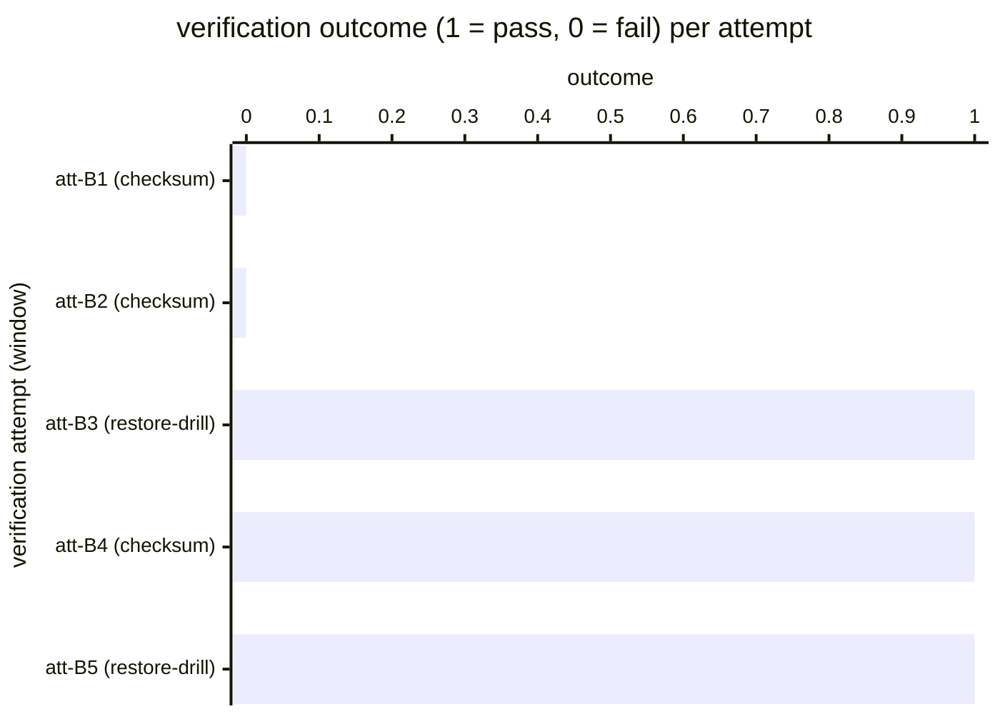

# Reference visualisation — `kpi.backup_integrity_pass_rate@v1`

This is the committed reference-visualisation artifact for the
backup-integrity pass-rate KPI. It exists so the G-04 catalog
definition-of-done (a *committed* reference visualisation, not a
narrated one) is closed; downstream compile targets (n8n / Temporal /
LangGraph) read the same metric YAML and render the executable form in
their own dashboard surface. The artifact here is the contract for the
chart shape, not the executable chart.

## Chart kind

Two-panel composition. The headline panel is a single gauge-style
horizontal bar reading the backup-integrity pass `ratio` across
verification attempts (restore drills or checksum verifications) that
ran within the evaluation window — the share of attempts that
verified successfully, divided by the total verification population
the operator ran. The drill-down panel is a horizontal bar chart, one
bar per verification attempt observed in the window, plotting the
attempt outcome encoded as `1` (pass) or `0` (fail). Slicing by
`backup_kind` (restore-drill vs checksum-verification) is the
canonical drill-down dimension because operators typically run a
mixed verification surface — checksum verifications are cheap and run
often, restore drills are expensive and run less often, and the
catalog KPI is the blended pass rate across both.

- **Headline (ratio):** the `ratio` aggregate across verification
  attempts in the window. This is the figure operators read first.
  Because the KPI is `higher_is_better`, a value near `1.00` is
  healthy and a falling value is the backup-integrity-erosion signal.
- **Drill-down x-axis:** one row per verification attempt observed
  in the window, labelled by the attempt id and backup-kind; sorted
  ascending so the failing attempts sit at the top — the attempts
  that pulled the ratio off `1.00`.
- **Drill-down y-axis:** attempt outcome encoded as `0` (failed
  verification) or `1` (successful verification). A bar at `0`
  contributes a `1` to the denominator without contributing a `1`
  to the numerator.
- **Threshold overlay (drill-down):** a horizontal line at `1` —
  every bar below the line is a failed verification. Operators
  reading the drill-down see *which* attempts pulled the ratio off
  `1.00` and which backup kinds carried the failures.

## Reference rendering (Mermaid)

The mermaid block below is the canonical reference rendering — small
enough to live in-tree and renderable directly on the public repo
surface. The numeric values are illustrative; the compile target is
the source of truth for the executable form against operator data.

Reading the bars in this illustrative rendering:

| attempt (kind)            | outcome | passed? | reading                                                          |
|---------------------------|---------|---------|------------------------------------------------------------------|
| att-B1 (checksum)         | 0       | no      | checksum-verification mismatch — backup unrecoverable in place   |
| att-B2 (checksum)         | 0       | no      | second checksum failure — operator owes root-cause on the chain  |
| att-B3 (restore-drill)    | 1       | yes     | restore drill completed end-to-end                               |
| att-B4 (checksum)         | 1       | yes     | checksum verification passed                                     |
| att-B5 (restore-drill)    | 1       | yes     | restore drill completed end-to-end                               |

With two failed verifications across five attempts, the headline
`ratio` resolves to `3 / 5 = 0.60` in this snapshot. That value is
what the catalog aggregation `measurement.aggregation: ratio`
resolves to for this snapshot.

## Threshold band reference

The catalog entry at `backup_integrity_pass_rate.yaml` is
vendor-neutral and does not declare numeric warn / breach thresholds
at the unscoped baseline — the operator's business-continuity
programme (and any sectoral DORA / NIS2 essential-entity scope) is
the source of truth for the per-system pass-rate floor, and the
catalog ratio reflects the blended pass rate across the verification
surface the operator runs. System-scoped or restore-drill-only
variants declare numeric bands and live as separate catalog entries.
The catalog YAML at `content/metrics/backup_integrity_pass_rate.yaml`
remains the source of truth for the indicator shape; this file is
the visualisation surface.

## OCSF source-data shape

The chart's underlying observations are derived from the operator's
backup-verification pipeline. Each verification attempt observed
within the evaluation window contributes one outcome sample computed
against the `measurement.inputs` declared on
`backup_integrity_pass_rate.yaml`:

- **numerator** — count of verification attempts that completed
  successfully (restore drill verified end-to-end, or checksum
  verification matched the recorded digest). The verification-attempt
  event is bound to the ransomware-containment backup-restore step
  transition declared on the catalog entry's `playbook_refs`:
  - `playbook.ransomware_containment@v1`
    `action--30000000-0000-4000-8000-000000000008` — backup-restore /
    integrity-verification step on the ransomware-containment
    playbook.
- **denominator** — count of verification attempts observed within
  the evaluation window across the backup surface in scope. Attempts
  that crashed before producing a verification verdict count toward
  the denominator (they are failed verifications) so the indicator
  does not silently improve when the verification pipeline itself
  fails.

The catalog entry deliberately does not pin a single OCSF telemetry
binding at the unscoped baseline: backup verification outcomes are
carried by the operator's backup-product surface (a Veeam / Bacula /
Borg report, an object-store integrity job, or a sovereign-cloud
backup service's own event), and there is no unambiguous OCSF event
class that covers the intersection of those surfaces at the catalog
level. The deferral is named honestly — the binding is to the
playbook-step transition on the ransomware-containment playbook, not
to an OCSF class. A CORE follow-up may add an OCSF binding for
specific backup-surface-scoped variants once the operator's backup
surface is declared.

The reference rendering above remains shape-valid: it reads a
pass/fail predicate per verification attempt and computes a ratio,
regardless of which backup-product surface the operator's compile
target resolves the verification event against.

## Operator override

Operators are expected to render this metric in their own dashboard
idiom — the catalog reference rendering above is the contract for the
chart shape (ratio headline, per-attempt pass/fail drill-down sliced
by backup-kind, pass-floor overlay at `1`), not the visual style. The
compile target is the source of truth for the executable form.
