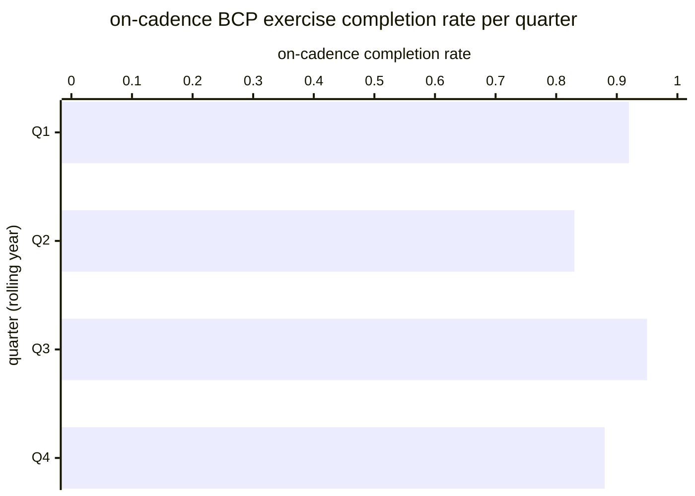

# Reference visualisation — `kpi.bcp_exercise_completion_rate@v1`

This is the committed reference-visualisation artifact for the
BCP exercise completion rate KPI anchoring NIS2 Art. 21(2)(c)
business-continuity arrangements and DORA Art. 11(6) annual
testing requirement on the exercise-attempt surface. It exists so
the G-04 catalog definition-of-done (a *committed* reference
visualisation, not a narrated one) is closed; downstream compile
targets (n8n / Temporal / LangGraph) read the same metric YAML and
render the executable form in their own dashboard surface. The
artifact here is the contract for the chart shape, not the
executable chart.

## Chart kind

Two-panel composition. The headline panel is a ratio-headline gauge
reading the on-cadence exercise-completion ratio
(`completion_rate = |C| / max(|S|, 1)`) across the rolling
12-month evaluation window, plotted against the catalog
`warn` / `high` / `breach` threshold bands (< 0.90 / < 0.75 /
< 0.50) and the community-baseline ≥ 0.90 target. Direction is
`higher_is_better`: a persistently below-target reading signals
the exercise-scheduling surface itself is stalling, which is a
NIS2 Art. 21(2)(c) periodic-testing shortfall. The drill-down
panel is a horizontal bar chart, one bar per quarter of the
rolling year, plotting the on-cadence completion ratio for the
exercises scheduled in that quarter.

- **Headline (ratio):** on-cadence exercise completion rate in the
  rolling year across the scheduled BCP exercise population. This
  is the figure the operator's continuity-review surface reads
  first — the annual on-cadence-completion reading against the
  community-baseline ≥ 0.90 target.
- **Drill-down x-axis:** on-cadence completion ratio for the
  exercises scheduled in each quarter of the rolling year. Higher
  values are better; the y-axis is the ratio range 0 → 1.
- **Drill-down y-axis:** four rows, one per quarter Q1–Q4 of the
  rolling year, labelled by quarter offset from the current
  evaluation moment; sorted chronologically so temporal drift in
  the exercise-scheduling lane is visible at a glance.
- **Threshold overlay (headline):** three horizontal lines at
  0.90 (warn), 0.75 (high), and 0.50 (breach). A headline reading
  below 0.90 warns the operator's periodic-testing lane; a reading
  below 0.75 is high-severity and below 0.50 is a critical
  breach against the NIS2 Art. 21(2)(c) periodic-testing floor.

## Reference rendering (Mermaid)

The mermaid block below is the canonical reference rendering — small
enough to live in-tree and renderable directly on the public repo
surface. The numeric values are illustrative; the compile target is
the source of truth for the executable form against operator data.

## Reading the chart

Two operator loops matter here. The first is the annual-cadence
loop: the headline gauge reads whether the exercise-scheduling
surface is closing scheduled BCP exercises on cadence across the
rolling year. A headline reading persistently below the ≥ 0.90
community baseline is a NIS2 Art. 21(2)(c) periodic-testing signal
that the reviewer picks up on the operator's continuity-review
surface. The second is the intra-year drift loop: the per-quarter
drill-down surfaces whether the on-cadence-completion rate is
degrading across quarters (a scheduler-surface stall or a
plan-lifecycle backlog) or improving (post-remediation of a
prior-year finding). Both loops are non-destructive readings on
the exercise-scheduling attestation stream — they do not require
firing a plan-lifecycle activation, only reading the schedule and
close-attestation records the business_continuity playbook already
emits per exercise.

## Regulatory anchor recap

- **NIS2 Art. 21(2)(c)** — the periodic-testing limb of the
  business-continuity, backup-management, disaster-recovery and
  crisis-management arrangement obligation. This KPI reads the
  exercise-attempt surface (did the scheduled exercise close on
  cadence), complementary to the drill-lane readings which read
  whether the backup-and-recovery apparatus remains exercisable.
- **DORA Art. 11(6)** — ICT business-continuity policy shall be
  tested at least once a year and after every substantive change.
  This KPI is the on-cadence-completion companion to the annual
  count reading on `kpi.service_continuity_test_frequency@v1`;
  operators subject to DORA read the two together so an
  ostensibly-satisfied count reading is cross-checked against the
  on-cadence-completion reading before the annual attestation
  closes.
- **ENISA NIS2 guidance** — periodic testing is one of the
  recurring themes in the essential/important-entity guidance;
  this KPI operationalises the theme on the exercise-attempt
  surface without prescribing a vendor-specific exercise-scheduling
  product.
- **ISO/IEC 27004:2016** — the measurement-guidance standard the
  catalog aligns against for KPI / KRI definition rigour.

## Cross-links

- Sibling KRI: `kri.backup_integrity_failure_rate@v1` (same PR).
- Portfolio-count sibling: `kpi.service_continuity_test_frequency@v1`.
- Drill-lane siblings: `kpi.restore_drill_cadence@v1`,
  `kri.restore_drill_rto_overrun@v1`,
  `kri.restore_drill_attestation_freshness@v1`.
- Playbook binding: `playbook.business_continuity@v1` steps
  `action--b17c0072-0000-4000-8000-000000000003`
  (activate_bcm_plan / scheduler call) and
  `action--b17c0072-0000-4000-8000-000000000008`
  (close attestation).
