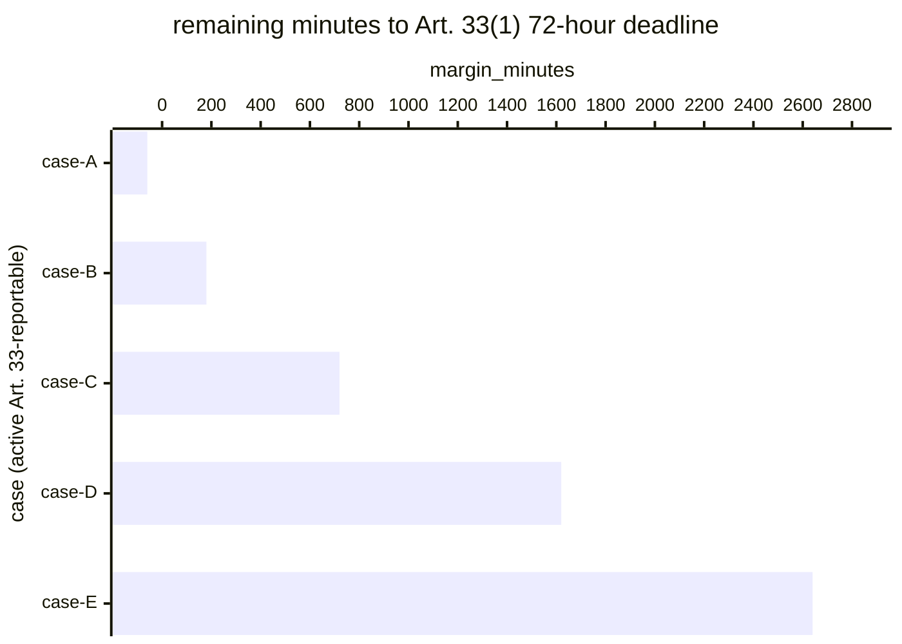

# Reference visualisation — `kri.breach_notification_clock_margin@v1`

This is the committed reference-visualisation artifact for the GDPR
Article 33 breach-notification clock-margin KRI. It exists so the
G-04 catalog definition-of-done (a *committed* reference
visualisation, not a narrated one) is closed; downstream compile
targets (n8n / Temporal / LangGraph) read the same metric YAML and
render the executable form in their own dashboard surface. The
artifact here is the contract for the chart shape, not the executable
chart.

## Chart kind

Horizontal bar chart, one bar per active Art. 33-reportable case in
the evaluation window, sorted by `margin_minutes` ascending so the
worst-case case (the bar nearest the deadline) sits at the top. The
`min` aggregate is the headline figure operators read first; the bar
chart is the supporting drill-down that names *which* case is closest
to the clock.

- **x-axis:** `margin_minutes` — remaining minutes to the Art. 33(1)
  72-hour deadline. Negative values left of zero indicate the case
  has overrun the clock and an Art. 33(1) "reasons for the delay"
  record is required on submission.
- **y-axis:** one row per active case, labelled by the case
  `incident.uid` (operator-facing) and sliced by classification
  severity (colour band).
- **Threshold overlays:** vertical lines at the `warn` (1440 min),
  `high` (240 min), and `breach` (0 min) threshold values from the
  catalog entry, so the operator reads the band each case sits in
  without arithmetic.
- **Headline annotation:** the `min` aggregate across active cases,
  annotated as the metric value with the threshold band it falls in.

## Reference rendering (Mermaid)

The mermaid block below is the canonical reference rendering — small
enough to live in-tree and renderable directly on the public repo
surface. The numeric values are illustrative; the compile target is
the source of truth for the executable form against operator data.

Reading the bars in this illustrative rendering:

| case   | margin_minutes | band      | reading                                           |
|--------|----------------|-----------|---------------------------------------------------|
| case-A | -60            | breach    | overrun the clock — Art. 33(1) delay record req'd |
| case-B | 180            | high      | inside 4-hour critical buffer                     |
| case-C | 720            | high      | inside 12-hour critical buffer                    |
| case-D | 1620           | warn      | inside 27-hour warn buffer                        |
| case-E | 2640           | on-target | 44h margin, above target floor                    |

The headline `min` figure here is `-60 min` — the worst-case case has
overrun the clock. That value is what the catalog aggregation
`measurement.aggregation: min` resolves to for this snapshot.

## Threshold band reference

| name      | comparator | value (min) | severity  |
|-----------|------------|-------------|-----------|
| warn      | <          | 1440        | warn      |
| high      | <          | 240         | high      |
| breach    | <          | 0           | critical  |

The bands match the `thresholds` array on
`breach_notification_clock_margin.yaml`; the catalog entry is the
source of truth, this file is the visualisation surface.

## OCSF source-data shape

The chart's underlying observations are derived from the OCSF
`Incident Finding` events the `incident_management@v1` playbook
emits at classification (carries `start_time` as the awareness
timestamp) and at regulator-notification dispatch (carries `time` as
the notification dispatch timestamp). The binding lives at
`content/telemetry/telemetry.ocsf.incident_finding@v1.json` and is
back-referenced from the metric YAML's `telemetry_refs[]` and from
each `measurement.inputs[].telemetry_ref`.

## Operator override

Operators are expected to render this metric in their own dashboard
idiom — the catalog reference rendering above is the contract for
the chart shape (horizontal bars, threshold overlays, `min` headline,
severity slicing on the y-axis), not the visual style. The compile
target is the source of truth for the executable form.
