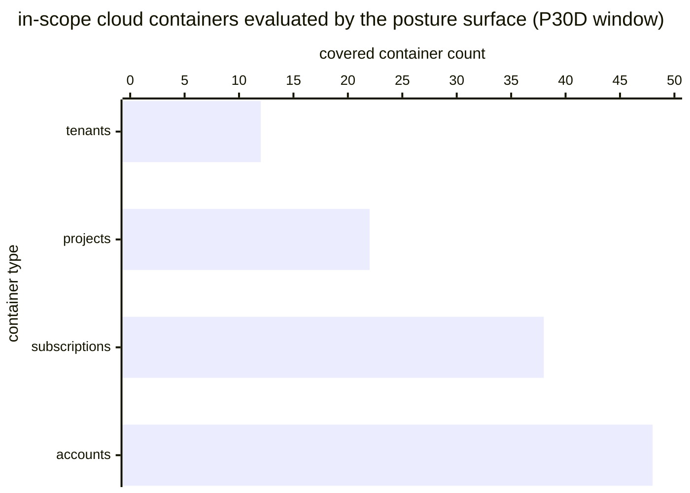

# Reference visualisation — `kpi.cloud_posture_coverage@v1`

This is the committed reference-visualisation artifact for the
cloud-posture-coverage KPI. It exists so the G-04 catalog
definition-of-done (a *committed* reference visualisation, not a
narrated one) is closed; downstream compile targets (n8n / Temporal /
LangGraph) read the same metric YAML and render the executable form in
their own dashboard surface. The artifact here is the contract for the
chart shape, not the executable chart.

## Chart kind

Stacked horizontal bar chart, one bar per in-scope cloud-account
container category (accounts, subscriptions, projects, tenants — or
whichever container types the operator's posture surface exposes),
with each bar partitioned into a covered band (containers currently
evaluated by the posture surface) and an uncovered band (containers
the operator believes should be evaluated but are not). The overall
ratio `covered_population / total_population` is the headline figure
operators read first; the per-container-type stacks are the supporting
drill-down that names *where* the coverage gap sits.

- **x-axis:** container count — number of in-scope containers per
  container type, partitioned by coverage state.
- **y-axis:** one row per container-type category exposed by the
  operator's posture surface (accounts, subscriptions, projects,
  tenants), sorted by coverage ratio ascending so the worst-covered
  category sits at the top.
- **Stack partition:** two segments per bar — `covered` (containers
  evaluated by the posture surface) and `uncovered` (in-scope
  containers with no evaluator bound).
- **Threshold overlays:** horizontal lines at the `warn` (0.95) and
  `breach` (0.8) ratio values, drawn on a companion ratio gauge / axis
  next to the bar chart, so the operator reads the band the overall
  ratio sits in without arithmetic.
- **Headline annotation:** the overall
  `covered_population / total_population` ratio across all in-scope
  containers, annotated as the metric value with the threshold band
  it falls in.

## Reference rendering (Mermaid)

The mermaid block below is the canonical reference rendering — small
enough to live in-tree and renderable directly on the public repo
surface. The numeric values are illustrative; the compile target is
the source of truth for the executable form against operator data.

Reading the bars in this illustrative rendering (assume each container
type has 50 in-scope containers, so the bar value is the `covered`
count out of 50):

| container type   | covered / in-scope | ratio | reading                                       |
|------------------|--------------------|-------|-----------------------------------------------|
| accounts         | 48 / 50            | 0.96  | above target — clear of warn band             |
| subscriptions    | 38 / 50            | 0.76  | inside breach band — below 0.8 critical floor |
| projects         | 22 / 50            | 0.44  | inside breach band — well below floor         |
| tenants          | 12 / 50            | 0.24  | inside breach band — worst-covered category   |

The headline `covered_population / total_population` figure here is
`(48+38+22+12) / (4·50) = 120/200 = 0.60` — inside the breach band,
well below the 0.8 critical floor. That value is what the catalog
aggregation `measurement.aggregation: ratio` resolves to for this
snapshot.

## Threshold band reference

| name      | comparator | value (ratio) | severity  |
|-----------|------------|---------------|-----------|
| warn      | <          | 0.95          | warn      |
| breach    | <          | 0.8           | high      |

The bands match the `thresholds` array on
`cloud_posture_coverage.yaml`; the catalog entry is the source of
truth, this file is the visualisation surface.

## OCSF source-data shape

The chart's underlying observations are derived from the operator's
posture-management surface. Each in-scope cloud container contributes
a `(container_uid, container_type, covered?)` sample computed against
the `measurement.inputs` declared on `cloud_posture_coverage.yaml`:

- **covered_population** — count of in-scope containers currently
  evaluated by the named posture surface. The evaluation event is
  bound to the cloud-misconfiguration playbook step transitions
  declared on the catalog entry's `playbook_refs`:
  - `playbook.cloud_misconfiguration@v1`
    `action--30000000-0000-4000-8000-000000000003` — posture-surface
    evaluation step on the cloud-misconfiguration playbook;
  - `playbook.cloud_misconfiguration@v1`
    `action--30000000-0000-4000-8000-000000000008` — posture-surface
    reconciliation step on the cloud-misconfiguration playbook.
- **total_population** — count of in-scope containers the operator
  believes should be under the named posture surface, per the
  operator's scoping artifact. Exclude containers whose in-scope state
  is unknown so the indicator does not silently improve on
  record-keeping gaps.

The catalog entry deliberately does not pin a single OCSF telemetry
binding at the unscoped baseline: posture-surface evaluators are
carried by an operator's own CSPM / posture tool, and there is no
unambiguous OCSF event class that covers the intersection of those
surfaces at the catalog level. The deferral is named honestly — the
playbook step transition is the binding for the evaluation event, not
an OCSF class. A CORE follow-up may add an OCSF binding for
surface-scoped variants once the operator's posture tool is declared.

The reference rendering above remains shape-valid: it reads one
`(container_uid, container_type, covered?)` sample per in-scope
container and partitions by container type, regardless of which
posture surface the operator's compile target resolves the evaluation
event against.

## Operator override

Operators are expected to render this metric in their own dashboard
idiom — the catalog reference rendering above is the contract for the
chart shape (per-container-type stacked horizontal bars, threshold
overlays on a companion ratio axis, overall
`covered_population / total_population` headline), not the visual
style. The compile target is the source of truth for the executable
form.
