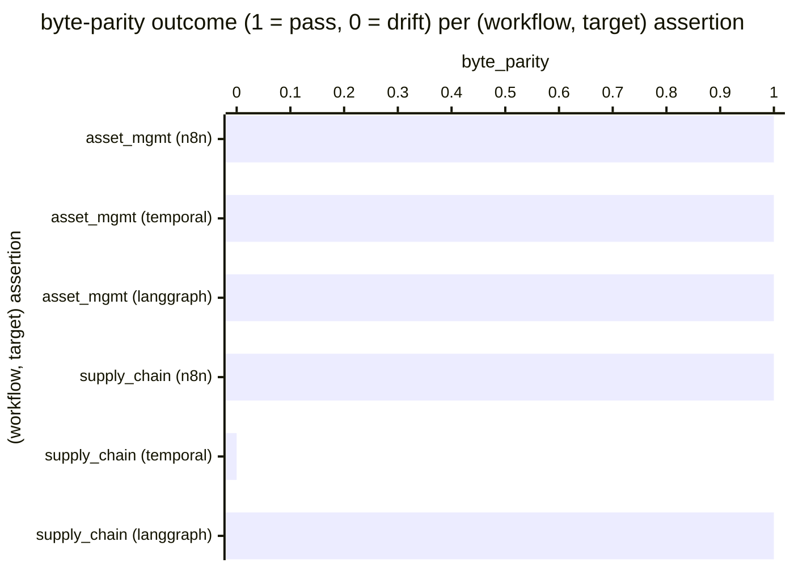

# Reference visualisation — `kpi.compiler_byte_parity_pass_rate@v1`

This is the committed reference-visualisation artifact for the
compiler byte-parity pass-rate KPI. It exists so the G-04 catalog
definition-of-done (a *committed* reference visualisation, not a
narrated one) is closed; downstream compile targets (n8n / Temporal /
LangGraph) read the same metric YAML and render the executable form
in their own dashboard surface. The artifact here is the contract for
the chart shape, not the executable chart.

## Chart kind

Two-panel composition. The headline panel is a single gauge-style
horizontal bar reading the byte-parity pass `ratio` across all
(workflow, target) per-example golden assertions exercised on the
evaluation commit — the share of assertions where the reference
compiler re-derived the committed bytes under
`examples/<target>/<workflow>/` exactly, divided by the total
assertion population the suite runs. The drill-down panel is a
horizontal bar chart, one bar per (workflow, target) assertion
observed, plotting the assertion outcome encoded as `1` (byte-parity
holds) or `0` (drift). Slicing by compile target (n8n / temporal /
langgraph) is the canonical drill-down dimension because the project
maintains three reference compile targets as one of three each, and
the determinism contract spans the ring rather than any single
target.

- **Headline (ratio):** the `ratio` aggregate across per-example
  byte-parity assertions on the evaluation commit. Because the KPI
  is `higher_is_better`, a reading of `1.00` is the floor (target
  value) and any reading below `1.00` is a determinism regression
  the project shipped.
- **Drill-down x-axis:** one row per (workflow, target) assertion
  observed, labelled by the workflow name and compile target;
  sorted ascending so the drift samples sit at the top — the
  per-example goldens that pulled the ratio off `1.00`.
- **Drill-down y-axis:** assertion outcome encoded as `0`
  (byte-parity drift — the compiler emitted bytes that do not match
  the committed reference artifact) or `1` (byte-parity holds — the
  compiler re-derived the committed bytes exactly).
- **Threshold overlay (drill-down):** a horizontal line at `1` —
  every bar below the line is a drift sample. Operators reading
  the drill-down see *which* (workflow, target) pairs pulled the
  ratio off `1.00`.

## Reference rendering (Mermaid)

The mermaid block below is the canonical reference rendering — small
enough to live in-tree and renderable directly on the public repo
surface. The numeric values are illustrative; the compile target is
the source of truth for the executable form against the per-example
golden suite at evaluation time.

Reading the bars in this illustrative rendering:

| (workflow, target)            | byte_parity | drift? | reading                                                              |
|-------------------------------|-------------|--------|----------------------------------------------------------------------|
| asset_mgmt (n8n)              | 1           | no     | compiler re-derived `examples/n8n/asset_management/` exactly         |
| asset_mgmt (temporal)         | 1           | no     | compiler re-derived `examples/temporal/asset_management/` exactly    |
| asset_mgmt (langgraph)        | 1           | no     | compiler re-derived `examples/langgraph/asset_management/` exactly   |
| supply_chain (n8n)            | 1           | no     | compiler re-derived `examples/n8n/supply_chain_security/` exactly    |
| supply_chain (temporal)       | 0           | yes    | temporal emitter drifted from `examples/temporal/supply_chain_security/` |
| supply_chain (langgraph)      | 1           | no     | compiler re-derived `examples/langgraph/supply_chain_security/` exactly  |

With one drift across six assertions, the headline `ratio` resolves
to `5 / 6 ≈ 0.83` in this snapshot. Because direction is
`higher_is_better`, a falling value is the determinism-erosion
signal — the per-example golden suite is the FOUNDATION §2
contract and a drop below `1.00` means the project shipped a
non-deterministic content rendering on the evaluation commit. That
value is what the catalog aggregation `measurement.aggregation: ratio`
resolves to for this snapshot.

## Threshold band reference

| name   | comparator | value (ratio) | severity |
|--------|------------|---------------|----------|
| warn   | <          | 1.0           | warn     |
| breach | <          | 0.95          | high     |

The bands match the `thresholds` array on
`compiler_byte_parity_pass_rate.yaml`; the catalog entry is the
source of truth, this file is the visualisation surface. The
`warn` band fires on any drift; the `breach` band fires when more
than 5 % of the suite is red, the practical level at which a
determinism regression cannot be explained away as a single
intentional emitter change that forgot to refresh its committed
reference artifact.

## Test-artifact source-data shape

The chart's underlying observations are derived from the per-example
byte-parity golden suite under ``tests/examples/``. Each
(workflow, target) assertion exercised by ``python -m pytest
tests/examples/`` on the evaluation commit contributes one
byte-parity observation computed against the `measurement.inputs`
declared on `compiler_byte_parity_pass_rate.yaml`:

- **`per_example_byte_parity_assertion`** — per-example golden
  assertion. The test re-runs the reference compiler against the
  canonical CACAO source under
  ``content/playbooks/<workflow>/playbook.cacao.json`` and asserts
  the emitted bytes match the committed reference artifact under
  ``examples/<target>/<workflow>/`` byte-for-byte. The catalog
  entry binds to that test-artifact shape, not to a vendor-specific
  test harness object.
- **`cross_target_byte_parity_assertion`** — the same per-example
  goldens evaluated as the conjunction across the three reference
  compile targets for one workflow. A workflow pass requires every
  target's assertion to pass.

Per-(workflow, target) observations are counted once per evaluation
commit; the catalog window is `P1D` and tumbling because the suite
runs against a discrete commit, not against an operator's
runtime telemetry stream.

## Operator override

Operators are expected to render this metric in their own dashboard
idiom — the catalog reference rendering above is the contract for
the chart shape (ratio headline, per-(workflow, target) byte-parity
drill-down sliced by compile target, pass-floor overlay at `1`), not
the visual style. The compile target is the source of truth for the
executable form.
