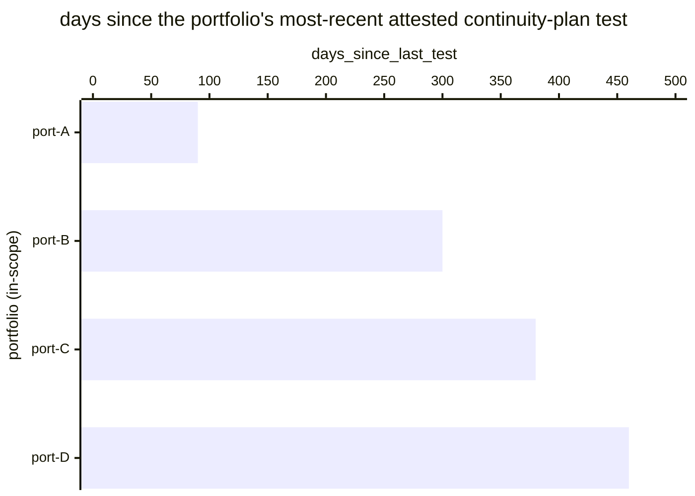

# Reference visualisation — `kri.continuity_test_overdue@v1`

This is the committed reference-visualisation artifact for the
continuity-test overdue KRI — the residual-risk counterpart to
`kpi.service_continuity_test_frequency@v1` anchoring the risk-
management-measures limb of NIS2 Art. 21(2)(e), the ICT-supported
business-function-continuity limb of DORA Art. 8, and the annual-
cadence floor under DORA Art. 11(6). It exists so the G-04 catalog
definition-of-done (a *committed* reference visualisation, not a
narrated one) is closed; downstream compile targets (n8n / Temporal /
LangGraph) read the same metric YAML and render the executable form in
their own dashboard surface. The artifact here is the contract for the
chart shape, not the executable chart.

## Chart kind

Two-panel composition. The headline panel is a count card reading the
number of in-scope service portfolios (`count`) whose most-recent
attested ICT business-continuity test lies outside the operator-
configured recurrence window at the moment of evaluation, plotted
against the catalog `warn` / `high` / `breach` threshold bands (>= 1 /
>= 2 / >= 3). Direction is `lower_is_better`: a rising overdue count
is the leading signal that the operator's testing lane is stalling on
one or more portfolios. The drill-down panel is a horizontal bar
chart, one bar per portfolio, plotting the number of days since the
portfolio's most-recent attested continuity-plan test.

- **Headline (count):** the total number of overdue portfolios at
  the moment of evaluation. This is the figure the operator's
  continuity surface reads first — the residual-risk exposure
  reading.
- **Drill-down x-axis:** days since the portfolio's most-recent
  attested continuity-plan test. Values above the operator-
  configured recurrence window (default 365 days) count as overdue.
- **Drill-down y-axis:** one row per in-scope service portfolio,
  labelled by portfolio identifier; sorted descending so the
  portfolios carrying the longest staleness (and any breaches) sit
  at the top — the cases that lift the count.
- **Threshold overlay (headline):** three vertical lines at 1
  (warn), 2 (high), and 3 (breach). A headline count at or above 3
  is a continuity-posture breach and should surface on the
  operator's continuity-register review. The drill-down carries a
  vertical line at the operator-configured recurrence window
  (default 365 days) — bars right of that line are the overdue
  portfolios contributing to the headline.

## Reference rendering (Mermaid)

The mermaid block below is the canonical reference rendering — small
enough to live in-tree and renderable directly on the public repo
surface. The numeric values are illustrative; the compile target is
the source of truth for the executable form against operator data.

Reading the bars in this illustrative rendering:

| portfolio | days_since_last_test | band          | reading                                                                 |
|-----------|----------------------|---------------|-------------------------------------------------------------------------|
| port-A    | 90                   | ok            | fresh — well inside the 365-day recurrence window                       |
| port-B    | 300                  | ok            | still inside the 365-day recurrence window                              |
| port-C    | 380                  | overdue       | outside the 365-day recurrence window — contributes to overdue count    |
| port-D    | 460                  | overdue       | outside the 365-day recurrence window — contributes to overdue count    |

With two overdue portfolios at the moment of evaluation the headline
resolves to `2` — inside the `high` band (`>= 2`). That value is what
the catalog aggregation `measurement.aggregation: count` resolves to
for this snapshot.

## Threshold band reference

| name   | comparator | value | severity |
|--------|------------|-------|----------|
| warn   | >=         | 1     | warn     |
| high   | >=         | 2     | high     |
| breach | >=         | 3     | critical |

The bands match the `thresholds` array on
`continuity_test_overdue.yaml`; the catalog entry is the source of
truth, this file is the visualisation surface. The catalog carries no
`target` field — the residual-risk reading is exposure to be
minimised, not a bounded objective. The default recurrence window is
P365D per DORA Art. 11(6); operators MAY tighten this via a per-
portfolio recurrence-window override on the continuity register (e.g.
P180D for essential-service or financial-sector ICT tiers).

## OCSF source-data shape

The chart's underlying observations are derived from the operator's
continuity-testing attestation surface. Each attested test
contributes one `attestation_age_days` sample per portfolio computed
from the inputs declared in `continuity_test_overdue.yaml`'s
`measurement.inputs`:

- `test_attestation` — ICT business-continuity plan test attestation
  emitted at test completion. Bound to
  `telemetry.ocsf.compliance_finding@v1` field `status_id` on the
  continuity-test attestation event.
- `attestation_timestamp` — timestamp of the continuity-test
  attestation used to decide whether the portfolio's most-recent
  test lies inside or outside the operator-configured recurrence
  window. Bound to `telemetry.ocsf.compliance_finding@v1` field
  `time` on the continuity-test attestation event.
- `recurrence_window` — operator-configured recurrence window
  against which the most-recent attestation is compared. Bound to
  `telemetry.ocsf.compliance_finding@v1` field
  `metadata.correlation_uid` on the continuity-test attestation
  event as a reference field linking the attestation to the register
  entry that declares the recurrence.

The overdue count that drives the headline is
`count(portfolios where days_since_last_test > recurrence_window)`.

## Operator override

Operators are expected to render this metric in their own dashboard
idiom — the catalog reference rendering above is the contract for
the chart shape (headline count card, per-portfolio staleness bars,
three exposure-threshold overlays plus a recurrence-window
reference line), not the visual style. The compile target is the
source of truth for the executable form.
