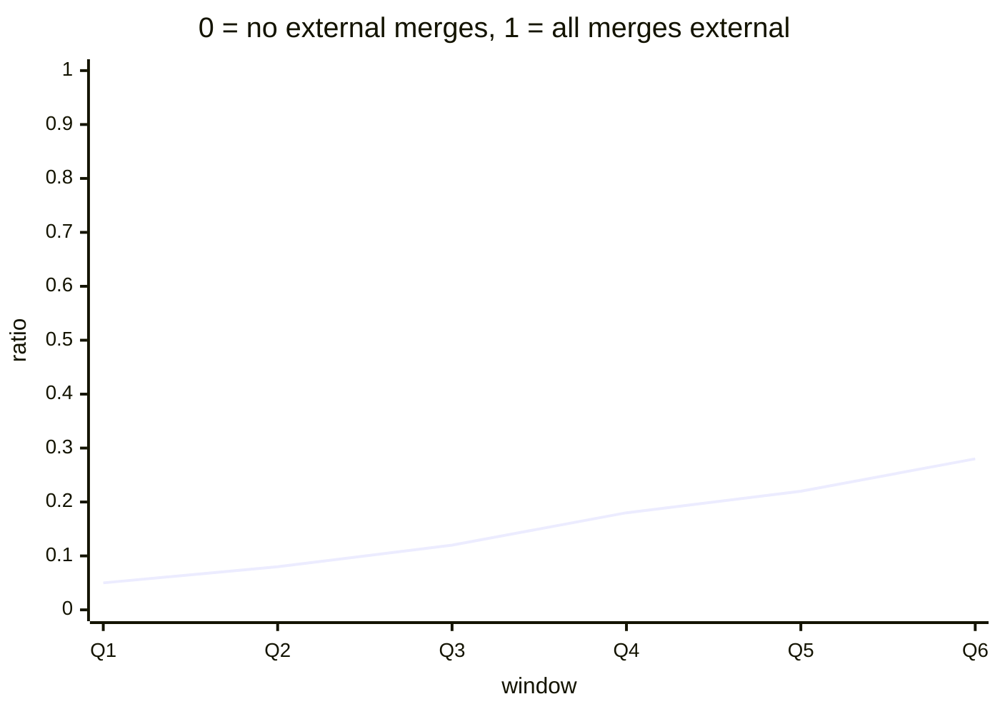

# Reference visualisation — `kpi.contributor_merged_prs_external_ratio@v1`

This is the committed reference-visualisation artifact for the
external-contributor merged-pull-request ratio KPI. It exists so the
G-04 catalog definition-of-done (a *committed* reference visualisation,
not a narrated one) is closed; downstream compile targets (n8n /
Temporal / LangGraph) read the same metric YAML and render the
executable form in their own dashboard surface. The artifact here is
the contract for the chart shape, not the executable chart.

## Chart kind

Ribbon plot of the per-window ratio contributing to the headline
`ratio` aggregate for `kpi.contributor_merged_prs_external_ratio@v1`.
Each point plots one evaluation window (default P90D tumbling) of the
shape declared under `measurement.inputs` on the catalog YAML; the
headline aggregate is the `ratio` roll-up per the catalog
`measurement.aggregation`. Direction `higher_is_better` fixes the
colour convention — higher points are better.

## Reference rendering (Mermaid)

The mermaid block below is the canonical reference rendering — small
enough to live in-tree and renderable directly on the public repo
surface. The numeric values are illustrative; the compile target is
the source of truth for the executable form against the artifacts
declared in `measurement.inputs`.

## Threshold band reference

| name | comparator | value | severity |
|------|------------|-------|----------|
| warn | < | 0.25 | warn |
| breach | < | 0.10 | high |

The bands match the `thresholds` array on
`contributor_merged_prs_external_ratio.yaml`; the catalog entry is the
source of truth, this file is the visualisation surface.

## Source-data shape

The chart's underlying observations are derived from the inputs
declared under `measurement.inputs` on
`contributor_merged_prs_external_ratio.yaml`. Merged-pull-request
events are the atom of measurement; on GitHub-shaped forges they map
to the pull-request merged-event class in the OCSF Application
Activity family. The founding-maintainer set is read from the
project's `GOVERNANCE.md` on the evaluation commit; bot authors are
excluded via the declared predicate. The catalog window is the
tumbling window declared under `measurement.window`, so operators can
compare readings across comparable windows without re-litigating the
shape.

## Operator override

Operators are expected to render this metric in their own dashboard
idiom — the catalog reference rendering above is the contract for
the chart shape, not the visual style. The compile target is the
source of truth for the executable form against the artifacts the
catalog entry binds to.
