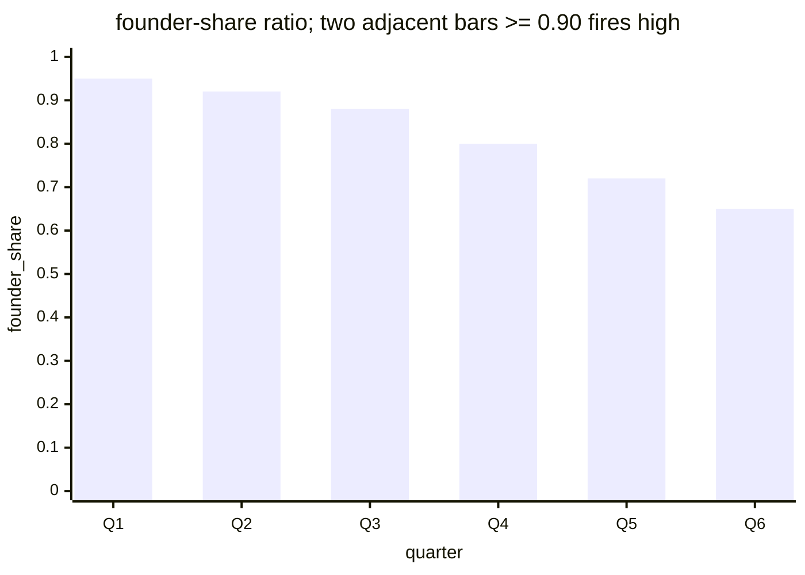

# Reference visualisation — `kri.contributor_pr_ratio_above_90pct@v1`

This is the committed reference-visualisation artifact for the
founding-maintainer merged-pull-request share KRI. It exists so the
G-04 catalog definition-of-done (a *committed* reference visualisation,
not a narrated one) is closed; downstream compile targets (n8n /
Temporal / LangGraph) read the same metric YAML and render the
executable form in their own dashboard surface. The artifact here is
the contract for the chart shape, not the executable chart.

## Chart kind

Stacked-bar chart of the per-quarter merged-pull-request share
contributing to the headline `ratio` aggregate for
`kri.contributor_pr_ratio_above_90pct@v1`. Each bar plots one
quarterly evaluation window of the shape declared under
`measurement.inputs` on the catalog YAML — founder-share stacked
below external-share so the two segments sum to 1.0. The headline
signal is the two-adjacent-bars persistence rule per the catalog
`measurement.formula`. Direction `lower_is_better` fixes the colour
convention — lower founder-share segments are better.

## Reference rendering (Mermaid)

The mermaid block below is the canonical reference rendering — small
enough to live in-tree and renderable directly on the public repo
surface. The numeric values are illustrative; the compile target is
the source of truth for the executable form against the artifacts
declared in `measurement.inputs`.

## Threshold band reference

| name | comparator | value | severity |
|------|------------|-------|----------|
| single_quarter_warn | >= | 0.90 | warn |
| two_quarter_high | >= | 0.90 | high |

The `high` band applies only when the current *and* the immediately
preceding quarter both meet the comparator, per the two-window
persistence rule on `contributor_pr_ratio_above_90pct.yaml`. The
catalog entry is the source of truth, this file is the visualisation
surface.

## Source-data shape

The chart's underlying observations are derived from the inputs
declared under `measurement.inputs` on
`contributor_pr_ratio_above_90pct.yaml`. Merged-pull-request events
are the atom of measurement; the founding-maintainer set is read from
the project's `GOVERNANCE.md` on the evaluation commit; bot authors
are excluded. The catalog window is the quarterly tumbling window
declared under `measurement.window`, so operators can compare readings
across comparable windows without re-litigating the shape.

## Operator override

Operators are expected to render this metric in their own dashboard
idiom — the catalog reference rendering above is the contract for
the chart shape, not the visual style. The compile target is the
source of truth for the executable form against the artifacts the
catalog entry binds to.
