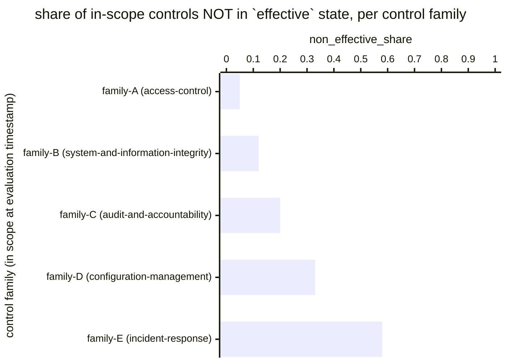

# Reference visualisation — `kri.control_effectiveness@v1`

This is the committed reference-visualisation artifact for the
control-effectiveness KRI. It exists so the G-04 catalog
definition-of-done (a *committed* reference visualisation, not a
narrated one) is closed; downstream compile targets (n8n / Temporal /
LangGraph) read the same metric YAML and render the executable form in
their own dashboard surface. The artifact here is the contract for the
chart shape, not the executable chart.

## Chart kind

Two-panel composition. The headline panel is a single gauge-style
horizontal bar reading the residual-exposure ratio across in-scope
controls — the share of in-scope controls NOT in the `effective`
attestation state, weighted equally across controls. The drill-down
panel is a horizontal bar chart, one bar per control family in scope,
plotting the family-scoped non-effective share so operators can see
which control families are pulling the headline reading upward.
Slicing by `control_family` (the catalog-grouping declared on the
operator's control catalog — typically the OSCAL family axis) is the
canonical drill-down dimension because remediation budget and
attestation cadence are usually allocated at the family scope.

- **Headline (ratio):** the `ratio` aggregate across in-scope
  controls. This is the figure operators read first. Because the KRI
  is `lower_is_better`, a value near zero is healthy and a rising
  value is the residual-exposure signal; threshold bands draw the
  line between healthy, warn, breach, and critical readings.
- **Drill-down x-axis:** family-scoped non-effective share — the
  share of in-scope controls within each control family whose latest
  attestation is anything other than `effective` (i.e. `partially
  effective`, `ineffective`, or `overdue`).
- **Drill-down y-axis:** one row per in-scope control family,
  labelled by the family identifier; sorted descending so the
  families that pulled the headline upward sit at the top — the
  families the attestation programme acts on next.
- **Threshold overlay:** horizontal lines on the headline gauge at
  the `warn` (`> 0.1`), `breach` (`> 0.25`), and `critical` (`> 0.5`)
  values declared on `control_effectiveness.yaml`, so the operator
  reads the band the overall ratio sits in without arithmetic.
  Per-family drill-down bars are not overlaid — the catalog YAML
  pins the unscoped baseline, and operators ship tighter per-family
  targets as separate catalog entries.

## Reference rendering (Mermaid)

The mermaid block below is the canonical reference rendering — small
enough to live in-tree and renderable directly on the public repo
surface. The numeric values are illustrative; the compile target is
the source of truth for the executable form against operator data.

Reading the bars in this illustrative rendering (assume five control
families are in scope across the catalog, with the per-family
in-scope populations implied by the family labels):

| control family (axis)                          | non_effective_share | reading                                                        |
|------------------------------------------------|---------------------|----------------------------------------------------------------|
| family-A (access-control)                      | 0.05                | well below target — strongest family in catalog                |
| family-B (system-and-information-integrity)    | 0.12                | inside warn band — just above 0.1 target floor                 |
| family-C (audit-and-accountability)            | 0.20                | inside warn band — pulls headline upward                       |
| family-D (configuration-management)            | 0.33                | inside breach band — above 0.25 high-severity floor            |
| family-E (incident-response)                   | 0.58                | inside critical band — above 0.5 critical floor                |

Aggregating the five family-scoped numerators and denominators across
the catalog (equal weight per control, not per family), the headline
`ratio` resolves to the control-weighted aggregate non-effective
share over the in-scope population. That value is what the catalog
aggregation `measurement.aggregation: ratio` resolves to for this
snapshot.

## Threshold band reference

| name     | comparator | value (ratio) | severity |
|----------|------------|---------------|----------|
| warn     | >          | 0.1           | warn     |
| breach   | >          | 0.25          | high     |
| critical | >          | 0.5           | critical |

The bands match the `thresholds` array on
`control_effectiveness.yaml`; the catalog entry is the source of
truth, this file is the visualisation surface. Operators under DORA
or NIS2 essential-entity scope typically scope tighter per-family
targets (and a tighter top-level `target.value`) in their own catalog
variants and ship those as separate entries — the unscoped baseline
above is community-recommended, not a regulatory floor.

## OCSF source-data shape

The chart's underlying observations are derived from the operator's
control catalog and attestation programme. Each in-scope control
contributes one sample computed against the `measurement.inputs`
declared on `control_effectiveness.yaml`:

- **in_scope_controls** — set of controls the operator has declared
  in scope. Sourced from the operator's control catalog, typically
  an OSCAL system-security-plan or an equivalent control register
  the catalog entry does not pin to a specific artifact.
- **latest_attestation** — most recent attestation per control as of
  the evaluation timestamp, carrying the effectiveness state
  (`effective`, `partially effective`, `ineffective`) and the
  attestation date. Controls without any attestation, or whose
  latest attestation predates the control's declared review cadence,
  count as `overdue` (i.e. NOT effective) so the indicator does not
  silently improve when the attestation programme stalls.

The catalog entry deliberately does not pin a single OCSF telemetry
binding at the unscoped baseline: control-attestation state is
carried on the operator's own GRC surface (an OSCAL assessment-results
document, a GRC platform's attestation register, or a control
spreadsheet), and there is no unambiguous OCSF event class that
covers the intersection of those surfaces at the catalog level. The
deferral is named honestly — the binding is to the operator's
attestation record, not to an OCSF class. A CORE follow-up may add
an OCSF binding for GRC-scoped variants once the operator's
attestation surface is declared.

The reference rendering above remains shape-valid: it reads an
attestation-state predicate per in-scope control and an in-scope flag
per control family, and computes a ratio, regardless of which GRC
surface the operator's compile target resolves the attestation record
against.

## Operator override

Operators are expected to render this metric in their own dashboard
idiom — the catalog reference rendering above is the contract for the
chart shape (ratio headline with warn / breach / critical overlays,
per-control-family non-effective-share drill-down sliced by control
family), not the visual style. The compile target is the source of
truth for the executable form.
