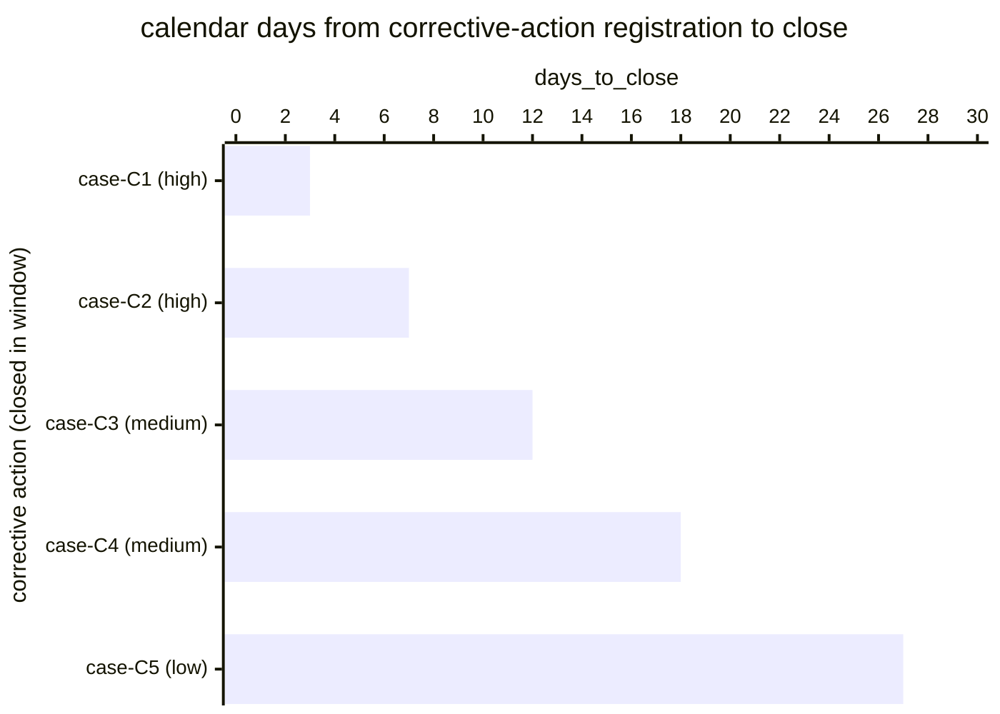

# Reference visualisation — `kpi.corrective_action_close_rate@v1`

This is the committed reference-visualisation artifact for the
corrective-action close-rate KPI. It exists so the G-04 catalog
definition-of-done (a *committed* reference visualisation, not a
narrated one) is closed; downstream compile targets (n8n / Temporal /
LangGraph) read the same metric YAML and render the executable form in
their own dashboard surface. The artifact here is the contract for the
chart shape, not the executable chart.

## Chart kind

Two-panel composition. The headline panel is a single gauge-style
horizontal bar reading the close rate (`ratio`) across in-scope
corrective actions tracked in the evaluation window — the share of
tracked corrective actions that closed within the window divided by
the total corrective-action population in flight. The drill-down
panel is a horizontal bar chart, one bar per corrective action that
crossed the close predicate inside the window, plotting
`days_to_close` — calendar days between the post-incident-review step
that registered the action and the close timestamp. Shorter bars are
faster remediations; longer bars are remediations that lingered. The
canonical drill-down slice is by `severity_band` (the case-derived
severity of the parent incident) because operators usually carry a
per-severity remediation expectation.

- **Headline (ratio):** the `ratio` aggregate across in-scope
  corrective actions tracked in the window. This is the figure
  operators read first.
- **Drill-down x-axis:** `days_to_close` — calendar days from
  corrective-action registration to close, for actions that closed
  within the evaluation window.
- **Drill-down y-axis:** one row per corrective action closed in the
  window, labelled by the parent case `incident.uid` and severity
  band; sorted ascending so the fastest closes sit at the top and
  long-tail closes pull the eye downward.
- **Threshold overlay (drill-down):** none at the unscoped baseline —
  the catalog YAML at `corrective_action_close_rate.yaml` does not
  pin numeric warn / breach values; the operator's
  post-incident-review programme is the source of truth for the
  per-severity expectation, and the catalog ratio reflects the share
  of actions that closed at all within the window.

## Reference rendering (Mermaid)

The mermaid block below is the canonical reference rendering — small
enough to live in-tree and renderable directly on the public repo
surface. The numeric values are illustrative; the compile target is
the source of truth for the executable form against operator data.

Reading the bars in this illustrative rendering (assume eight
corrective actions were in flight across the window and five of them
closed):

| case (severity) | days_to_close | closed in window? | reading                                         |
|-----------------|---------------|-------------------|-------------------------------------------------|
| case-C1 (high)  | 3             | yes               | high-severity action closed inside three days   |
| case-C2 (high)  | 7             | yes               | high-severity action closed inside a week       |
| case-C3 (medium)| 12            | yes               | medium-severity action closed inside two weeks  |
| case-C4 (medium)| 18            | yes               | long-tail medium action — pulled eye downward   |
| case-C5 (low)   | 27            | yes               | low-severity action lingered most of the window |

With five closes against eight tracked corrective actions, the
headline `ratio` resolves to `5 / 8 = 0.625` in this snapshot. That
value is what the catalog aggregation `measurement.aggregation: ratio`
resolves to for this snapshot.

## Threshold band reference

The catalog entry at `corrective_action_close_rate.yaml` is
programme-neutral and does not declare numeric warn / breach
thresholds at the unscoped baseline — the operator's
post-incident-review programme is the source of truth for the
per-severity remediation expectation, and the catalog ratio reflects
the share of in-scope corrective actions that closed in the
evaluation window. Severity-scoped variants (for example a
high-severity-only corrective-action close-rate indicator) declare
numeric bands and live as separate catalog entries. The catalog YAML
at `content/metrics/corrective_action_close_rate.yaml` remains the
source of truth for the indicator shape; this file is the
visualisation surface.

## OCSF source-data shape

The chart's underlying observations are derived from the operator's
post-incident-review programme. Each in-scope corrective action
contributes one sample computed against the `measurement.inputs`
declared on `corrective_action_close_rate.yaml`:

- **numerator** — count of in-scope corrective actions that crossed
  the close predicate within the evaluation window. The close event
  is bound to the corrective-action lifecycle step transition
  declared on the catalog entry's `playbook_refs`:
  - `playbook.post_incident_review@v1`
    `action--40000000-0000-4000-8000-000000000004` — corrective-action
    tracking step on the post-incident-review playbook.
- **denominator** — count of in-scope corrective actions tracked in
  the evaluation window (open at the start of the window plus
  registered during the window). Exclude actions whose lifecycle
  step never fired (record-keeping gap) so the indicator does not
  silently improve when the post-incident-review programme stalls.

The catalog entry deliberately does not pin a single OCSF telemetry
binding at the unscoped baseline: corrective-action lifecycle events
are carried by an operator's own remediation tracker (issue tracker,
GRC platform, action-register spreadsheet), and there is no
unambiguous OCSF event class that covers the intersection of those
trackers at the catalog level. The deferral is named honestly — the
playbook step transition is the binding for the lifecycle event, not
an OCSF class. A CORE follow-up may add an OCSF binding for
tracker-scoped variants once the operator's tracker is declared.

The reference rendering above remains shape-valid: it reads two
timestamps per closed corrective action (the registration timestamp
and the close timestamp) and computes a duration, regardless of which
tracker the operator's compile target resolves the lifecycle event
against.

## Operator override

Operators are expected to render this metric in their own dashboard
idiom — the catalog reference rendering above is the contract for the
chart shape (ratio headline, per-corrective-action days-to-close
drill-down sliced by severity band), not the visual style. The
compile target is the source of truth for the executable form.
