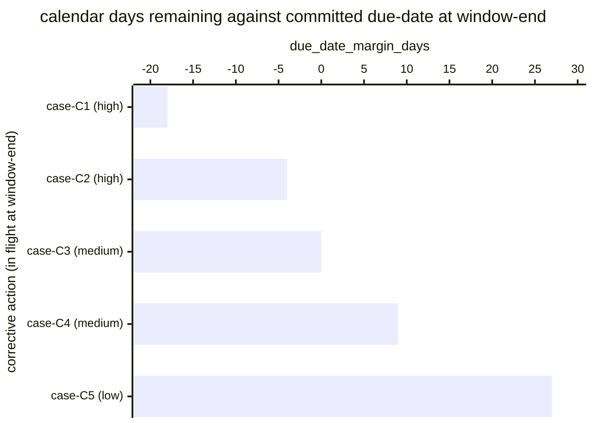

# Reference visualisation — `kri.corrective_action_overdue@v1`

This is the committed reference-visualisation artifact for the
corrective-action overdue KRI. It exists so the G-04 catalog
definition-of-done (a *committed* reference visualisation, not a
narrated one) is closed; downstream compile targets (n8n / Temporal /
LangGraph) read the same metric YAML and render the executable form in
their own dashboard surface. The artifact here is the contract for the
chart shape, not the executable chart.

## Chart kind

Two-panel composition. The headline panel is a single gauge-style
horizontal bar reading the overdue rate (`ratio`) across in-scope
corrective actions tracked in the evaluation window — the share of
tracked corrective actions whose committed due-date has passed without
a close event, divided by the total corrective-action population in
flight. The drill-down panel is a horizontal bar chart, one bar per
in-scope corrective action open at the close of the window, plotting
`due_date_margin_days` — calendar days between the committed due-date
and the window-end timestamp. Negative bars are overdue actions and
contribute the failing samples that pull the KRI off zero; positive
bars are actions still inside their committed window. Slicing by
`severity_band` (the case-derived severity of the parent incident) is
the canonical drill-down dimension because operators usually carry a
per-severity remediation expectation.

- **Headline (ratio):** the `ratio` aggregate across in-scope
  corrective actions tracked in the window. This is the figure
  operators read first. Because the KRI is `lower_is_better`, a value
  near zero is healthy and a rising value is the risk signal.
- **Drill-down x-axis:** `due_date_margin_days` — calendar days
  remaining at the window-end timestamp against the corrective
  action's committed due-date. Negative values left of zero are
  overdue actions; positive values right of zero are actions still
  inside their committed window.
- **Drill-down y-axis:** one row per in-scope corrective action open
  at the close of the window, labelled by the parent case
  `incident.uid` and severity band; sorted ascending so the most
  overdue (largest-negative-margin) actions sit at the top — the
  actions that are pulling the KRI off zero hardest.
- **Threshold overlay (drill-down):** a vertical line at zero — every
  bar left of zero is an overdue sample that contributes a `1` to the
  numerator. Operators reading the drill-down see *which* corrective
  actions pulled the KRI off zero.

## Reference rendering (Mermaid)

The mermaid block below is the canonical reference rendering — small
enough to live in-tree and renderable directly on the public repo
surface. The numeric values are illustrative; the compile target is
the source of truth for the executable form against operator data.

Reading the bars in this illustrative rendering (assume seven
corrective actions are in flight at window-end and three of them are
past their committed due-date):

| case (severity)   | due_date_margin_days | overdue? | reading                                                  |
|-------------------|----------------------|----------|----------------------------------------------------------|
| case-C1 (high)    | -18                  | yes      | high-severity action 18 days past committed due-date     |
| case-C2 (high)    | -4                   | yes      | high-severity action 4 days past committed due-date      |
| case-C3 (medium)  | 0                    | yes      | due-date crossed today — sample contributes to numerator |
| case-C4 (medium)  | 9                    | no       | still inside committed window, comfortable margin        |
| case-C5 (low)     | 27                   | no       | well inside committed window                             |

With three overdue actions across seven in flight at window-end, the
headline `ratio` resolves to `3 / 7 ≈ 0.43` in this snapshot. That
value is what the catalog aggregation `measurement.aggregation: ratio`
resolves to for this snapshot.

## Threshold band reference

The catalog entry at `corrective_action_overdue.yaml` is
programme-neutral and does not declare numeric warn / breach
thresholds at the unscoped baseline — the operator's
post-incident-review programme is the source of truth for the
per-severity remediation expectation, and the catalog ratio reflects
the share of in-scope corrective actions that are past their
committed due-date at the evaluation timestamp. Severity-scoped
variants (for example a high-severity-only corrective-action overdue
KRI) declare numeric bands and live as separate catalog entries. The
catalog YAML at `content/metrics/corrective_action_overdue.yaml`
remains the source of truth for the indicator shape; this file is
the visualisation surface.

## OCSF source-data shape

The chart's underlying observations are derived from the operator's
post-incident-review programme. Each in-scope corrective action open
at the evaluation timestamp contributes one sample computed against
the `measurement.inputs` declared on `corrective_action_overdue.yaml`:

- **numerator** — count of in-scope corrective actions whose
  committed due-date is earlier than the evaluation timestamp and
  whose close event has not yet fired. The lifecycle event is bound
  to the corrective-action lifecycle step transition declared on the
  catalog entry's `playbook_refs`:
  - `playbook.post_incident_review@v1`
    `action--40000000-0000-4000-8000-000000000004` — corrective-action
    tracking step on the post-incident-review playbook.
- **denominator** — count of in-scope corrective actions tracked at
  the evaluation timestamp (open at window-end). Exclude actions
  whose lifecycle step never fired (record-keeping gap) so the
  indicator does not silently improve when the post-incident-review
  programme stalls.

The catalog entry deliberately does not pin a single OCSF telemetry
binding at the unscoped baseline: corrective-action lifecycle events
are carried by an operator's own remediation tracker (issue tracker,
GRC platform, action-register spreadsheet), and there is no
unambiguous OCSF event class that covers the intersection of those
trackers at the catalog level. The deferral is named honestly — the
playbook step transition is the binding for the lifecycle event, not
an OCSF class. A CORE follow-up may add an OCSF binding for
tracker-scoped variants once the operator's tracker is declared.

The reference rendering above remains shape-valid: it reads the
committed due-date and the window-end timestamp per in-flight
corrective action and computes a duration, regardless of which
tracker the operator's compile target resolves the lifecycle event
against.

## Operator override

Operators are expected to render this metric in their own dashboard
idiom — the catalog reference rendering above is the contract for the
chart shape (ratio headline, per-corrective-action due-date-margin
drill-down sliced by severity band, zero-line overdue overlay), not
the visual style. The compile target is the source of truth for the
executable form.
