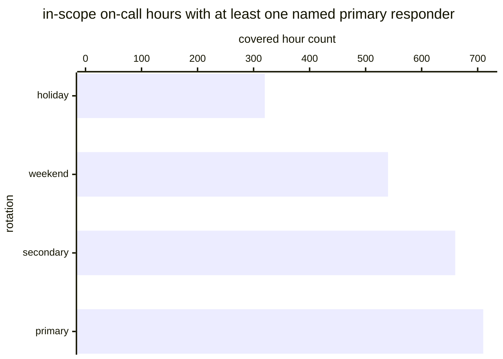

# Reference visualisation — `kpi.coverage_on_call_schedule@v1`

This is the committed reference-visualisation artifact for the
on-call-schedule coverage KPI. It exists so the G-04 catalog
definition-of-done (a *committed* reference visualisation, not a
narrated one) is closed; downstream compile targets (n8n / Temporal /
LangGraph) read the same metric YAML and render the executable form in
their own dashboard surface. The artifact here is the contract for the
chart shape, not the executable chart.

## Chart kind

Stacked horizontal bar chart, one bar per on-call rotation in the
operator's in-scope schedule (primary, secondary, weekend, holiday —
or whichever rotations the operator's paging tool exposes), with each
bar partitioned into a covered band (rotation hours with at least one
named primary responder assigned) and an uncovered band (rotation
hours with no responder bound). The overall ratio
`covered_population / total_population` is the headline figure
operators read first; the per-rotation stacks are the supporting
drill-down that names *where* the schedule gap sits.

- **x-axis:** on-call hour count — number of in-scope rotation hours
  per rotation, partitioned by coverage state.
- **y-axis:** one row per rotation exposed by the operator's paging
  tool (primary, secondary, weekend, holiday), sorted by coverage
  ratio ascending so the worst-covered rotation sits at the top.
- **Stack partition:** two segments per bar — `covered` (hours with a
  named primary responder) and `uncovered` (hours with no responder
  bound).
- **Threshold overlays:** horizontal lines at the `warn` (0.95) and
  `breach` (0.8) ratio values, drawn on a companion ratio gauge / axis
  next to the bar chart, so the operator reads the band the overall
  ratio sits in without arithmetic.
- **Headline annotation:** the overall
  `covered_population / total_population` ratio across all in-scope
  rotation hours, annotated as the metric value with the threshold
  band it falls in.

## Reference rendering (Mermaid)

The mermaid block below is the canonical reference rendering — small
enough to live in-tree and renderable directly on the public repo
surface. The numeric values are illustrative; the compile target is
the source of truth for the executable form against operator data.

Reading the bars in this illustrative rendering (assume each rotation
has 720 in-scope hours over the P30D window, so the bar value is the
`covered` count out of 720):

| rotation         | covered / in-scope | ratio | reading                                       |
|------------------|--------------------|-------|-----------------------------------------------|
| primary          | 710 / 720          | 0.99  | above target — clear of warn band             |
| secondary        | 660 / 720          | 0.92  | inside warn band — below 0.95 target floor    |
| weekend          | 540 / 720          | 0.75  | inside breach band — below 0.8 critical floor |
| holiday          | 320 / 720          | 0.44  | inside breach band — worst-covered rotation   |

The headline `covered_population / total_population` figure here is
`(710+660+540+320) / (4·720) = 2230/2880 = 0.77` — inside the breach
band, just below the 0.8 critical floor. That value is what the
catalog aggregation `measurement.aggregation: ratio` resolves to for
this snapshot.

## Threshold band reference

| name      | comparator | value (ratio) | severity  |
|-----------|------------|---------------|-----------|
| warn      | <          | 0.95          | warn      |
| breach    | <          | 0.8           | high      |

The bands match the `thresholds` array on
`coverage_on_call_schedule.yaml`; the catalog entry is the source of
truth, this file is the visualisation surface.

## OCSF source-data shape

The chart's underlying observations are derived from the operator's
on-call paging tool. Each in-scope on-call hour contributes a
`(rotation, hour_bucket, covered?)` sample computed against the
`measurement.inputs` declared on `coverage_on_call_schedule.yaml`:

- **covered_population** — count of in-scope rotation hours with at
  least one named primary responder assigned. The assignment event is
  bound to the on-call-rotation playbook step transition declared on
  the catalog entry's `playbook_refs`:
  - `playbook.on_call_rotation@v1`
    `action--30000000-0000-4000-8000-000000000002` — schedule-assignment
    step on the on-call-rotation playbook.
- **total_population** — count of in-scope rotation hours the operator
  believes should be staffed, per the operator's schedule policy.
  Exclude rotation hours whose in-scope state is unknown so the
  indicator does not silently improve on record-keeping gaps.

The catalog entry deliberately does not pin a single OCSF telemetry
binding at the unscoped baseline: on-call schedule assignments are
carried by an operator's own paging tool, and there is no unambiguous
OCSF event class that covers schedule-assignment events at the catalog
level. The deferral is named honestly — the playbook step transition
is the binding for the assignment event, not an OCSF class. A CORE
follow-up may add an OCSF binding for tool-scoped variants once the
operator's paging tool is declared.

The reference rendering above remains shape-valid: it reads one
`(rotation, hour_bucket, covered?)` sample per in-scope on-call hour
and partitions by rotation, regardless of which paging tool the
operator's compile target resolves the assignment event against.

## Operator override

Operators are expected to render this metric in their own dashboard
idiom — the catalog reference rendering above is the contract for the
chart shape (per-rotation stacked horizontal bars, threshold overlays
on a companion ratio axis, overall
`covered_population / total_population` headline), not the visual
style. The compile target is the source of truth for the executable
form.
