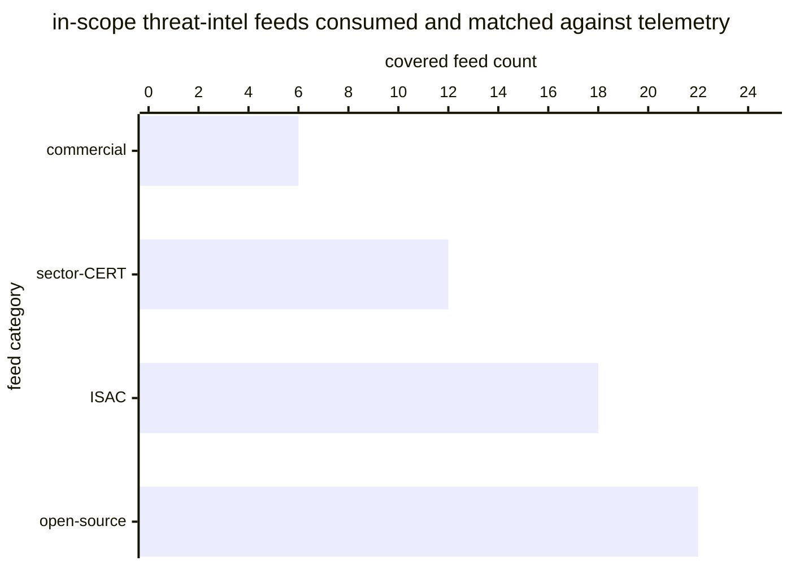

# Reference visualisation — `kpi.coverage_threat_intel_feed@v1`

This is the committed reference-visualisation artifact for the
threat-intel-feed coverage KPI. It exists so the G-04 catalog
definition-of-done (a *committed* reference visualisation, not a
narrated one) is closed; downstream compile targets (n8n / Temporal /
LangGraph) read the same metric YAML and render the executable form in
their own dashboard surface. The artifact here is the contract for the
chart shape, not the executable chart.

## Chart kind

Stacked horizontal bar chart, one bar per in-scope threat-intel feed
category (open-source / ISAC / commercial / sector-CERT — or whichever
feed-source categories the operator has declared relevant), with each
bar partitioned into a covered band (feeds the operator is currently
consuming and matching against telemetry) and an uncovered band (feeds
the operator has identified as relevant but is not yet consuming). The
overall ratio `covered_population / total_population` is the headline
figure operators read first; the per-category stacks are the
supporting drill-down that names *where* the feed gap sits.

- **x-axis:** feed count — number of in-scope feeds per category,
  partitioned by coverage state.
- **y-axis:** one row per feed-source category (open-source, ISAC,
  commercial, sector-CERT), sorted by coverage ratio ascending so the
  worst-covered category sits at the top.
- **Stack partition:** two segments per bar — `covered` (feeds being
  consumed and matched against telemetry) and `uncovered` (in-scope
  feeds with no ingest binding).
- **Threshold overlays:** horizontal lines at the `warn` (0.95) and
  `breach` (0.8) ratio values, drawn on a companion ratio gauge / axis
  next to the bar chart, so the operator reads the band the overall
  ratio sits in without arithmetic.
- **Headline annotation:** the overall
  `covered_population / total_population` ratio across all in-scope
  feeds, annotated as the metric value with the threshold band it
  falls in.

## Reference rendering (Mermaid)

The mermaid block below is the canonical reference rendering — small
enough to live in-tree and renderable directly on the public repo
surface. The numeric values are illustrative; the compile target is
the source of truth for the executable form against operator data.

Reading the bars in this illustrative rendering (assume each category
has 25 in-scope feeds, so the bar value is the `covered` count out of
25):

| feed category    | covered / in-scope | ratio | reading                                       |
|------------------|--------------------|-------|-----------------------------------------------|
| open-source      | 22 / 25            | 0.88  | inside warn band — below 0.95 target floor    |
| ISAC             | 18 / 25            | 0.72  | inside breach band — below 0.8 critical floor |
| sector-CERT      | 12 / 25            | 0.48  | inside breach band — well below floor         |
| commercial       | 6 / 25             | 0.24  | inside breach band — worst-covered category   |

The headline `covered_population / total_population` figure here is
`(22+18+12+6) / (4·25) = 58/100 = 0.58` — inside the breach band, well
below the 0.8 critical floor. That value is what the catalog
aggregation `measurement.aggregation: ratio` resolves to for this
snapshot.

## Threshold band reference

| name      | comparator | value (ratio) | severity  |
|-----------|------------|---------------|-----------|
| warn      | <          | 0.95          | warn      |
| breach    | <          | 0.8           | high      |

The bands match the `thresholds` array on
`coverage_threat_intel_feed.yaml`; the catalog entry is the source of
truth, this file is the visualisation surface.

## OCSF source-data shape

The chart's underlying observations are derived from the operator's
threat-intel ingest pipeline. Each in-scope feed contributes a
`(feed_uid, feed_category, covered?)` sample computed against the
`measurement.inputs` declared on `coverage_threat_intel_feed.yaml`:

- **covered_population** — count of in-scope feeds the operator is
  currently consuming and matching against telemetry. The ingest event
  is bound to the threat-intel-ingest playbook step transition
  declared on the catalog entry's `playbook_refs`:
  - `playbook.threat_intel_ingest@v1`
    `action--10000000-0000-4000-8000-000000000002` — feed-ingest step
    on the threat-intel-ingest playbook.
- **total_population** — count of in-scope feeds the community or
  operator has identified as relevant per the operator's scoping
  artifact. Exclude feeds whose in-scope state is unknown so the
  indicator does not silently improve on record-keeping gaps.

The catalog entry deliberately does not pin a single OCSF telemetry
binding at the unscoped baseline: threat-intel feed ingestion is
carried by an operator's own ingest pipeline, and there is no
unambiguous OCSF event class that covers feed-ingest events across the
open-source / ISAC / commercial / sector-CERT split at the catalog
level. The deferral is named honestly — the playbook step transition
is the binding for the ingest event, not an OCSF class. A CORE
follow-up may add an OCSF binding for category-scoped variants once
the operator's ingest pipeline is declared.

The reference rendering above remains shape-valid: it reads one
`(feed_uid, feed_category, covered?)` sample per in-scope feed and
partitions by feed category, regardless of which ingest pipeline the
operator's compile target resolves the ingest event against.

## Operator override

Operators are expected to render this metric in their own dashboard
idiom — the catalog reference rendering above is the contract for the
chart shape (per-feed-category stacked horizontal bars, threshold
overlays on a companion ratio axis, overall
`covered_population / total_population` headline), not the visual
style. The compile target is the source of truth for the executable
form.
