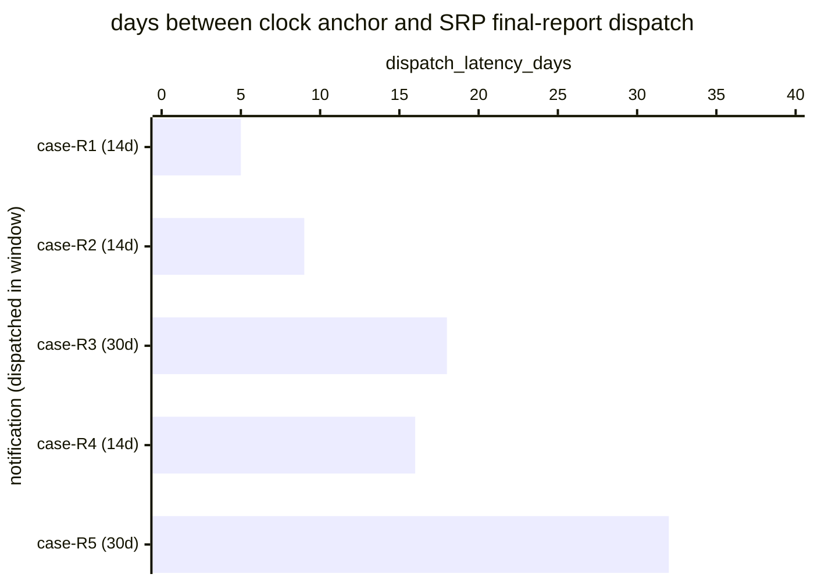

# Reference visualisation — `kri.cra_final_report_latency_days@v1`

This is the committed reference-visualisation artifact for the CRA
Article 14 final-report dispatch-latency KRI. It exists so the G-04
catalog definition-of-done (a *committed* reference visualisation,
not a narrated one) is closed; downstream compile targets (n8n /
Temporal / LangGraph) read the same metric YAML and render the
executable form in their own dashboard surface. The artifact here is
the contract for the chart shape, not the executable chart.

## Chart kind

Two-panel composition. The headline panel is a single gauge-style
horizontal bar reading the max dispatch latency (`days`) across CRA
final-report dispatches in the evaluation window, plotted against
the catalog `warn` / `high` / `breach` thresholds (10d / 14d / 30d)
and the two statutory bounds — 14 days after corrective-measure
availability for Art. 14(2) actively-exploited-vulnerability cases,
30 days after awareness for Art. 14(3) severe-incident cases.
Direction is `lower_is_better`: an Art. 14(2) case above 14 days is
a statutory overrun; a case above 30 days is a statutory overrun
under either regime. The drill-down panel is a horizontal bar chart,
one bar per final-report dispatched in the window, plotting
`dispatch_latency_days` — days between the applicable clock anchor
and the SRP submission. Slicing by `__clock_kind__`
(actively-exploited-vulnerability vs severe-incident) is the
canonical drill-down dimension because each regime binds a different
per-case bound.

- **Headline (max):** the worst-case latency across dispatches in the
  window. This is the figure the operator's risk surface reads
  first — the case that came closest to (or beyond) its per-case
  statutory wall.
- **Drill-down x-axis:** `dispatch_latency_days` — days between the
  applicable clock anchor and the SRP dispatch. The clock anchor is
  the corrective-measure-available timestamp for Art. 14(2) cases
  and the awareness timestamp for Art. 14(3) cases.
- **Drill-down y-axis:** one row per final-report dispatched in the
  window, labelled by the case `incident.uid` and `__clock_kind__`;
  sorted descending so the longest latencies (and any overruns) sit
  at the top — the cases that lift the max.
- **Threshold overlay (drill-down):** three vertical lines at 10d
  (warn), 14d (high / Art. 14(2) statutory bound), and 30d (breach
  / Art. 14(3) statutory bound). An Art. 14(2) bar right of the 14d
  line is a statutory overrun; any bar right of the 30d line is a
  statutory overrun under either regime.

## Reference rendering (Mermaid)

The mermaid block below is the canonical reference rendering — small
enough to live in-tree and renderable directly on the public repo
surface. The numeric values are illustrative; the compile target is
the source of truth for the executable form against operator data.

Reading the bars in this illustrative rendering:

| case (regime)               | dispatch_latency_days | band     | reading                                                              |
|-----------------------------|-----------------------|----------|----------------------------------------------------------------------|
| case-R1 (Art. 14(2) 14d)    | 5                     | ok       | inside 10d — comfortable slack                                       |
| case-R2 (Art. 14(2) 14d)    | 9                     | ok       | inside 10d — comfortable slack                                       |
| case-R3 (Art. 14(3) 30d)    | 18                    | high     | above 14d — Art. 14(3) case still inside its 30-day bound            |
| case-R4 (Art. 14(2) 14d)    | 16                    | high     | above 14d — statutory overrun under Art. 14(2), reasons required     |
| case-R5 (Art. 14(3) 30d)    | 32                    | breach   | above 30d — statutory overrun under Art. 14(3), reasons required     |

With one Art. 14(3) overrun in the window the max resolves to `32`
days — inside the `breach` band (`> 30`). That value is what the
catalog aggregation `measurement.aggregation: max` resolves to for
this snapshot. Note the `high` band is the tighter Art. 14(2) bound:
case-R4 shows why the two-tier `high` / `breach` split matters —
without it, an Art. 14(2) case that overran its 14-day bound would
sit in the same band as an Art. 14(3) case still comfortably inside
its 30-day bound.

## Threshold band reference

| name   | comparator | value | severity |
|--------|------------|-------|----------|
| warn   | >          | 10    | warn     |
| high   | >          | 14    | high     |
| breach | >          | 30    | critical |

The bands match the `thresholds` array on
`cra_final_report_latency_days.yaml`; the catalog entry is the
source of truth, this file is the visualisation surface. The catalog
`target` (`<= 14`) is the tighter Art. 14(2) statutory ceiling; the
`high` threshold pins the same 14-day bound so an Art. 14(2) case
overrunning it surfaces as high, and the `breach` threshold pins the
looser Art. 14(3) 30-day bound so a case above it is a statutory
overrun under either regime.

## OCSF source-data shape

The chart's underlying observations are derived from the operator's
CRA SRP notification chain. Each final-report dispatched in the
evaluation window contributes one `dispatch_latency_days` sample
computed from the inputs declared in
`cra_final_report_latency_days.yaml`'s `measurement.inputs`:

- `clock_anchor_timestamp` — corrective-measure-available timestamp
  for Art. 14(2) cases, awareness timestamp for Art. 14(3) cases;
  selected at dispatch by the operator's SRP notification chain
  against the `__clock_kind__` playbook variable. Bound to
  `telemetry.ocsf.compliance_finding@v1` field `start_time` on the
  final-report submission event.
- `notification_dispatch` — the regulator-notification chain step
  transition that dispatches the final report through the SRP.
  Bound to `telemetry.ocsf.compliance_finding@v1` field `time` on
  the final-report submission event.
- `clock_kind` — the `__clock_kind__` playbook variable carried
  through the notification chain, used by the compile target to pick
  the per-case bound the latency is measured against.

The latency samples that drive the max headline are
`notification_dispatch.time - clock_anchor_timestamp.start_time`
converted to days, with the per-case bound recorded alongside so a
reviewer reading the drill-down can distinguish an Art. 14(2) miss
from an Art. 14(3) miss.

## Operator override

Operators are expected to render this metric in their own dashboard
idiom — the catalog reference rendering above is the contract for
the chart shape (max headline, per-dispatch horizontal bars sliced
by `__clock_kind__`, three statutory-clock threshold overlays), not
the visual style. The compile target is the source of truth for the
executable form.
