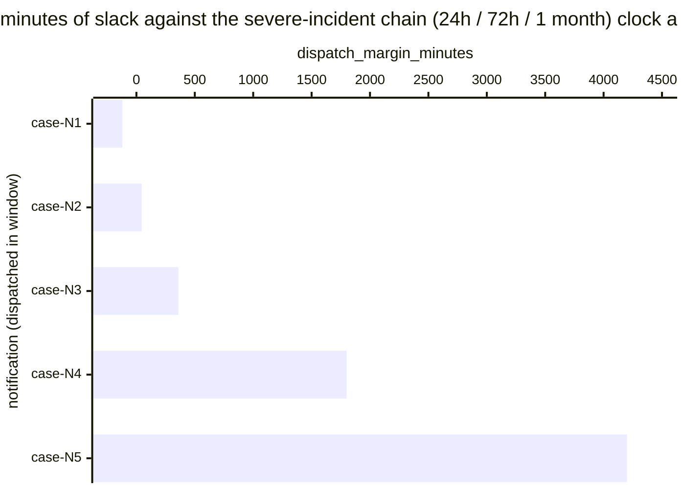

# Reference visualisation — `kpi.cra_severe_incident_on_time@v1`

This is the committed reference-visualisation artifact for the CRA
Article 14(3) severe-incident chain (24h / 72h / 1 month) on-time-rate KPI. It exists so the
G-04 catalog definition-of-done (a *committed* reference
visualisation, not a narrated one) is closed; downstream compile
targets (n8n / Temporal / LangGraph) read the same metric YAML and
render the executable form in their own dashboard surface. The
artifact here is the contract for the chart shape, not the executable
chart.

## Chart kind

Two-panel composition. The headline panel is a single gauge-style
horizontal bar reading the on-time rate (`ratio`) against the
catalog `warn` and `breach` thresholds. The drill-down panel is a
horizontal bar chart, one bar per CRA Article 14(3) notification
dispatched within the evaluation window, plotting
`dispatch_margin_minutes` — minutes between the dispatch timestamp
and the clock deadline. Positive bars are on-time slack; negative
bars are clock overruns and contribute the failing samples that pull
the ratio below 1.00.

- **Headline (ratio):** the `ratio` aggregate across dispatched
  notifications in the evaluation window, rendered against the
  `warn` (< 1.00) and `breach` (< 0.95) bands from the catalog
  entry. This is the figure operators read first.
- **Drill-down x-axis:** `dispatch_margin_minutes` — minutes
  remaining at dispatch against the severe-incident chain (24h / 72h / 1 month) clock. Positive
  values left-to-right are on-time slack; negative values left of
  zero are clock overruns.
- **Drill-down y-axis:** one row per dispatched notification in the
  window, labelled by the case `incident.uid`. Sorted ascending so
  the slimmest margins (and any overruns) sit at the top — the cases
  that are about to break the rate.
- **Threshold overlay (drill-down):** a vertical line at zero —
  every bar left of zero is a sample that failed the on-time clock
  and contributes a `1` to the denominator without contributing a
  `1` to the numerator. Operators reading the drill-down see *which*
  cases pulled the ratio off 1.00.

## Reference rendering (Mermaid)

The mermaid block below is the canonical reference rendering — small
enough to live in-tree and renderable directly on the public repo
surface. The numeric values are illustrative; the compile target is
the source of truth for the executable form against operator data.

Reading the bars in this illustrative rendering:

| case    | dispatch_margin_minutes | on-time? | reading                                                |
|---------|-------------------------|----------|--------------------------------------------------------|
| case-N1 | -120                    | no       | clock overrun — Art. 14 "reasons for the delay" req'd  |
| case-N2 | 45                      | yes      | dispatched 45 min before the deadline — thin slack     |
| case-N3 | 360                     | yes      | comfortable slack, well inside the clock               |
| case-N4 | 1800                    | yes      | mid-window dispatch, healthy slack                     |
| case-N5 | 4200                    | yes      | early dispatch, large slack                            |

With one overrun across five dispatches, the headline `ratio`
resolves to `4 / 5 = 0.80` — inside the `breach` band (< 0.95).
That value is what the catalog aggregation
`measurement.aggregation: ratio` resolves to for this snapshot.

## Threshold band reference

| name      | comparator | value  | severity  |
|-----------|------------|--------|-----------|
| warn      | <          | 1.00   | warn      |
| breach    | <          | 0.95   | critical  |

The bands match the `thresholds` array on `cra_severe_incident_on_time.yaml`; the catalog
entry is the source of truth, this file is the visualisation surface.
The catalog `target` (`>= 1.00`) is the floor every dispatch is
expected to clear.

## OCSF source-data shape

The chart's underlying observations are derived from the operator's
CRA Article 14(3) reporting pipeline. Each dispatched notification in
the evaluation window contributes one `dispatch_margin_minutes`
sample computed from the two inputs declared in `cra_severe_incident_on_time.yaml`'s
`measurement.inputs`:

- `awareness_timestamp` — the operator-awareness timestamp recorded
  by the CRA reporting trigger assessment step, used as the start
  of the severe-incident chain (24h / 72h / 1 month) clock.
- `notification_dispatch` — the regulator-notification chain step
  transition that dispatches the severe-incident chain (24h / 72h / 1 month) notification to the
  coordinator CSIRT / ENISA single reporting platform.

The on-time predicate for the ratio is
`(notification_dispatch - awareness_timestamp) <= clock`, where
`clock` is the severe-incident chain (24h / 72h / 1 month) clock defined by CRA Article 14(3).
Excluded from the denominator: in-scope cases whose dispatch step
never fired — so the indicator does not silently improve when the
notification pipeline stalls.

The catalog entry deliberately does not pin a single OCSF telemetry
binding at the unscoped baseline (a CORE follow-up will add an OCSF
binding for the dispatch event once it is declared at the catalog
level). The reference rendering above remains shape-valid: it reads
two timestamps per dispatched notification and computes a duration,
regardless of which OCSF classes carry them.

## Operator override

Operators are expected to render this metric in their own dashboard
idiom — the catalog reference rendering above is the contract for
the chart shape (ratio headline, per-notification horizontal bars,
zero-line overlay marking the on-time predicate), not the visual
style. The compile target is the source of truth for the executable
form.
