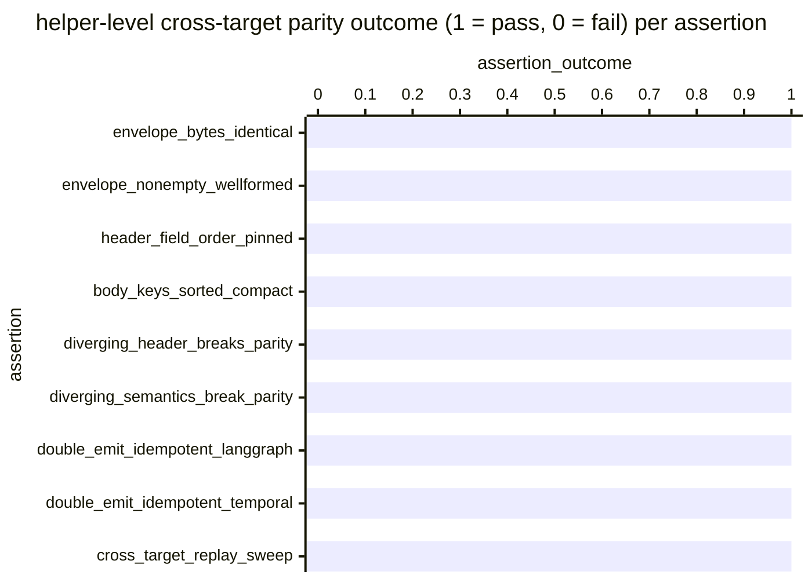

# Reference visualisation — `kpi.cross_target_audit_envelope_parity_rate@v1`

This is the committed reference-visualisation artifact for the
cross-target audit-envelope byte-parity KPI. It exists so the G-04
catalog definition-of-done (a *committed* reference visualisation,
not a narrated one) is closed; downstream compile targets (n8n /
Temporal / LangGraph) read the same metric YAML and render the
executable form in their own dashboard surface. The artifact here is
the contract for the chart shape, not the executable chart.

## Chart kind

Two-panel composition. The headline panel is a single gauge-style
horizontal bar reading the cross-target audit-envelope `ratio` —
the share of helper-level cross-target parity assertions in
``tests/compilers/_shared/test_audit_mirror_cross_target_parity.py``
that pass on the evaluation commit, divided by the total assertion
population the file exercises. The drill-down panel is a horizontal
bar chart, one bar per assertion observed, plotting the assertion
outcome encoded as `1` (pass) or `0` (fail). Slicing by assertion
class (positive-parity / negative-parity / shape-pin) is the
canonical drill-down dimension because the contract is structurally
three-layer — the helper must produce identical bytes for
equivalent semantic inputs, MUST break parity on divergent inputs,
and MUST keep its serialisation shape pinned.

- **Headline (ratio):** the `ratio` aggregate across helper-level
  cross-target parity assertions on the evaluation commit. Because
  the KPI is `higher_is_better`, a reading of `1.00` is the floor
  (target value) and any reading below `1.00` is a cross-target
  helper-level non-determinism the project shipped.
- **Drill-down x-axis:** one row per assertion in
  ``test_audit_mirror_cross_target_parity.py``, labelled by the
  test-function name (or function + parametrised label); sorted so
  the failed assertions sit at the top.
- **Drill-down y-axis:** assertion outcome encoded as `0` (fail —
  the helper-level cross-target parity assertion is red) or `1`
  (pass — the assertion is green).
- **Threshold overlay (drill-down):** a horizontal line at `1` —
  every bar below the line is a fail sample. Operators reading the
  drill-down see *which* helper-level invariant pulled the ratio
  off `1.00`.

## Reference rendering (Mermaid)

The mermaid block below is the canonical reference rendering — small
enough to live in-tree and renderable directly on the public repo
surface. The numeric values are illustrative; the compile target is
the source of truth for the executable form against the
cross-target audit-envelope parity test file at evaluation time.

Reading the bars in this illustrative rendering:

| assertion                                                       | outcome | fail? | reading                                                                                |
|-----------------------------------------------------------------|---------|-------|----------------------------------------------------------------------------------------|
| envelope_bytes_identical                                        | 1       | no    | helper-level cross-target envelope bytes are equal across the two emitter shapes       |
| envelope_nonempty_wellformed                                    | 1       | no    | envelopes produced by either emitter shape are non-empty and well-formed               |
| header_field_order_pinned                                       | 1       | no    | envelope header field order is pinned across the two emitter shapes                    |
| body_keys_sorted_compact                                        | 1       | no    | body attribute keys are sorted and the JSON is compact                                 |
| diverging_header_breaks_parity                                  | 1       | no    | parity correctly breaks when the header compile_target diverges                        |
| diverging_semantics_break_parity                                | 1       | no    | parity correctly breaks when the semantic input diverges                               |
| double_emit_idempotent_langgraph                                | 1       | no    | re-driving the LangGraph emitter shape is a no-op                                      |
| double_emit_idempotent_temporal                                 | 1       | no    | re-driving the Temporal emitter shape is a no-op                                       |
| cross_target_replay_sweep                                       | 1       | no    | sweep of cross-target replays holds parity across the population                       |

With zero failures across nine assertions, the headline `ratio`
resolves to `9 / 9 = 1.00` in this snapshot. Because direction is
`higher_is_better`, a falling value is the cross-target helper-level
non-determinism signal — the cross-target parity suite is the
F-CR-04 helper-level contract and a drop below `1.00` means the
helper itself is non-deterministic across compile targets. That
value is what the catalog aggregation
`measurement.aggregation: ratio` resolves to for this snapshot.

## Threshold band reference

| name   | comparator | value (ratio) | severity |
|--------|------------|---------------|----------|
| warn   | <          | 1.0           | warn     |
| breach | <          | 0.90          | high     |

The bands match the `thresholds` array on
`cross_target_audit_envelope_parity_rate.yaml`; the catalog entry
is the source of truth, this file is the visualisation surface.
The `warn` band fires on any helper-level cross-target failure;
the `breach` band fires when more than 10 % of the helper-level
contract is red, the practical level at which the per-example
goldens cannot honestly attest to portability.

## Test-artifact source-data shape

The chart's underlying observations are derived from the
helper-level cross-target parity suite at
``tests/compilers/_shared/test_audit_mirror_cross_target_parity.py``.
Each test function (and each parametrised invocation thereof)
contributes one observation computed against the
`measurement.inputs` declared on
`cross_target_audit_envelope_parity_rate.yaml`:

- **`cross_target_envelope_bytes_assertion`** —
  positive-parity: two emitter-shaped call patterns fed equivalent
  semantic inputs produce byte-identical envelopes.
- **`cross_target_envelope_negative_assertion`** —
  negative-parity: divergent header or divergent semantics correctly
  breaks byte equality (so the positive assertion is non-vacuous).
- **`cross_target_envelope_shape_pin_assertion`** — shape-pin:
  header field order is pinned and body keys are sorted with
  compact JSON, so future changes to the envelope serialisation
  fail loudly at the helper level.

Per-assertion observations are counted once per evaluation commit;
the catalog window is `P1D` and tumbling because the suite runs
against a discrete commit, not against an operator's runtime
telemetry stream.

## Operator override

Operators are expected to render this metric in their own dashboard
idiom — the catalog reference rendering above is the contract for
the chart shape (ratio headline, per-assertion drill-down sliced
by assertion class, pass-floor overlay at `1`), not the visual
style. The compile target is the source of truth for the executable
form.
