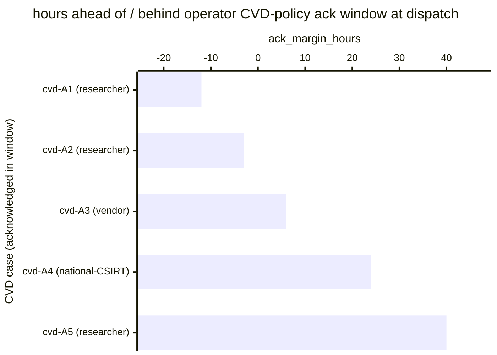

# Reference visualisation — `kpi.cvd_ack_sla@v1`

This is the committed reference-visualisation artifact for the CRA
Article 14 §6 coordinated-vulnerability-disclosure
acknowledgement-to-reporter on-time-rate KPI. It exists so the G-04
catalog definition-of-done (a *committed* reference visualisation,
not a narrated one) is closed; downstream compile targets (n8n /
Temporal / LangGraph) read the same metric YAML and render the
executable form in their own dashboard surface. The artifact here is
the contract for the chart shape, not the executable chart.

## Chart kind

Horizontal bar chart, one bar per CVD case whose intake fell in the
evaluation window and whose `ack_to_reporter` step fired. The bar
value is `ack_margin_hours`: hours by which the acknowledgement
dispatch preceded the operator's documented CVD-policy
acknowledgement window boundary. Positive bars are on-time cases;
negative bars are cases the acknowledgement pipeline delivered late.
A vertical line at zero marks the on-time predicate and the ratio
aggregate (`on_time_count / dispatched_count`) is annotated as the
headline figure against the `warn` (<1.00) and `breach` (<0.95)
bands.

- **Headline (ratio):** `on_time_count / dispatched_count` over
  cases whose intake fell in the window. Because the KPI is
  `higher_is_better`, the target is `1.00`; any reading below is a
  reportable compliance exception on the operator's CVD-policy
  surface.
- **Bar x-axis:** `ack_margin_hours` — hours between the
  acknowledgement dispatch and the operator's documented
  CVD-policy acknowledgement-window boundary computed against
  intake. Positive right-of-zero values are on-time cases; negative
  left-of-zero values are late cases.
- **Bar y-axis:** one row per CVD case acknowledged in the window,
  labelled by the case identifier and disclosure source (researcher
  / vendor-coordination / national-CSIRT); sorted ascending by
  margin so the most-overdue cases sit at the top — the cases the
  operator's CVD lane owes the biggest catch-up on.
- **Threshold overlay:** a vertical line at `0` — every bar left of
  zero is a late sample that pulls the ratio away from `1.00`.
  Operators reading the drill-down see *which* CVD cases pulled the
  KPI off target.

## Reference rendering (Mermaid)

The mermaid block below is the canonical reference rendering — small
enough to live in-tree and renderable directly on the public repo
surface. The numeric values are illustrative; the compile target is
the source of truth for the executable form against operator data.

Reading the bars in this illustrative rendering:

| case (source)           | ack_margin_hours | on-time? | reading                                                          |
|-------------------------|------------------|----------|------------------------------------------------------------------|
| cvd-A1 (researcher)     | -12              | no       | acknowledgement dispatched 12h past documented CVD window        |
| cvd-A2 (researcher)     | -3               | no       | acknowledgement dispatched 3h past documented CVD window         |
| cvd-A3 (vendor)         | 6                | yes      | vendor-coordinated case acknowledged 6h inside window            |
| cvd-A4 (national-CSIRT) | 24               | yes      | CSIRT-routed case acknowledged 24h ahead of window boundary      |
| cvd-A5 (researcher)     | 40               | yes      | researcher report acknowledged 40h ahead of window boundary      |

With two late cases and three on-time cases at window-end, the
headline ratio resolves to `3/5 = 0.60` in this snapshot — below the
`breach` threshold (`<0.95`) and therefore a high-severity signal.
Because direction is `higher_is_better`, a higher reading is better —
`1.00` is the target and any reading below is a documented-CVD-policy
exception the operator carries on their audit surface. That value is
what the catalog aggregation `measurement.aggregation: ratio`
resolves to for this snapshot.

## Threshold band reference

| name   | comparator | value (ratio) | severity |
|--------|------------|---------------|----------|
| warn   | <          | 1.00          | warn     |
| breach | <          | 0.95          | high     |

The bands match the `thresholds` array on `cvd_ack_sla.yaml`; the
catalog entry is the source of truth, this file is the visualisation
surface. Operators under CRA Article 14 §6 scope typically pin the
acknowledgement window in their own CVD policy — the KPI reads
on-time-ness against whichever window the operator declares, and the
band shape above is the community-recommended baseline aligned with
ISO/IEC 29147.

## OCSF source-data shape

The chart's underlying observations are derived from the operator's
coordinated-vulnerability-disclosure intake ledger and the cra_cvd
playbook's step-level telemetry. Each CVD case whose intake fell in
the window contributes one `ack_margin_hours` sample computed
against the `measurement.inputs` declared on `cvd_ack_sla.yaml`:

- **`intake_timestamp`** — operator-intake timestamp emitted by the
  cra_cvd intake step. The intake event is bound to the cra_cvd
  intake step transition declared on the catalog entry's
  `playbook_refs`:
  - `playbook.cra_cvd@v1`
    `action--c7d51014-0000-4000-8000-000000000002` — intake step on
    the cra_cvd playbook.
- **`ack_dispatch`** — reporter-acknowledgement dispatch step
  transition that emits the durable acknowledgement to the reporter
  carrying `__case_id__` and the operator's CVD-policy reference.
  Carried on the OCSF Compliance Finding event the cra_cvd
  ack_to_reporter step emits (status_id transition into the
  acknowledged state):
  - `playbook.cra_cvd@v1`
    `action--c7d51014-0000-4000-8000-000000000003` —
    ack_to_reporter step on the cra_cvd playbook.

Cases whose intake fell in the window but whose ack_to_reporter step
never fired do not contribute to this KPI — they surface on
`kri.cvd_intake_aging@v1` as an open-backlog signal instead, so the
two indicators are complementary: the KPI here reads on-time-ness of
the acknowledgements that were dispatched; the sibling KRI reads the
open backlog of intakes that have not yet been acknowledged.

## Operator override

Operators are expected to render this metric in their own dashboard
idiom — the catalog reference rendering above is the contract for
the chart shape (ratio headline, per-case ack_margin_hours
drill-down sliced by disclosure source, on-time-floor overlay at
`0`), not the visual style. The compile target is the source of
truth for the executable form.
