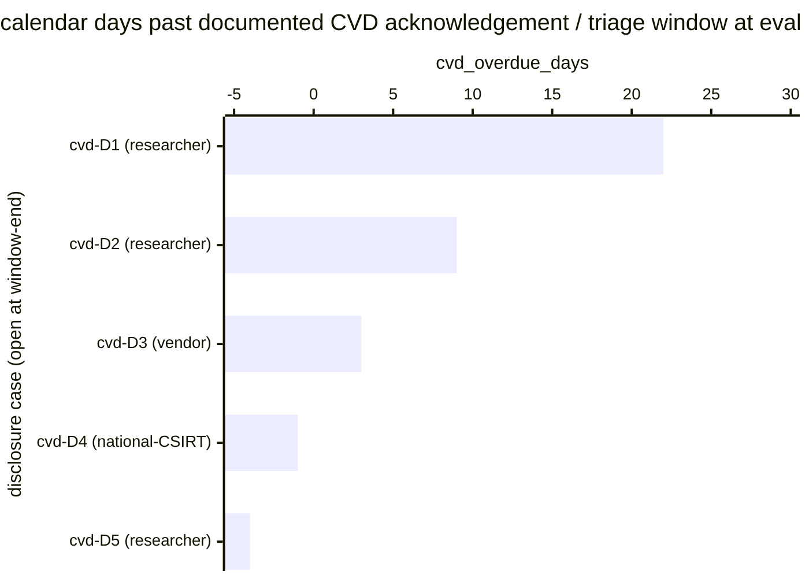

# Reference visualisation — `kri.cvd_intake_aging@v1`

This is the committed reference-visualisation artifact for the
coordinated-vulnerability-disclosure intake-aging KRI. It exists so
the G-04 catalog definition-of-done (a *committed* reference
visualisation, not a narrated one) is closed; downstream compile
targets (n8n / Temporal / LangGraph) read the same metric YAML and
render the executable form in their own dashboard surface. The
artifact here is the contract for the chart shape, not the executable
chart.

## Chart kind

Two-panel composition. The headline panel is a single gauge-style
horizontal bar reading the count of open coordinated-vulnerability-
disclosure cases that have aged past the operator's documented CVD
acknowledgement / triage window at the evaluation timestamp. The
drill-down panel is a horizontal bar chart, one bar per open
disclosure case at window-end, plotting `cvd_overdue_days` — calendar
days by which the case has exceeded the operator's documented CVD
acknowledgement / triage window. Positive bars are overdue cases that
contribute the failing samples; cases still inside the window appear
with non-positive bars. Slicing by `disclosure_source`
(security-researcher / vendor-coordination / national-CSIRT) is the
canonical drill-down dimension because each source carries a
different operator-side response posture.

- **Headline (count):** the `count` aggregate of disclosure cases
  open at window-end whose elapsed time since intake exceeds the
  documented CVD window. Because the KRI is `lower_is_better`, a
  reading of `0` is the floor (target value) and any positive
  reading is an open exposure on the CVD channel.
- **Drill-down x-axis:** `cvd_overdue_days` — calendar days the case
  has aged past the operator's documented CVD window at window-end.
  Positive values right-to-left are the overdue tail; cases still
  inside the window appear with non-positive bars.
- **Drill-down y-axis:** one row per open disclosure case at
  window-end, labelled by the case `disclosure.uid` and source band;
  sorted descending so the most-overdue cases sit at the top — the
  cases the operator's CVD lane owes attention to next.
- **Threshold overlay (drill-down):** a vertical line at `0` — every
  bar right of zero is an overdue sample that contributes a `1` to
  the count. Operators reading the drill-down see *which* disclosure
  cases pulled the KRI off zero.

## Reference rendering (Mermaid)

The mermaid block below is the canonical reference rendering — small
enough to live in-tree and renderable directly on the public repo
surface. The numeric values are illustrative; the compile target is
the source of truth for the executable form against operator data.

Reading the bars in this illustrative rendering:

| case (source)           | cvd_overdue_days | overdue? | reading                                                  |
|-------------------------|------------------|----------|----------------------------------------------------------|
| cvd-D1 (researcher)     | 22               | yes      | researcher report aged 22 days past CVD window           |
| cvd-D2 (researcher)     | 9                | yes      | researcher report aged 9 days past CVD window            |
| cvd-D3 (vendor)         | 3                | yes      | vendor-coordinated disclosure 3 days past window         |
| cvd-D4 (national-CSIRT) | -1               | no       | CSIRT-routed disclosure inside window (1 day of slack)   |
| cvd-D5 (researcher)     | -4               | no       | researcher report well inside window                     |

With three overdue cases at window-end, the headline `count`
resolves to `3` in this snapshot. Because direction is
`lower_is_better`, a higher reading is worse — every positive value
is a documented-CVD-window exception the operator carries on their
risk surface. That value is what the catalog aggregation
`measurement.aggregation: count` resolves to for this snapshot.

## Threshold band reference

| name   | comparator | value (count) | severity |
|--------|------------|---------------|----------|
| warn   | >=         | 1             | warn     |
| breach | >=         | 5             | high     |

The bands match the `thresholds` array on `cvd_intake_aging.yaml`;
the catalog entry is the source of truth, this file is the
visualisation surface. Operators under CRA Annex I §2(5) scope or
DORA Art. 9(4)(a) ICT-risk-management scope typically scope tighter
per-source targets (and a tighter top-level `target.value`) in their
own catalog variants and ship those as separate entries — the
unscoped baseline above is community-recommended, not a regulatory
floor.

## OCSF source-data shape

The chart's underlying observations are derived from the operator's
coordinated-vulnerability-disclosure intake ledger. Each disclosure
case still open at window-end contributes one `cvd_overdue_days`
sample computed against the `measurement.inputs` declared on
`cvd_intake_aging.yaml`:

- **`intake_disclosure`** — first playbook step transition that
  registers an inbound disclosure on the case ledger. The
  intake-disclosure event is bound to the vulnerability-intake
  intake step transition declared on the catalog entry's
  `playbook_refs`:
  - `playbook.vuln_intake@v1`
    `action--01a17a01-0000-4000-8000-000000000002` — intake-
    disclosure step on the vulnerability-intake playbook.
- **`case_closed`** — terminal step transition that closes the
  disclosure case on any response branch (patch shipped, scheduled
  remediation, accept-risk). Cases with a `case_closed` event drop
  out of the count regardless of how long they took, so the
  indicator measures the *current* backlog rather than historical
  throughput.

The catalog entry deliberately does not pin a single OCSF telemetry
binding at the unscoped baseline: CVD intake ledgers live on the
operator's own case-management surface (a ticketing system's
vulnerability queue, a SOAR case object, a dedicated CVD-platform
record), and there is no unambiguous OCSF event class that covers
the intersection of those surfaces at the catalog level. The
deferral is named honestly — the binding is to the playbook-step
transition on the vulnerability-intake playbook, not to an OCSF
class. A CORE follow-up may add an OCSF binding for specific
case-management-surface-scoped variants once the operator's CVD
surface is declared.

The reference rendering above remains shape-valid: it reads an
age-against-policy-window predicate per open disclosure case and
counts the overdue samples, regardless of which case-management
surface the operator's compile target resolves the intake event
against.

## Operator override

Operators are expected to render this metric in their own dashboard
idiom — the catalog reference rendering above is the contract for
the chart shape (count headline, per-case overdue-days drill-down
sliced by disclosure source, overdue-floor overlay at `0`), not the
visual style. The compile target is the source of truth for the
executable form.
