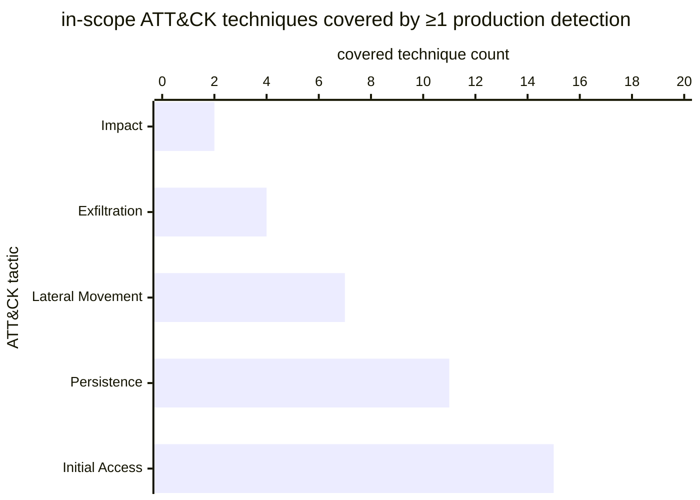

# Reference visualisation — `kpi.detection_coverage@v1`

This is the committed reference-visualisation artifact for the
detection-coverage KPI. It exists so the G-04 catalog
definition-of-done (a *committed* reference visualisation, not a
narrated one) is closed; downstream compile targets (n8n / Temporal /
LangGraph) read the same metric YAML and render the executable form in
their own dashboard surface. The artifact here is the contract for the
chart shape, not the executable chart.

## Chart kind

Stacked horizontal bar chart, one bar per ATT&CK tactic in the
operator's in-scope set, with each bar partitioned into a covered band
(techniques in T ∩ C — at least one production detection bound) and an
uncovered band (techniques in T \\ C). The overall ratio `|C| / |T|` is
the headline figure operators read first; the per-tactic stacks are
the supporting drill-down that names *where* the coverage gap sits.

- **x-axis:** technique count — number of in-scope techniques per
  tactic, partitioned by coverage state.
- **y-axis:** one row per ATT&CK tactic (Initial Access, Execution,
  Persistence, … Impact), labelled by the tactic name; sorted by
  coverage ratio ascending so the worst-covered tactic sits at the
  top.
- **Stack partition:** two segments per bar — `covered` (techniques
  with at least one production detection) and `uncovered` (techniques
  with none).
- **Threshold overlays:** horizontal lines at the `warn` (0.6) and
  `breach` (0.3) ratio values, drawn on a companion ratio gauge / axis
  next to the bar chart, so the operator reads the band the overall
  ratio sits in without arithmetic.
- **Headline annotation:** the overall `|C| / |T|` ratio across all
  in-scope techniques, annotated as the metric value with the
  threshold band it falls in.

## Reference rendering (Mermaid)

The mermaid block below is the canonical reference rendering — small
enough to live in-tree and renderable directly on the public repo
surface. The numeric values are illustrative; the compile target is
the source of truth for the executable form against operator data.

Reading the bars in this illustrative rendering (assume each tactic
has 20 in-scope techniques, so the bar value is the `covered` count
out of 20):

| tactic           | covered / in-scope | ratio | reading                                       |
|------------------|--------------------|-------|-----------------------------------------------|
| Initial Access   | 15 / 20            | 0.75  | above target — clear of warn band             |
| Persistence      | 11 / 20            | 0.55  | inside warn band — below 0.6 target floor     |
| Lateral Movement | 7 / 20             | 0.35  | inside warn band — approaching breach floor   |
| Exfiltration     | 4 / 20             | 0.20  | inside breach band — below 0.3 critical floor |
| Impact           | 2 / 20             | 0.10  | inside breach band — worst-covered tactic     |

The headline `|C| / |T|` figure here is `(15+11+7+4+2) / (5·20) = 39/100 = 0.39` —
inside the warn band, above the breach floor. That value is what the
catalog aggregation `measurement.aggregation: ratio` resolves to for
this snapshot.

## Threshold band reference

| name      | comparator | value (ratio) | severity  |
|-----------|------------|---------------|-----------|
| warn      | <          | 0.6           | warn      |
| breach    | <          | 0.3           | high      |

The bands match the `thresholds` array on
`detection_coverage.yaml`; the catalog entry is the source of truth,
this file is the visualisation surface.

## OCSF source-data shape

The chart's underlying observations are derived from the OCSF
`Detection Finding` meta-events the `detection_engineering@v1`
playbook emits at the `measure-rule-version` step
(action--f0e4f404-0000-4000-8000-000000000005). Each production-status
rule version emits one meta-finding carrying the rule identity on
`finding_info.uid` and the per-rule-version effectiveness snapshot
pointers the F-CP-06 stream consumes. The binding lives at
`content/telemetry/telemetry.ocsf.detection_finding@v1.json` and is
back-referenced from the metric YAML's `telemetry_refs[]` and from the
`production_detections` `measurement.inputs[].telemetry_ref`. The
in-scope technique set (`in_scope_techniques`) is the operator's
scoping artifact and is not bound to an OCSF telemetry class —
operators declare it once and the compile target joins it against the
detection inventory at evaluation time.

## Operator override

Operators are expected to render this metric in their own dashboard
idiom — the catalog reference rendering above is the contract for
the chart shape (per-tactic stacked horizontal bars, threshold
overlays on a companion ratio axis, overall `|C| / |T|` headline),
not the visual style. The compile target is the source of truth for
the executable form.
