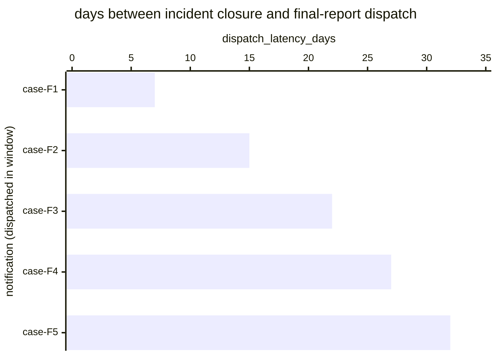

# Reference visualisation — `kri.dora_incident_final_report_latency_days@v1`

This is the committed reference-visualisation artifact for the DORA
Art. 19(4)(c) one-month final-report dispatch-latency KRI. It exists
so the G-04 catalog definition-of-done (a *committed* reference
visualisation, not a narrated one) is closed; downstream compile
targets (n8n / Temporal / LangGraph) read the same metric YAML and
render the executable form in their own dashboard surface. The
artifact here is the contract for the chart shape, not the executable
chart.

## Chart kind

Two-panel composition. The headline panel is a single gauge-style
horizontal bar reading the max dispatch latency (`days`) across DORA
Art. 19(4)(c) final-reports dispatched in the evaluation window,
plotted against the catalog `warn` / `high` / `breach` thresholds
(20d / 25d / 30d) and the statutory one-month bound. Direction is
`lower_is_better`: a max reading beyond 30 days is a statutory
overrun. The drill-down panel is a horizontal bar chart, one bar per
final-report dispatched in the window, plotting
`dispatch_latency_days` — days between the incident-closure
timestamp and the competent-authority submission.

- **Headline (max):** the worst-case latency across dispatches in the
  window. This is the figure the operator's risk surface reads
  first — the case that came closest to (or beyond) the statutory
  wall.
- **Drill-down x-axis:** `dispatch_latency_days` — days between
  incident-closure / root-cause-analysis-complete and final-report
  dispatch. Positive values grow towards the one-month bound.
- **Drill-down y-axis:** one row per final-report dispatched in the
  window, labelled by the case `incident.uid`; sorted descending so
  the longest latencies (and any overruns) sit at the top — the
  cases that lift the max.
- **Threshold overlay (drill-down):** three vertical lines at 20d
  (warn), 25d (high), and 30d (breach / statutory bound). Bars right
  of the 30d line are statutory overruns and require a "reasons for
  the delay" record on the competent-authority submission.

## Reference rendering (Mermaid)

The mermaid block below is the canonical reference rendering — small
enough to live in-tree and renderable directly on the public repo
surface. The numeric values are illustrative; the compile target is
the source of truth for the executable form against operator data.

Reading the bars in this illustrative rendering:

| case    | dispatch_latency_days | band     | reading                                                       |
|---------|-----------------------|----------|---------------------------------------------------------------|
| case-F1 | 7                     | ok       | dispatched inside 20d — comfortable slack                     |
| case-F2 | 15                    | ok       | dispatched inside 20d — comfortable slack                     |
| case-F3 | 22                    | warn     | above 20d — leading signal, still inside statutory bound      |
| case-F4 | 27                    | high     | above 25d — approaching the one-month statutory wall          |
| case-F5 | 32                    | breach   | above 30d — statutory overrun, reasons-for-delay required     |

With one overrun in the window the max resolves to `32` days —
inside the `breach` band (`> 30`). That value is what the catalog
aggregation `measurement.aggregation: max` resolves to for this
snapshot.

## Threshold band reference

| name   | comparator | value | severity |
|--------|------------|-------|----------|
| warn   | >          | 20    | warn     |
| high   | >          | 25    | high     |
| breach | >          | 30    | critical |

The bands match the `thresholds` array on
`dora_incident_final_report_latency_days.yaml`; the catalog entry is
the source of truth, this file is the visualisation surface. The
catalog `target` (`<= 30`) is the statutory ceiling every dispatch is
expected to clear.

## OCSF source-data shape

The chart's underlying observations are derived from the operator's
DORA regulator-notification chain. Each final-report dispatched in
the evaluation window contributes one `dispatch_latency_days` sample
computed from the two inputs declared in
`dora_incident_final_report_latency_days.yaml`'s
`measurement.inputs`:

- `resolution_timestamp` — incident-closure / root-cause-analysis-
  complete timestamp emitted by the DORA Art. 17 incident-management
  process, used as the start of the one-month clock. Bound to
  `telemetry.ocsf.compliance_finding@v1` field `start_time` on the
  final-report submission event.
- `notification_dispatch` — the regulator-notification chain step
  transition that dispatches the final report to the competent
  authority. Bound to `telemetry.ocsf.compliance_finding@v1` field
  `time` on the final-report submission event.

The latency samples that drive the max headline are
`notification_dispatch.time - resolution_timestamp.start_time`
converted to days.

## Playbook linkage

The dispatch-latency observations this chart plots originate from the
regulator-notification chain step declared on the sibling
`dora_incident_final_report_latency_days.yaml` in `playbook_refs`:

- `playbook.incident_management@v1` step `action--50000000-0000-4000-8000-000000000009` — the DORA Art. 19(4)(c) final-report dispatch step (co-anchored with the NIS2 Art. 23 one-month final report) of the dual-mandate incident-management chain.

Compile targets render that playbook-step boundary as the terminal
transition of the statutory clock this KRI reads; this reference
visualisation shows where dispatches fall against that boundary. The
catalog entry's `playbook_refs` is the source of truth for the link
direction — this visualisation surface only labels it.

## Operator override

Operators are expected to render this metric in their own dashboard
idiom — the catalog reference rendering above is the contract for
the chart shape (max headline, per-dispatch horizontal bars, three
statutory-clock threshold overlays), not the visual style. The
compile target is the source of truth for the executable form.
