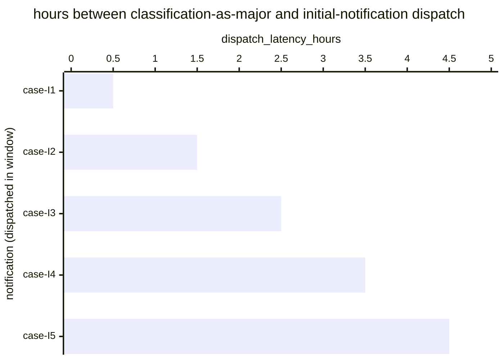

# Reference visualisation — `kri.dora_incident_initial_report_latency_hours@v1`

This is the committed reference-visualisation artifact for the DORA
Art. 19(4)(a) 4-hour initial-report dispatch-latency KRI. It exists
so the G-04 catalog definition-of-done (a *committed* reference
visualisation, not a narrated one) is closed; downstream compile
targets (n8n / Temporal / LangGraph) read the same metric YAML and
render the executable form in their own dashboard surface. The
artifact here is the contract for the chart shape, not the executable
chart.

## Chart kind

Two-panel composition. The headline panel is a single gauge-style
horizontal bar reading the max dispatch latency (`hours`) across DORA
Art. 19(4)(a) initial notifications dispatched in the evaluation
window, plotted against the catalog `warn` / `high` / `breach`
thresholds (2h / 3h / 4h) and the statutory 4-hour bound. Direction
is `lower_is_better`: a max reading beyond 4 hours is a statutory
overrun. The drill-down panel is a horizontal bar chart, one bar per
initial-notification dispatched in the window, plotting
`dispatch_latency_hours` — hours between the classification-as-major
timestamp and the competent-authority submission.

- **Headline (max):** the worst-case latency across dispatches in the
  window. This is the figure the operator's risk surface reads
  first — the case that came closest to (or beyond) the statutory
  wall.
- **Drill-down x-axis:** `dispatch_latency_hours` — hours between
  classification-as-major and initial-notification dispatch.
  Positive values grow towards the 4-hour bound.
- **Drill-down y-axis:** one row per initial-notification dispatched
  in the window, labelled by the case `incident.uid`; sorted
  descending so the longest latencies (and any overruns) sit at the
  top — the cases that lift the max.
- **Threshold overlay (drill-down):** three vertical lines at 2h
  (warn), 3h (high), and 4h (breach / statutory bound). Bars right
  of the 4h line are statutory overruns and require a "reasons for
  the delay" record on the competent-authority submission.

## Reference rendering (Mermaid)

The mermaid block below is the canonical reference rendering — small
enough to live in-tree and renderable directly on the public repo
surface. The numeric values are illustrative; the compile target is
the source of truth for the executable form against operator data.

Reading the bars in this illustrative rendering:

| case    | dispatch_latency_hours | band     | reading                                                       |
|---------|------------------------|----------|---------------------------------------------------------------|
| case-I1 | 0.5                    | ok       | dispatched inside 2h — comfortable slack                      |
| case-I2 | 1.5                    | ok       | dispatched inside 2h — comfortable slack                      |
| case-I3 | 2.5                    | warn     | above 2h — leading signal, still inside statutory bound       |
| case-I4 | 3.5                    | high     | above 3h — approaching the 4-hour statutory wall              |
| case-I5 | 4.5                    | breach   | above 4h — statutory overrun, reasons-for-delay required      |

With one overrun in the window the max resolves to `4.5` hours —
inside the `breach` band (`> 4`). That value is what the catalog
aggregation `measurement.aggregation: max` resolves to for this
snapshot.

## Threshold band reference

| name   | comparator | value | severity |
|--------|------------|-------|----------|
| warn   | >          | 2     | warn     |
| high   | >          | 3     | high     |
| breach | >          | 4     | critical |

The bands match the `thresholds` array on
`dora_incident_initial_report_latency_hours.yaml`; the catalog entry
is the source of truth, this file is the visualisation surface. The
catalog `target` (`<= 4`) is the statutory ceiling every dispatch is
expected to clear.

## OCSF source-data shape

The chart's underlying observations are derived from the operator's
DORA regulator-notification chain. Each initial-notification
dispatched in the evaluation window contributes one
`dispatch_latency_hours` sample computed from the two inputs declared
in `dora_incident_initial_report_latency_hours.yaml`'s
`measurement.inputs`:

- `classification_timestamp` — classification-as-major timestamp
  emitted by the DORA Art. 17 incident-management process, used as
  the start of the 4-hour clock. Bound to
  `telemetry.ocsf.compliance_finding@v1` field `start_time` on the
  initial-notification submission event.
- `notification_dispatch` — the regulator-notification chain step
  transition that dispatches the initial notification to the
  competent authority. Bound to
  `telemetry.ocsf.compliance_finding@v1` field `time` on the
  initial-notification submission event.

The latency samples that drive the max headline are
`notification_dispatch.time - classification_timestamp.start_time`
converted to hours.

## Playbook linkage

The dispatch-latency observations this chart plots originate from the
regulator-notification chain step declared on the sibling
`dora_incident_initial_report_latency_hours.yaml` in `playbook_refs`:

- `playbook.incident_management@v1` step `action--50000000-0000-4000-8000-000000000006` — the DORA Art. 19(4)(a) initial-notification dispatch step (co-anchored with the NIS2 Art. 23 24-hour early warning) of the dual-mandate incident-management chain.

Compile targets render that playbook-step boundary as the terminal
transition of the statutory clock this KRI reads; this reference
visualisation shows where dispatches fall against that boundary. The
catalog entry's `playbook_refs` is the source of truth for the link
direction — this visualisation surface only labels it.

## Operator override

Operators are expected to render this metric in their own dashboard
idiom — the catalog reference rendering above is the contract for
the chart shape (max headline, per-dispatch horizontal bars, three
statutory-clock threshold overlays), not the visual style. The
compile target is the source of truth for the executable form.
