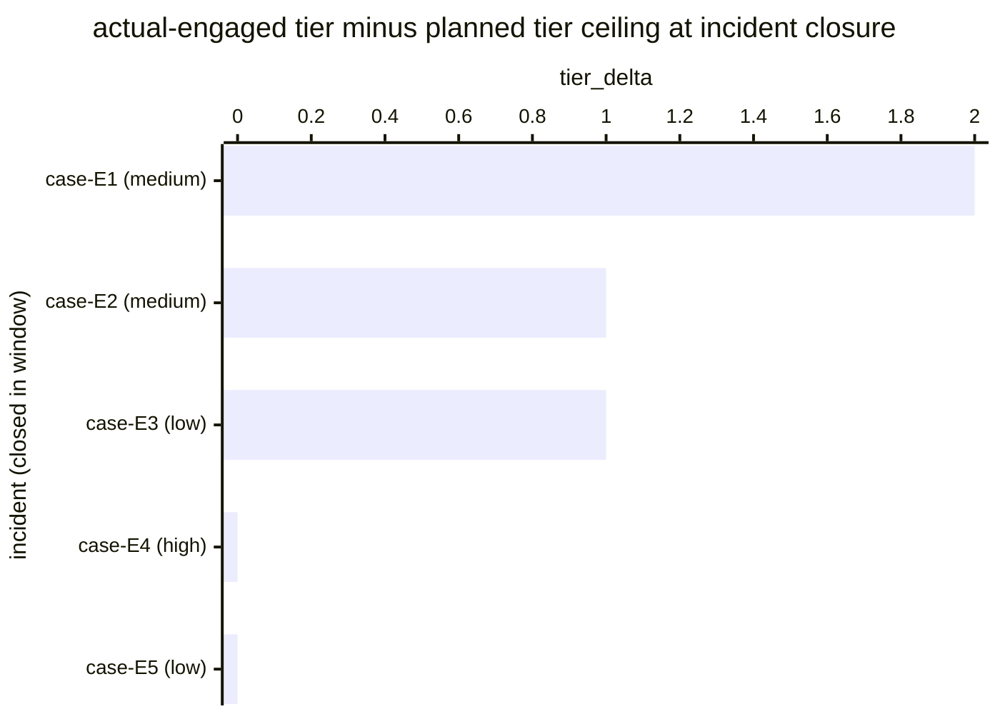

# Reference visualisation — `kri.escalation_tier_breach@v1`

This is the committed reference-visualisation artifact for the
escalation-tier breach-rate KRI. It exists so the G-04 catalog
definition-of-done (a *committed* reference visualisation, not a
narrated one) is closed; downstream compile targets (n8n / Temporal /
LangGraph) read the same metric YAML and render the executable form
in their own dashboard surface. The artifact here is the contract for
the chart shape, not the executable chart.

## Chart kind

Two-panel composition. The headline panel is a single gauge-style
horizontal bar reading the escalation-tier breach `ratio` across
in-scope incidents closed in the evaluation window — the share of
incidents whose response escalated past the planned tier ceiling,
divided by total in-scope incidents. The drill-down panel is a
horizontal bar chart, one bar per incident closed in the window,
plotting `tier_delta` — the integer difference between the
*actual-engaged* tier (deepest tier touched during response) and the
*planned* tier ceiling (the tier the playbook expected at the
incident's declared severity). Positive bars are escalation
breaches; non-positive bars are responses that held within the
planned ceiling. Slicing by `incident.severity` is the canonical
drill-down dimension because lower-tier capability is the surface
that gets stress-tested first.

- **Headline (ratio):** the `ratio` aggregate of incidents that
  escalated past the planned tier ceiling divided by total in-scope
  incidents closed in the window. Because the KRI is
  `lower_is_better`, a value near `0.00` is healthy and a rising
  value is the under-resourcing / mis-classification signal.
- **Drill-down x-axis:** `tier_delta` — integer steps the response
  ran past the planned tier ceiling. `0` is a response that held
  within the ceiling; `+1` is one tier of escalation past plan;
  `+2` is two tiers (typically lower-tier → executive engagement on
  a mid-severity incident, which the catalog flags as the canonical
  breach pattern).
- **Drill-down y-axis:** one row per incident closed in the window,
  labelled by the case `incident.uid` and severity; sorted
  descending so the deepest breaches sit at the top — the incidents
  pulling the ratio off `0.00`.
- **Threshold overlay (drill-down):** a vertical line at `0` —
  every bar right of zero is a sample that contributes a `1` to the
  numerator. Operators reading the drill-down see *which* incidents
  escalated past plan and at what severity band.

## Reference rendering (Mermaid)

The mermaid block below is the canonical reference rendering — small
enough to live in-tree and renderable directly on the public repo
surface. The numeric values are illustrative; the compile target is
the source of truth for the executable form against operator data.

Reading the bars in this illustrative rendering:

| case (severity)   | tier_delta | breach? | reading                                                              |
|-------------------|------------|---------|----------------------------------------------------------------------|
| case-E1 (medium)  | 2          | yes     | mid-severity incident pulled executive engagement — canonical breach |
| case-E2 (medium)  | 1          | yes     | mid-severity incident escalated one tier past plan                   |
| case-E3 (low)     | 1          | yes     | low-severity incident pulled tier-2 — lower-tier capacity strain     |
| case-E4 (high)    | 0          | no      | high-severity incident held within planned tier-3 ceiling            |
| case-E5 (low)     | 0          | no      | low-severity incident held within planned tier-1 ceiling             |

With three breaches across five closed incidents, the headline
`ratio` resolves to `3 / 5 = 0.60` in this snapshot. Because
direction is `lower_is_better`, a higher reading is worse — every
positive `tier_delta` is an escalation-discipline exception the
operator carries on their risk surface. That value is what the
catalog aggregation `measurement.aggregation: ratio` resolves to for
this snapshot.

## Threshold band reference

The catalog entry at `escalation_tier_breach.yaml` is
operator-neutral and does not declare numeric warn / breach
thresholds at the unscoped baseline — the operator's on-call /
escalation policy is the source of truth for the per-tier engagement
expectation, and the catalog ratio reflects the share of in-scope
incidents whose response left that envelope. Severity-scoped variants
(for example a high-severity-only escalation breach KRI, or an
executive-engagement-only variant) declare numeric bands and live as
separate catalog entries. The catalog YAML at
`content/metrics/escalation_tier_breach.yaml` remains the source of
truth for the indicator shape; this file is the visualisation
surface.

## OCSF source-data shape

The chart's underlying observations are derived from the operator's
on-call rotation surface and the per-incident tier-engagement
record. Each in-scope incident closed within the evaluation window
contributes one `tier_delta` sample computed against the
`measurement.inputs` declared on `escalation_tier_breach.yaml`:

- **numerator** — count of closed incidents whose deepest-engaged
  tier exceeded the planned tier ceiling declared at incident
  declaration time (per the operator's on-call / escalation
  policy). The escalation-engagement event is bound to the
  on-call-rotation engage-tier step transition declared on the
  catalog entry's `playbook_refs`:
  - `playbook.on_call_rotation@v1`
    `action--30000000-0000-4000-8000-000000000003` — engage-tier
    step on the on-call rotation playbook.
- **denominator** — count of in-scope incidents closed within the
  evaluation window. Incidents whose declaration step never fired
  (record-keeping gap) are excluded so the indicator does not
  silently improve when the on-call rotation pipeline stalls.

The catalog entry deliberately does not pin a single OCSF telemetry
binding at the unscoped baseline: tier-engagement records live on
the operator's on-call surface (a PagerDuty / Opsgenie / Grafana
OnCall escalation record, a SOAR case object, or a manually-kept
runbook log), and there is no unambiguous OCSF event class that
covers the intersection of those surfaces at the catalog level. The
deferral is named honestly — the binding is to the playbook-step
transition on the on-call rotation playbook, not to an OCSF class.
A CORE follow-up may add an OCSF binding for specific
on-call-surface-scoped variants once the operator's escalation
surface is declared.

The reference rendering above remains shape-valid: it reads an
actual-engaged-tier-against-planned-ceiling predicate per closed
incident and computes a ratio, regardless of which on-call surface
the operator's compile target resolves the engagement record
against.

## Operator override

Operators are expected to render this metric in their own dashboard
idiom — the catalog reference rendering above is the contract for
the chart shape (ratio headline, per-incident tier-delta drill-down
sliced by severity, breach-floor overlay at `0`), not the visual
style. The compile target is the source of truth for the executable
form.
