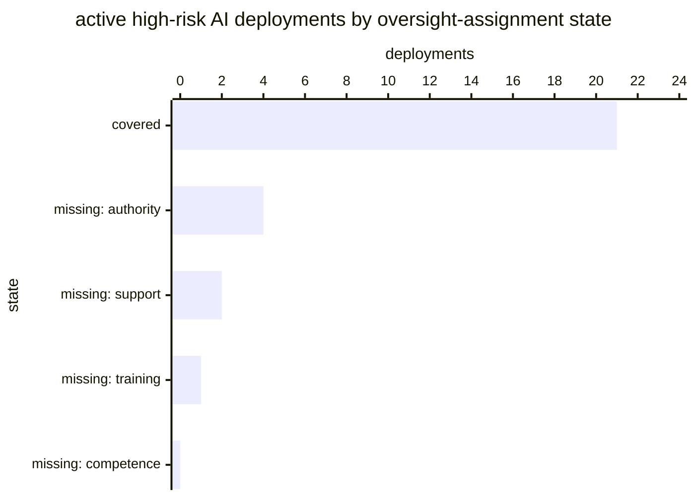

# Reference visualisation — `kpi.eu_ai_act_deployer_oversight_coverage@v1`

This is the committed reference-visualisation artifact for the EU AI
Act Article 26(2) deployer oversight-assignment coverage KPI. It exists
so the G-04 catalog definition-of-done (a *committed* reference
visualisation, not a narrated one) is closed; downstream compile
targets (n8n / Temporal / LangGraph) read the same metric YAML and
render the executable form in their own dashboard surface. The
artifact here is the contract for the chart shape, not the executable
chart.

## Chart kind

Stacked horizontal bar, one bar per evaluation, split into covered and
uncovered deployments — with the **uncovered** segment broken out by
which of the four Art. 26(2) limbs is missing. The headline figure is
the coverage ratio; the breakout is the supporting drill-down that
tells the operator *what to fix*, not merely that something is broken.

The breakout is the load-bearing part of this chart. A single "70%
covered" figure sends an operator looking for thirty per cent of
deployments with no assignment at all, when the real population is
usually deployments that have a named assignee and no recorded
delegated authority — a different and much cheaper remediation.

- **x-axis:** deployment count, from zero to `|D|` (the active
  high-risk AI deployment set).
- **Series:** `covered`, then four uncovered sub-series — `missing:
  competence`, `missing: training`, `missing: authority`, `missing:
  support`. A deployment missing more than one limb is attributed to
  the first missing limb in that order so the segments sum to `|D|`
  rather than double-counting.
- **Threshold overlays:** vertical lines at the `warn` (1.0), `high`
  (0.95) and `breach` (0.8) values from the catalog entry, expressed
  as counts against `|D|`.
- **Headline annotation:** the coverage ratio with the threshold band
  it falls in. Where `|D|` is zero the headline reads *undefined*, not
  100% — see the catalog `measurement.formula`.

## Reference rendering (Mermaid)

The mermaid block below is the canonical reference rendering — small
enough to live in-tree and renderable directly on the public repo
surface. The numeric values are illustrative; the compile target is
the source of truth for the executable form against operator data.

Reading the bars in this illustrative rendering:

| state               | deployments | reading                                                        |
|---------------------|-------------|----------------------------------------------------------------|
| covered             | 21          | all four Art. 26(2) limbs recorded and current                  |
| missing: authority  | 4           | a named assignee with no recorded power to halt the deployment — an overseer who cannot lawfully oversee |
| missing: support    | 2           | assignee named and empowered, no recorded resourcing            |
| missing: training   | 1           | competence asserted, no training attestation on file            |
| missing: competence | 0           | —                                                               |

`|D|` is 28 and `covered` is 21, so the headline ratio is **0.75** —
inside the `breach` band (`< 0.8`, critical). The remediation the
chart actually points at is the four authority gaps, which is a
governance delegation record rather than a training exercise.

## Threshold band reference

| name   | comparator | value (ratio) | severity |
|--------|------------|---------------|----------|
| warn   | <          | 1.0           | warn     |
| high   | <          | 0.95          | high     |
| breach | <          | 0.8           | critical |

The warn band opens immediately below 1.0 because Art. 26(2) is
unconditional — there is no permissible steady state with an
unassigned active deployment. The bands match the `thresholds` array
on `eu_ai_act_deployer_oversight_coverage.yaml`; the catalog entry is
the source of truth for the values, this file for the chart shape.

## OCSF source-data shape

Both inputs ride on `telemetry.ocsf.compliance_finding@v1` (Findings
category, class 2003), emitted by the
`playbook.eu_ai_act_deployer_obligations@v1` lifecycle.

| input | step | OCSF field | shape |
|---|---|---|---|
| `intended_use_determination` | `action--e26d1a00-0000-4000-8000-000000000002` (`confirm_intended_use`) | `status_id` | Positive Art. 26(1) determination admits the deployment to `D`; a negative determination excludes it — the deployment is not running, so no oversight is owed. |
| `oversight_assignment` | `action--e26d1a00-0000-4000-8000-000000000003` (`assign_human_oversight`) | `time` | Presence alone is insufficient. The four Art. 26(2) limbs are carried as enrichment on the finding; the coverage test reads all four. |

Both findings join on the deployment identifier the lifecycle threads
as `__deployment_id__`, which is the external variable the operator's
deployment register supplies.

## Operator override

The 1.0 target is the obligation, not a tunable — see the catalog
`target.rationale`. What an operator legitimately overrides is the
**reassignment cadence** that decides when an existing assignment
stops counting as current, and the attribution order used to break out
multi-limb gaps in the chart. Both are deployment-context choices; the
catalog contract is the four-limb completeness test, not the cadence.

Operators running no high-risk AI deployments should render the
headline as *undefined* rather than suppressing the tile — an empty
estate and a fully covered estate are different states, and collapsing
them hides the moment the first deployment arrives.
