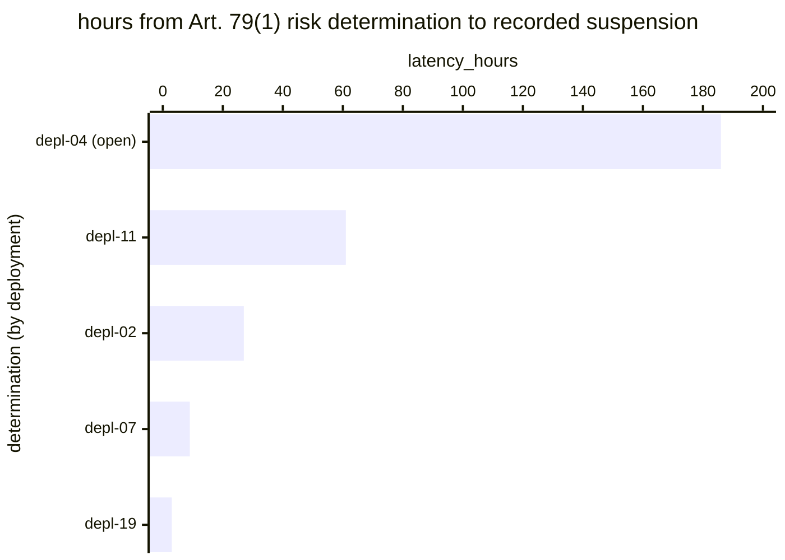

# Reference visualisation — `kri.eu_ai_act_deployer_suspension_latency_hours@v1`

This is the committed reference-visualisation artifact for the EU AI
Act Article 26(5) deployer suspension-latency KRI. It exists so the
G-04 catalog definition-of-done (a *committed* reference
visualisation, not a narrated one) is closed; downstream compile
targets (n8n / Temporal / LangGraph) read the same metric YAML and
render the executable form in their own dashboard surface. The
artifact here is the contract for the chart shape, not the executable
chart.

## Chart kind

Horizontal bar chart, one bar per Article 79(1) risk determination in
the evaluation window, sorted by `latency_hours` descending so the
longest-running determination sits at the top. The `p95` aggregate is
the headline figure; the bar chart is the supporting drill-down that
names *which* determination is furthest from its suspension.

**Open determinations — those with no recorded suspension — render as
open-ended bars**, visually distinct from closed ones. This is not
decoration: the catalog formula accrues open intervals against the
indicator rather than excluding them, precisely so the metric cannot
be improved by never suspending. A renderer that drew open
determinations as ordinary bars, or omitted them, would invert the
meaning of the chart.

- **x-axis:** `latency_hours` — hours from the Art. 79(1) risk
  determination to the recorded suspension of use, or to the
  evaluation timestamp where no suspension has been recorded.
- **y-axis:** one row per determination, labelled by the deployment
  identifier, with open determinations marked.
- **Threshold overlays:** vertical lines at the `warn` (24 h), `high`
  (72 h) and `breach` (168 h) values from the catalog entry.
- **Headline annotation:** the `p95` across determinations, with the
  threshold band it falls in.

## Reference rendering (Mermaid)

The mermaid block below is the canonical reference rendering — small
enough to live in-tree and renderable directly on the public repo
surface. The numeric values are illustrative; the compile target is
the source of truth for the executable form against operator data.

Reading the bars in this illustrative rendering:

| deployment | latency_hours | state  | band      | reading                                                    |
|------------|---------------|--------|-----------|-------------------------------------------------------------|
| depl-04    | 186           | open   | breach    | determined over a week ago, still running — the failure this KRI exists to surface |
| depl-11    | 61            | closed | warn      | suspended, but two and a half days after the determination   |
| depl-02    | 27            | closed | warn      | just past the 24 h SLO                                       |
| depl-07    | 9             | closed | on-target | suspended same working day                                   |
| depl-19    | 3             | closed | on-target | prompt                                                       |

The `p95` here is **≈161 hours**, inside the `high` band and driven
almost entirely by `depl-04`. That is the intended behaviour of the
`p95` aggregation: a mean over these five would read 57 hours and let
one week-long open determination hide behind four prompt suspensions.

## Threshold band reference

| name   | comparator | value (hours) | severity |
|--------|------------|---------------|----------|
| warn   | >          | 24            | warn     |
| high   | >          | 72            | high     |
| breach | >          | 168           | critical |

The bands match the `thresholds` array on
`eu_ai_act_deployer_suspension_latency_hours.yaml`; the catalog entry
is the source of truth for the values, this file for the chart shape.

**These numbers are not law.** Art. 26(5) requires suspension "without
undue delay" and sets no bound — unlike Art. 73(2)-(4), whose 2 / 10 /
15-day bounds are statutory and are what
`kri.eu_ai_act_report_clock_margin_days@v1` measures against. Treat
the bands as an operator SLO; see the catalog `target.rationale`.

## OCSF source-data shape

Both timestamps ride on `telemetry.ocsf.compliance_finding@v1`
(Findings category, class 2003), emitted by the `monitor_operation`
step of `playbook.eu_ai_act_deployer_obligations@v1`.

| input | step | OCSF field | shape |
|---|---|---|---|
| `risk_determined_at` | `action--e26d1a00-0000-4000-8000-000000000004` (`monitor_operation`) | `start_time` | Selected on the escalation trigger class being an Art. 79(1) risk determination. The lifecycle carries that class as `__escalation_trigger_class__`, distinct from the monitoring observation id, specifically so this selection is possible. |
| `suspension_recorded_at` | `action--e26d1a00-0000-4000-8000-000000000004` (`monitor_operation`) | `time` | Absence marks the determination open; the open interval accrues. |

`evaluation_now` is the compile target's scheduler clock and binds to
no OCSF class.

Two trigger classes are deliberately **not** sources here. Routine
monitoring carries no suspension duty and would dilute the indicator
toward zero. Serious incidents belong to the provider-side Art. 73
chain measured by `kri.eu_ai_act_report_clock_margin_days@v1`;
including them would double-count one event against two clocks.

## Operator override

The 24 / 72 / 168-hour bands are a starting point and operators should
replace them with their own documented reasoning rather than inheriting
them as though they were the regulation.

The exclusion worth governing carefully is the reasoned
no-suspension-owed determination — where the risk was eliminated
inside the instructions for use rather than by ceasing use. The
catalog formula excludes those windows and treats the dated reasoning
as the evidence. That is the exclusion an auditor should sample, and
an operator dashboard should surface the excluded count alongside the
headline rather than silently dropping it.
