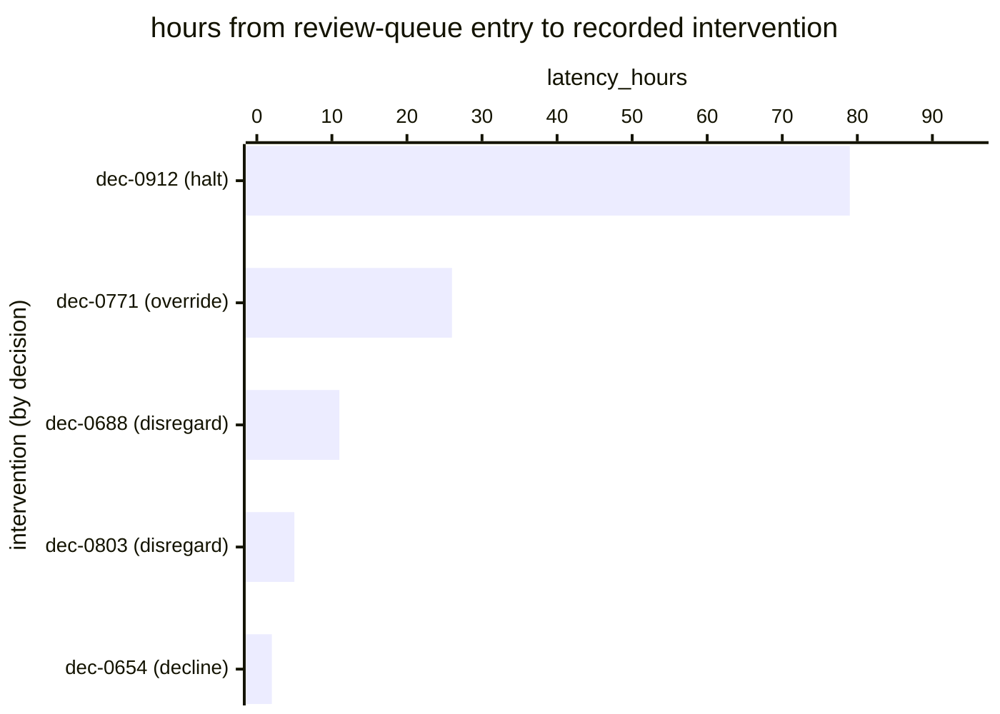

# Reference visualisation — `kri.eu_ai_act_oversight_intervention_latency_hours@v1`

This is the committed reference-visualisation artifact for the EU AI Act
Article 14 oversight intervention-latency KRI. It exists so the G-04
catalog definition-of-done (a *committed* reference visualisation, not a
narrated one) is closed; downstream compile targets (n8n / Temporal /
LangGraph) read the same metric YAML and render the executable form in
their own dashboard surface. The artifact here is the contract for the
chart shape, not the executable chart.

## Chart kind

Horizontal bar chart, one bar per Article 14(4)(d)-(e) intervention in
the window, sorted by `latency_hours` descending so the slowest sits at
the top, **coloured by intervention type**. The `p95` is the headline;
the bars name *which* intervention was slowest.

Colouring by type is the load-bearing part. Latency on a **halt** is the
reading that matters most, because a halt is the only exercise whose
value decays to nothing once the output has been acted on — a disregard
recorded late still corrects the record, a halt recorded late prevented
nothing. A chart that renders all four alike hides the one case where
the number has teeth.

- **x-axis:** `latency_hours` — from the decision entering the review
  queue to the intervention being recorded.
- **y-axis:** one row per intervention, labelled by decision reference,
  coloured by type (decline / disregard / override / halt).
- **Threshold overlays:** vertical lines at warn (8 h), high (24 h) and
  breach (72 h).
- **Headline annotation:** the `p95`, with the band it falls in, and the
  **excluded count** beside it (see below).

## Reference rendering (Mermaid)

The mermaid block below is the canonical reference rendering — small
enough to live in-tree and renderable directly on the public repo
surface. The numeric values are illustrative; the compile target is the
source of truth for the executable form against operator data.

Reading the bars in this illustrative rendering:

| decision | type      | latency_hours | band      | reading                                                  |
|----------|-----------|---------------|-----------|------------------------------------------------------------|
| dec-0912 | halt      | 79            | breach    | the system ran for three days after a halt was warranted — the failure this KRI exists to surface |
| dec-0771 | override  | 26            | high      | output reversed a day late                                 |
| dec-0688 | disregard | 11            | warn      | just past the working-day SLO                              |
| dec-0803 | disregard | 5             | on-target |                                                            |
| dec-0654 | decline   | 2             | on-target | prompt                                                     |

The `p95` here is **≈68 hours**, inside the `high` band and driven almost
entirely by `dec-0912`. That is the intended behaviour of `p95`: a mean
over these five reads 25 hours and lets a three-day halt hide behind four
prompt interventions.

Note the worst bar is the halt. That is the case worth escalating even
when the headline sits inside an acceptable band, and it is why the chart
colours by type rather than reporting an undifferentiated distribution.

## Threshold band reference

| name   | comparator | value (hours) | severity |
|--------|------------|---------------|----------|
| warn   | >          | 8             | warn     |
| high   | >          | 24            | high     |
| breach | >          | 72            | critical |

The bands match the `thresholds` array on
`eu_ai_act_oversight_intervention_latency_hours.yaml`; the catalog entry
is the source of truth for the values, this file for the chart shape.

**These numbers are not law.** Article 14 sets no clock at all — it
requires oversight to be possible and effective and says nothing about
elapsed time. That is unlike Art. 73(2)-(4), whose 2 / 10 / 15-day bounds
are statutory and are what
`kri.eu_ai_act_report_clock_margin_days@v1` measures against. Eight hours
is sized to one working day; see the catalog `target.rationale` for why
it should be re-derived from how fast the overseen system's output takes
effect.

## OCSF source-data shape

All inputs ride on `telemetry.ocsf.compliance_finding@v1` (Findings
category, class 2003), emitted by `playbook.ai_human_oversight@v1`.

| input | step | OCSF field | shape |
|---|---|---|---|
| `flagged_for_review_at` | `action--e14a5100-0000-4000-8000-000000000004` (`review_flagged_decisions`) | `start_time` | Starts the clock. Absent ⇒ the intervention is excluded and the exclusion count increments. |
| `intervention_recorded_at` | `action--e14a5100-0000-4000-8000-000000000005` (`record_intervention`) | `time` | Stops the clock. Nil records carry no timestamp and are excluded. |
| `intervention_type` | same step | `activity_id` | Drives the colouring. |

## Operator override

Re-derive the bands from how quickly the overseen system's output takes
effect. A system whose outputs are acted on within minutes needs a far
tighter figure than one feeding a weekly batch, and inheriting eight
hours unexamined in the first case sets a bound that cannot prevent
anything.

Two reporting requirements the catalog formula imposes, both of which a
dashboard must honour rather than quietly simplify:

- **Reviews with no intervention are excluded, not scored as zero.**
  Including them would drive this indicator toward zero in exactly the
  rubber-stamping case that `kpi.eu_ai_act_oversight_intervention_rate@v1`
  exists to catch. The two indicators must not be able to look healthy
  for the same wrong reason, which is why they ship as a pair and should
  be read together.
- **Show the excluded count next to the headline.** Interventions whose
  parent review has no queue-entry timestamp are dropped from the
  aggregate; hiding that lets an operator with poor queue
  instrumentation read an artificially clean `p95`.
