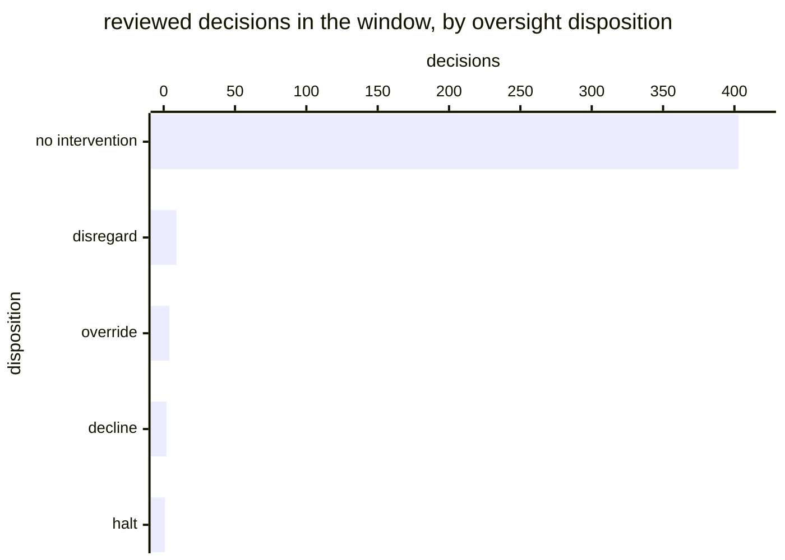

# Reference visualisation — `kpi.eu_ai_act_oversight_intervention_rate@v1`

This is the committed reference-visualisation artifact for the EU AI Act
Article 14 oversight intervention-rate KPI. It exists so the G-04 catalog
definition-of-done (a *committed* reference visualisation, not a narrated
one) is closed; downstream compile targets (n8n / Temporal / LangGraph)
read the same metric YAML and render the executable form in their own
dashboard surface. The artifact here is the contract for the chart shape,
not the executable chart.

## Chart kind

Stacked horizontal bar over the reviewed-decision population, split into
**no intervention** and the four Article 14(4)(d)-(e) exercises. The rate
is the headline; the composition is the reading that actually matters.

The split is not decoration. A rate of 0.04 made up entirely of
*disregard* describes an oversight function correcting the record. The
same 0.04 made up of *halts* describes a system being stopped one time in
twenty-five. Reporting the scalar alone loses that distinction entirely,
which is why the catalog formula requires slicing by
`__intervention_type__`.

- **x-axis:** reviewed decisions in the window, zero to `R`.
- **Series:** `no intervention`, then `decline`, `disregard`, `override`,
  `halt`.
- **Threshold overlays:** the warn (0.02), high (0.005) and breach (0)
  **floors**, drawn as vertical markers against `R`. Note these are
  floors — the band is entered by falling *below* them, which is the
  opposite of most indicators in the catalogue and should be labelled on
  the chart so it cannot be misread.
- **Headline annotation:** the rate, with the band it falls in. Where `R`
  is zero the headline reads *undefined*, not 0 — see below.

## Reference rendering (Mermaid)

The mermaid block below is the canonical reference rendering — small
enough to live in-tree and renderable directly on the public repo
surface. The numeric values are illustrative; the compile target is the
source of truth for the executable form against operator data.

Reading the bars in this illustrative rendering:

| disposition     | decisions | reading                                                     |
|-----------------|-----------|--------------------------------------------------------------|
| no intervention | 403       | reviewed, nothing warranted — recorded, not absent            |
| disregard       | 9         | output set aside                                              |
| override        | 4         | output reversed                                              |
| decline         | 2         | system not used for the situation                             |
| halt            | 1         | operation interrupted — the highest-weight exercise           |

`R` is 419 and `I` is 16, so the headline rate is **0.038** — above the
0.02 floor, on-target. The composition is the useful part: sixteen
exercises of which one was a halt reads as an oversight function using
its authority proportionately.

## Threshold band reference

| name   | comparator | value (ratio) | severity |
|--------|------------|---------------|----------|
| warn   | <          | 0.02          | warn     |
| high   | <          | 0.005         | high     |
| breach | <=         | 0             | critical |

**These are floors.** A breach means the rate reached zero — oversight
that reviewed and never once exercised its Art. 14(4)(d)-(e) authority,
which is the rubber-stamping failure the indicator exists to detect.

The bands match the `thresholds` array on
`eu_ai_act_oversight_intervention_rate.yaml`; the catalog entry is the
source of truth for the values, this file for the chart shape.

**A high rate is not scored, and that is deliberate.** A sustained high
intervention rate is evidence the *AI system* is degrading, not that
oversight improved. The catalog `target.rationale` explains why the
indicator refuses to score that direction; a dashboard should surface it
as an annotation rather than inventing an upper threshold.

## OCSF source-data shape

All three inputs ride on `telemetry.ocsf.compliance_finding@v1` (Findings
category, class 2003), emitted by `playbook.ai_human_oversight@v1`.

| input | step | OCSF field | shape |
|---|---|---|---|
| `review_disposition` | `action--e14a5100-0000-4000-8000-000000000004` (`review_flagged_decisions`) | `time` | Denominator. A review that found nothing is emitted and counts — that is what makes the rubber-stamping signal computable. |
| `intervention_record` | `action--e14a5100-0000-4000-8000-000000000005` (`record_intervention`) | `status_id` | Numerator. The nil record the step emits on a quiet window must be excluded, or every window scores 1.0. |
| `intervention_type` | same step | `activity_id` | The four-way split. |

Both findings join on the deployment and the review window that the
lifecycle threads as `__deployment_id__` and `__oversight_cycle__`.

## Operator override

The 0.02 floor is a starting point and should be set against the
deployment's own base rate once one exists — a mature, well-tuned system
legitimately produces fewer warranted interventions than a new one.

What should **not** be tuned away is the zero case. A rate sitting at
zero across a material number of reviews is not a threshold to relax. The
first thing to check is whether the overseers named on the roster
actually hold the delegated authority Art. 14(4)(d)-(e) requires — a
roster entry without it produces someone who *cannot* intervene, and that
is indistinguishable here from an oversight function that chooses not to.

Render the headline as *undefined* where no decisions were reviewed.
Scoring an empty window as a breach fires the rubber-stamping alarm at an
operator whose system simply produced nothing reviewable, and trains them
to ignore it.
