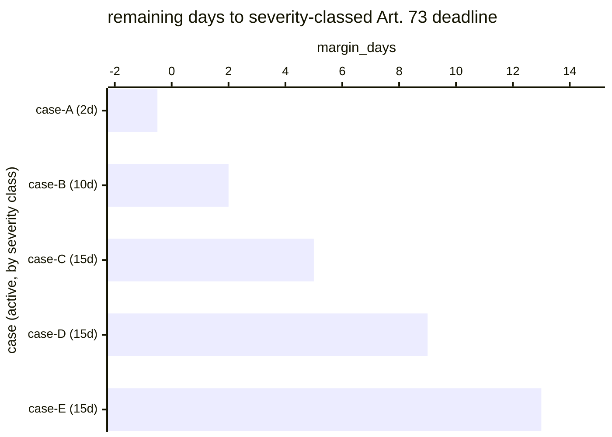

# Reference visualisation — `kri.eu_ai_act_report_clock_margin_days@v1`

This is the committed reference-visualisation artifact for the EU AI
Act Article 73 report clock-margin KRI. It exists so the G-04 catalog
definition-of-done (a *committed* reference visualisation, not a
narrated one) is closed; downstream compile targets (n8n / Temporal /
LangGraph) read the same metric YAML and render the executable form
in their own dashboard surface. The artifact here is the contract for
the chart shape, not the executable chart.

## Chart kind

Horizontal bar chart, one bar per active Art. 73-reportable case in
the evaluation window, sorted by `margin_days` ascending so the
worst-case case (the bar nearest its statutory wall) sits at the top.
The `min` aggregate is the headline figure operators read first; the
bar chart is the supporting drill-down that names *which* case is
closest to its clock.

- **x-axis:** `margin_days` — remaining days to the case's
  severity-classed Art. 73 deadline (2, 10, or 15 days from
  awareness per Art. 73(3) / 73(4) / 73(2)). Negative values left of
  zero indicate the case has overrun its clock and the provider
  should expect to account for the delay on submission.
- **y-axis:** one row per active case, labelled by the case
  `incident.uid` (operator-facing) and sliced by severity class
  (colour band: two-day / ten-day / fifteen-day bound).
- **Threshold overlays:** vertical lines at the `warn` (3 d), `high`
  (1 d), and `breach` (0 d) threshold values from the catalog entry,
  so the operator reads the band each case sits in without
  arithmetic.
- **Headline annotation:** the `min` aggregate across active cases,
  annotated as the metric value with the threshold band it falls in.

## Reference rendering (Mermaid)

The mermaid block below is the canonical reference rendering — small
enough to live in-tree and renderable directly on the public repo
surface. The numeric values are illustrative; the compile target is
the source of truth for the executable form against operator data.

Reading the bars in this illustrative rendering:

| case   | class bound | margin_days | band      | reading                                              |
|--------|-------------|-------------|-----------|------------------------------------------------------|
| case-A | 2 d         | -0.5        | breach    | overrun its two-day Art. 73(3) clock — account for delay on submission |
| case-B | 10 d        | 2           | warn      | two days of buffer on the ten-day Art. 73(4) clock   |
| case-C | 15 d        | 5           | on-target | five days of buffer                                  |
| case-D | 15 d        | 9           | on-target | comfortable margin                                   |
| case-E | 15 d        | 13          | on-target | freshly classified, near-full window                 |

The headline `min` figure here is `-0.5 days` — the worst-case case
has overrun its clock. That value is what the catalog aggregation
`measurement.aggregation: min` resolves to for this snapshot. Note
that two-day-class cases live their whole lifecycle inside the warn
band by construction (the 3-day target buffer exceeds the entire
bound) — the intended posture per the catalog `target.rationale`.

## Threshold band reference

| name   | comparator | value (days) | severity |
|--------|------------|--------------|----------|
| warn   | <          | 3            | warn     |
| high   | <          | 1            | high     |
| breach | <          | 0            | critical |

The bands match the `thresholds` array on
`eu_ai_act_report_clock_margin_days.yaml`; the catalog entry is the
source of truth for the values, this file for the chart shape.
