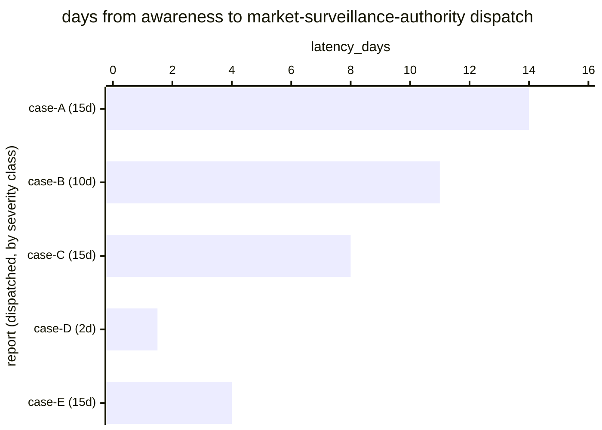

# Reference visualisation — `kri.eu_ai_act_serious_incident_report_latency_days@v1`

This is the committed reference-visualisation artifact for the EU AI
Act Article 73 serious-incident report dispatch-latency KRI. It exists
so the G-04 catalog definition-of-done (a *committed* reference
visualisation, not a narrated one) is closed; downstream compile
targets (n8n / Temporal / LangGraph) read the same metric YAML and
render the executable form in their own dashboard surface. The
artifact here is the contract for the chart shape, not the executable
chart.

## Chart kind

Horizontal bar chart, one bar per Art. 73(1) report dispatched to the
market-surveillance authority in the evaluation window, sorted by
`latency_days` descending so the worst-case dispatch (the bar nearest
— or beyond — its statutory wall) sits at the top. The `max`
aggregate is the headline figure operators read first; the bar chart
is the supporting drill-down that names *which* cycle came closest to
its bound.

- **x-axis:** `latency_days` — elapsed days between provider
  awareness and report dispatch.
- **y-axis:** one row per dispatched report, labelled by the case
  `incident.uid` (operator-facing) and sliced by severity class
  (colour band: two-day / ten-day / fifteen-day bound).
- **Per-case bound overlay:** each bar carries a tick at its
  *applicable* severity-classed bound (2, 10, or 15 days) — a bar
  crossing its own tick is a statutory overrun even when it sits
  below the default-class thresholds.
- **Threshold overlays:** vertical lines at the default-class `warn`
  (10 d), `high` (13 d), and `breach` (15 d) threshold values from
  the catalog entry.
- **Headline annotation:** the `max` aggregate across dispatches,
  annotated as the metric value with the threshold band it falls in.

## Reference rendering (Mermaid)

The mermaid block below is the canonical reference rendering — small
enough to live in-tree and renderable directly on the public repo
surface. The numeric values are illustrative; the compile target is
the source of truth for the executable form against operator data.

Reading the bars in this illustrative rendering:

| case   | class bound | latency_days | band      | reading                                            |
|--------|-------------|--------------|-----------|----------------------------------------------------|
| case-A | 15 d        | 14           | high      | dispatched one day inside the default wall         |
| case-B | 10 d        | 11           | overrun   | exceeds its *own* ten-day Art. 73(4) bound         |
| case-C | 15 d        | 8            | on-target | comfortable margin                                 |
| case-D | 2 d         | 1.5          | on-target | inside the two-day Art. 73(3) bound                |
| case-E | 15 d        | 4            | on-target | comfortable margin                                 |

The headline `max` figure here is `14 days` on the default-class
thresholds — but note case-B: at 11 days it sits below the
default-class `high` line yet is a statutory overrun of its
applicable ten-day bound, which the per-case bound overlay (and the
formula's per-class overrun flag) surfaces. That value pattern is why
the per-case tick exists: the catalog thresholds are calibrated to
the default class, the statute is per-class.

## Threshold band reference

| name   | comparator | value (days) | severity |
|--------|------------|--------------|----------|
| warn   | >          | 10           | warn     |
| high   | >          | 13           | high     |
| breach | >          | 15           | critical |

The bands match the `thresholds` array on
`eu_ai_act_serious_incident_report_latency_days.yaml`; the catalog
entry is the source of truth for the values, this file for the chart
shape.
