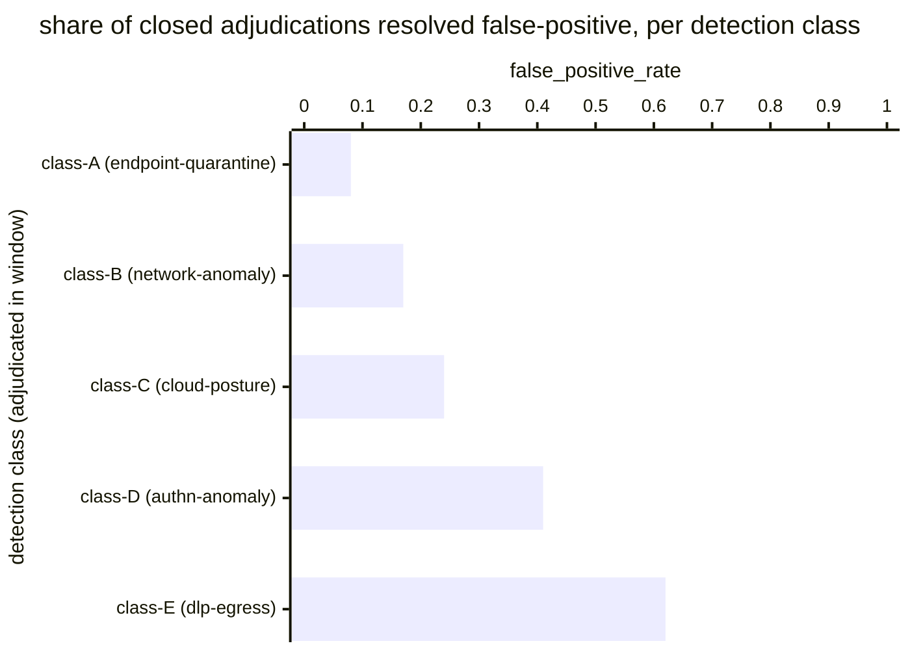

# Reference visualisation — `kpi.false_positive_rate@v1`

This is the committed reference-visualisation artifact for the
detection false-positive-rate KPI. It exists so the G-04 catalog
definition-of-done (a *committed* reference visualisation, not a
narrated one) is closed; downstream compile targets (n8n / Temporal /
LangGraph) read the same metric YAML and render the executable form in
their own dashboard surface. The artifact here is the contract for the
chart shape, not the executable chart.

## Chart kind

Two-panel composition. The headline panel is a single gauge-style
horizontal bar reading the false-positive rate (`ratio`) across
in-scope detection firings adjudicated inside the evaluation window —
the share of closed firings adjudicated false positive divided by the
total adjudicated population (false + true positives). The drill-down
panel is a horizontal bar chart, one bar per detection class that
fired inside the window, plotting the per-class `false_positive_rate`
so operators can see which detection classes drove the headline
reading. Slicing by `detection_class` (the catalog-bound detection
identity declared on the operator's detection inventory) is the
canonical drill-down dimension because tuning decisions are taken at
the detection-class scope.

- **Headline (ratio):** the `ratio` aggregate across closed
  adjudications in the window. This is the figure operators read
  first. Because the KPI is `lower_is_better`, a value near zero is a
  healthy reading and a rising value is the signal that triage burden
  is climbing; threshold bands draw the line between healthy, warn,
  and breach readings.
- **Drill-down x-axis:** `false_positive_rate` per detection class
  that adjudicated firings inside the evaluation window — the
  class-scoped `FP_C / (FP_C + TP_C)` ratio.
- **Drill-down y-axis:** one row per detection class with at least
  one closed adjudication in the window, labelled by detection-class
  stable id; sorted descending so the classes that pulled the
  headline upwards sit at the top — the classes the
  detection-engineering programme acts on next.
- **Threshold overlay:** horizontal lines on the headline gauge at
  the `warn` (`> 0.2`) and `breach` (`> 0.5`) values declared on
  `false_positive_rate.yaml`, so the operator reads the band the
  overall ratio sits in without arithmetic. Per-class drill-down
  bars are not overlaid — the catalog YAML pins the unscoped
  baseline, and operators ship tighter per-class targets as
  separate catalog entries.

## Reference rendering (Mermaid)

The mermaid block below is the canonical reference rendering — small
enough to live in-tree and renderable directly on the public repo
surface. The numeric values are illustrative; the compile target is
the source of truth for the executable form against operator data.

Reading the bars in this illustrative rendering (assume five
detection classes adjudicated firings across the window, with the
firing counts implied by the class labels):

| detection class (family)         | false_positive_rate | reading                                                          |
|----------------------------------|---------------------|------------------------------------------------------------------|
| class-A (endpoint-quarantine)    | 0.08                | well below target — high-fidelity class                          |
| class-B (network-anomaly)        | 0.17                | comfortably below the 0.2 target floor                           |
| class-C (cloud-posture)          | 0.24                | inside warn band — above 0.2 target, tuning watch                |
| class-D (authn-anomaly)          | 0.41                | inside warn band — pulls the headline upward                     |
| class-E (dlp-egress)             | 0.62                | inside breach band — above the 0.5 critical floor                |

Aggregating the five class-scoped numerators and denominators across
the window, the headline `ratio` resolves to the firing-weighted
aggregate false-positive rate over the in-scope adjudicated
population. That value is what the catalog aggregation
`measurement.aggregation: ratio` resolves to for this snapshot.

## Threshold band reference

| name   | comparator | value (ratio) | severity |
|--------|------------|---------------|----------|
| warn   | >          | 0.2           | warn     |
| breach | >          | 0.5           | high     |

The bands match the `thresholds` array on
`false_positive_rate.yaml`; the catalog entry is the source of truth,
this file is the visualisation surface. Operators MAY scope tighter
targets per detection class (for example endpoint-quarantine
detections typically tolerate a lower FP rate than
authentication-anomaly detections) and ship those as separate catalog
entries.

## OCSF source-data shape

The chart's underlying observations are derived from the operator's
detection-engineering and case-management surfaces. Each closed
adjudication contributes one sample computed against the
`measurement.inputs` declared on `false_positive_rate.yaml`:

- **detection_firings** — stream of detection firings within the
  evaluation window, bound to their detection-class stable id. The
  catalog entry is detection-vendor neutral; the operator's
  detection inventory is the source of truth for the class binding.
- **triage_dispositions** — closed triage dispositions tagging each
  firing as false positive, true positive, or benign / expected.
  Sourced from the operator's case-management system. Firings whose
  adjudication is still pending at evaluation time are excluded so
  the indicator reflects closed dispositions only and does not flap
  during triage backlogs.

The catalog entry deliberately does not pin a single OCSF telemetry
binding at the unscoped baseline: detection firings are observable
through more than one OCSF class depending on the operator's
detection surface — typically a Detection Finding event class
against the detection-engine surface, sometimes a Security Finding
event class against a SIEM-fronted correlation surface, and the
adjudication lifecycle is usually carried on a case-management
record outside OCSF entirely. The deferral is named honestly — the
catalog binds the firing to its detection-class stable id and the
adjudication to its closed disposition, not to a specific OCSF
class. A CORE follow-up may add an OCSF binding for case-tracker
variants once the operator's case-management surface is declared.

The reference rendering above remains shape-valid: it reads a
disposition predicate per closed adjudication and a detection-class
reference, and computes a ratio, regardless of which OCSF class the
operator's compile target resolves the firing against.

## Operator override

Operators are expected to render this metric in their own dashboard
idiom — the catalog reference rendering above is the contract for the
chart shape (ratio headline with warn / breach overlays, per-class
false-positive-rate drill-down sliced by detection class), not the
visual style. The compile target is the source of truth for the
executable form.
