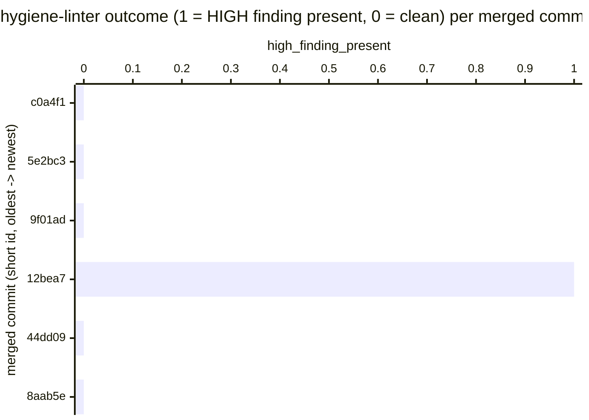

# Reference visualisation — `kpi.forward_public_hygiene_high_severity_escape_rate@v1`

This is the committed reference-visualisation artifact for the
forward-public hygiene HIGH-severity escape-rate KPI. It exists so the
G-04 catalog definition-of-done (a *committed* reference
visualisation, not a narrated one) is closed; downstream compile
targets (n8n / Temporal / LangGraph) read the same metric YAML and
render the executable form in their own dashboard surface. The
artifact here is the contract for the chart shape, not the executable
chart.

## Chart kind

Two-panel composition. The headline panel is a single gauge-style
horizontal bar reading the `ratio` of merged-to-main commits in the
evaluation window that carry at least one HIGH-severity hygiene
finding — the public-bar escape rate across the merge stream. The
drill-down panel is a horizontal bar chart, one bar per merged commit
observed in the window, plotting commit outcome encoded as `1` (at
least one HIGH-severity finding present at that tree) or `0` (clean).
Bars at `1` contribute the headline ratio; bars at `0` do not.
Slicing by commit-author kind (community contributor / maintainer /
automated) is a useful drill-down dimension but is not part of the
canonical contract — the contract is the per-commit outcome series
and the headline ratio.

- **Headline (ratio):** the `ratio` aggregate across merged-to-main
  commits in the evaluation window. Because the KPI is
  `lower_is_better`, a reading of `0.00` is the floor (target value)
  and any positive reading is an open public-bar regression that the
  gate failed to catch.
- **Drill-down x-axis:** one row per merged commit observed in the
  evaluation window, labelled by short commit identifier; sorted
  ascending by timestamp so the most recent merges sit at the right
  edge — the operator sees whether the escapes cluster recently or
  are tail noise from older history rotating out of the window.
- **Drill-down y-axis:** commit outcome encoded as `0` (clean tree —
  no HIGH-severity finding) or `1` (escape — at least one
  HIGH-severity finding present at that tree).
- **Threshold overlay (headline):** horizontal lines at the `warn`
  (0.01) and `breach` (0.05) ratio values on the headline gauge, so
  the operator reads the band the overall ratio sits in without
  arithmetic.

## Reference rendering (Mermaid)

The mermaid block below is the canonical reference rendering — small
enough to live in-tree and renderable directly on the public repo
surface. The numeric values are illustrative; the compile target is
the source of truth for the executable form against the merge log at
evaluation time.

Reading the bars in this illustrative rendering:

| merged commit | high_finding_present | escape? | reading                                                              |
|---------------|----------------------|---------|----------------------------------------------------------------------|
| c0a4f1        | 0                    | no      | tree clean under `python -m tools.hygiene_linter --min-severity HIGH` |
| 5e2bc3        | 0                    | no      | tree clean                                                           |
| 9f01ad        | 0                    | no      | tree clean                                                           |
| 12bea7        | 1                    | yes     | HIGH finding landed — credentials-rule hit per linter rule           |
| 44dd09        | 0                    | no      | tree clean — escape from 12bea7 has been remediated by this point    |
| 8aab5e        | 0                    | no      | tree clean                                                           |

With one escape across six merges, the headline `ratio` resolves to
`1 / 6 ≈ 0.167` in this snapshot. Because direction is
`lower_is_better`, a higher reading is worse — the ratio sits inside
the `breach` band (`>= 0.05`) and the operator reads the gate as
broken on this window. That value is what the catalog aggregation
`measurement.aggregation: ratio` resolves to for this snapshot.

## Threshold band reference

| name   | comparator | value (ratio) | severity |
|--------|------------|---------------|----------|
| warn   | >=         | 0.01          | warn     |
| breach | >=         | 0.05          | high     |

The bands match the `thresholds` array on
`forward_public_hygiene_high_severity_escape_rate.yaml`; the catalog
entry is the source of truth, this file is the visualisation surface.
The `warn` band fires at any sustained escape above the 1%-of-merges
floor; the `breach` band fires at the 5%-of-merges level where the
gate cannot honestly be described as holding.

## Linter source-data shape

The chart's underlying observations are derived from re-running the
forward-public hygiene linter against the tree at each merged-to-main
commit in the evaluation window. Each commit contributes one
`(commit_id, high_finding_present)` observation computed against the
`measurement.inputs` declared on
`forward_public_hygiene_high_severity_escape_rate.yaml`:

- **`hygiene_linter_high_finding`** — single HIGH-severity finding
  emitted by ``python -m tools.hygiene_linter`` against the tree at
  the commit under evaluation. HIGH-severity rules cover
  credential-shape detection (AWS access keys, GitHub tokens, PEM
  blocks, KEY=value high-entropy assignments, generic high-entropy
  tokens) per ``tools/hygiene_linter/rules/credentials.py``. The
  linter is the offline pure-Python contract pinned in the module
  docstring at ``tools/hygiene_linter/cli.py``.
- **`merged_commit_under_evaluation`** — distinct merge into the
  default branch in the evaluation window. The numerator counts
  commits with at least one finding; the denominator counts every
  commit in the same window so the ratio is comparable across
  windows of different volume.

Observations are derived per evaluation commit at evaluation time;
the catalog window is `P90D` and sliding so the gauge reflects the
recent merge stream rather than a tumbling quarter boundary.

## Operator override

Operators are expected to render this metric in their own dashboard
idiom — the catalog reference rendering above is the contract for
the chart shape (headline escape ratio over the merge stream, per-
commit presence drill-down, warn / breach overlay), not the visual
style. The compile target is the source of truth for the executable
form against the operator's merge log.
