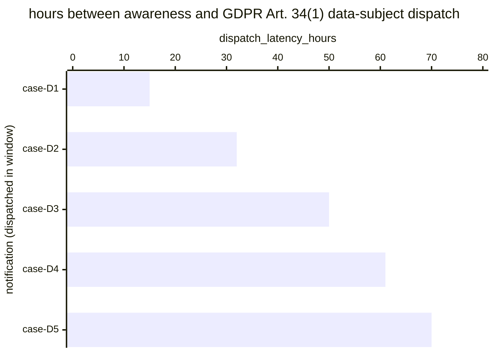

# Reference visualisation — `kri.gdpr_breach_data_subject_notification_latency_hours@v1`

This is the committed reference-visualisation artifact for the GDPR
Article 34(1) data-subject breach-notification dispatch-latency KRI.
It exists so the G-04 catalog definition-of-done (a *committed*
reference visualisation, not a narrated one) is closed; downstream
compile targets (n8n / Temporal / LangGraph) read the same metric
YAML and render the executable form in their own dashboard surface.
The artifact here is the contract for the chart shape, not the
executable chart.

## Chart kind

Two-panel composition. The headline panel is a single gauge-style
horizontal bar reading the max dispatch latency (`hours`) across
GDPR Art. 34(1) data-subject notifications dispatched in the
evaluation window, plotted against the catalog `warn` / `high` /
`breach` thresholds (48h / 60h / 72h) and the operational 72-hour
benchmark. Direction is `lower_is_better`: a max reading beyond 72
hours is above the operational benchmark (not a statutory hard-hour
overrun — Art. 34(1) sets no statutory hour cap). The drill-down
panel is a horizontal bar chart, one bar per data-subject
notification dispatched in the window, plotting
`dispatch_latency_hours` — hours between the awareness timestamp and
the data-subject communication.

- **Headline (max):** the worst-case latency across dispatches in the
  window. This is the figure the operator's risk surface reads
  first — the case that came closest to (or beyond) the operational
  benchmark.
- **Drill-down x-axis:** `dispatch_latency_hours` — hours between
  controller awareness and Art. 34(1) dispatch. Positive values grow
  towards the 72-hour operational benchmark.
- **Drill-down y-axis:** one row per data-subject notification
  dispatched in the window, labelled by the case `incident.uid`;
  sorted descending so the longest latencies sit at the top — the
  cases that lift the max.
- **Threshold overlay (drill-down):** three vertical lines at 48h
  (warn), 60h (high), and 72h (breach / operational-benchmark
  ceiling). Bars right of the 72h line are above the operational
  benchmark and warrant a "reasons for the delay" record on the case
  for the operator's own governance, even though Art. 34(1) itself
  sets no hard-hour cap.

## Reference rendering (Mermaid)

The mermaid block below is the canonical reference rendering — small
enough to live in-tree and renderable directly on the public repo
surface. The numeric values are illustrative; the compile target is
the source of truth for the executable form against operator data.

Reading the bars in this illustrative rendering:

| case    | dispatch_latency_hours | band     | reading                                                       |
|---------|------------------------|----------|---------------------------------------------------------------|
| case-D1 | 15                     | ok       | dispatched inside 48h — comfortable slack                     |
| case-D2 | 32                     | ok       | dispatched inside 48h — comfortable slack                     |
| case-D3 | 50                     | warn     | above 48h — leading signal, still inside operational benchmark|
| case-D4 | 61                     | high     | above 60h — approaching the 72-hour operational benchmark     |
| case-D5 | 70                     | high     | still inside 72h — operational benchmark met                  |

With no case above 72h in this window the max resolves to `70` hours
— inside the `high` band (`> 60`, `<= 72`). That value is what the
catalog aggregation `measurement.aggregation: max` resolves to for
this snapshot.

## Threshold band reference

| name   | comparator | value | severity |
|--------|------------|-------|----------|
| warn   | >          | 48    | warn     |
| high   | >          | 60    | high     |
| breach | >          | 72    | critical |

The bands match the `thresholds` array on
`gdpr_breach_data_subject_notification_latency_hours.yaml`; the
catalog entry is the source of truth, this file is the visualisation
surface. The catalog `target` (`<= 72`) is the operational benchmark
every dispatch is expected to clear; unlike the Art. 33(1) sibling,
the 72-hour value here is not a statutory hard-hour bound but an
operational alignment with the supervisory-authority floor.

## OCSF source-data shape

The chart's underlying observations are derived from the controller's
GDPR data-subject notification chain. Each Art. 34(1) notification
dispatched in the evaluation window contributes one
`dispatch_latency_hours` sample computed from the two inputs declared
in `gdpr_breach_data_subject_notification_latency_hours.yaml`'s
`measurement.inputs`:

- `awareness_timestamp` — controller-awareness timestamp emitted when
  a candidate incident crosses the Art. 4(12) personal-data-breach
  classification threshold and the Art. 34(1) high-risk criterion is
  met with no Art. 34(3) exemption, used as the start of the
  operational 72-hour clock. Bound to
  `telemetry.ocsf.compliance_finding@v1` field `start_time` on the
  data-subject notification submission event.
- `notification_dispatch` — the data-subject notification chain step
  transition that dispatches the Art. 34(1) communication. Bound to
  `telemetry.ocsf.compliance_finding@v1` field `time` on the
  data-subject notification submission event.

The latency samples that drive the max headline are
`notification_dispatch.time - awareness_timestamp.start_time`
converted to hours.

## Playbook linkage

The dispatch-latency observations this chart plots originate from the
regulator-notification chain step declared on the sibling
`gdpr_breach_data_subject_notification_latency_hours.yaml` in `playbook_refs`:

- `playbook.data_exfil@v1` step `action--20000000-0000-4000-8000-000000000008` — the affected-data-subject (GDPR Art. 34(1) without-undue-delay) notification-gate step of the data-exfiltration containment chain.

Compile targets render that playbook-step boundary as the terminal
transition of the statutory clock this KRI reads; this reference
visualisation shows where dispatches fall against that boundary. The
catalog entry's `playbook_refs` is the source of truth for the link
direction — this visualisation surface only labels it.

## Operator override

Operators are expected to render this metric in their own dashboard
idiom — the catalog reference rendering above is the contract for
the chart shape (max headline, per-dispatch horizontal bars, three
operational-clock threshold overlays), not the visual style. The
compile target is the source of truth for the executable form.
