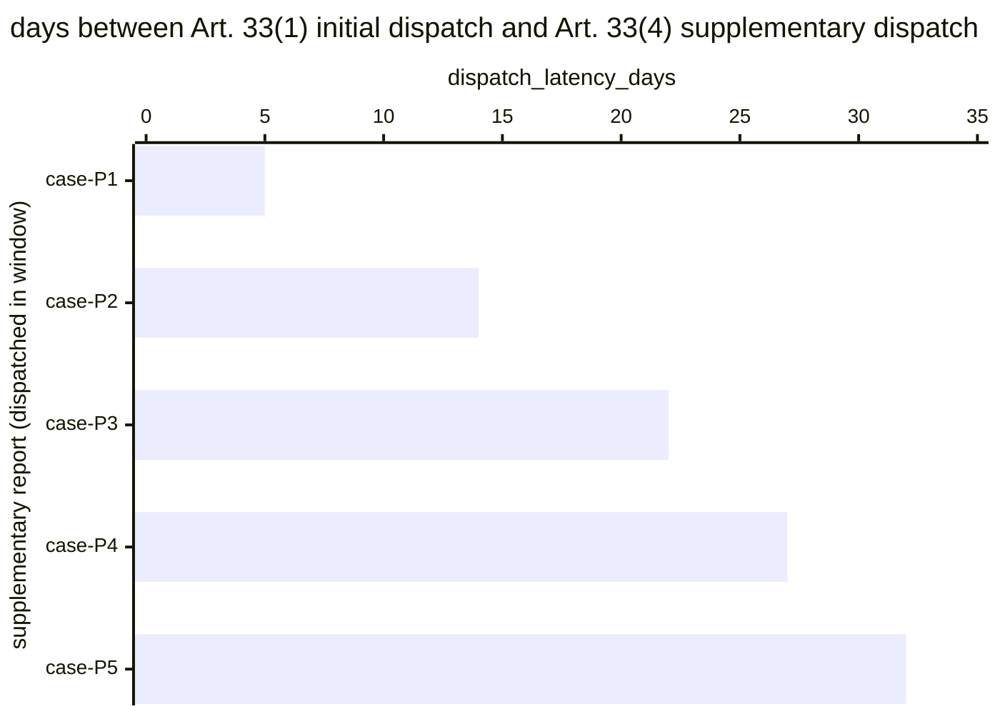

# Reference visualisation — `kri.gdpr_breach_dpa_escalation_latency_days@v1`

This is the committed reference-visualisation artifact for the GDPR
Article 33(4) phased supplementary supervisory-authority report
dispatch-latency KRI. It exists so the G-04 catalog definition-of-
done (a *committed* reference visualisation, not a narrated one) is
closed; downstream compile targets (n8n / Temporal / LangGraph) read
the same metric YAML and render the executable form in their own
dashboard surface. The artifact here is the contract for the chart
shape, not the executable chart.

## Chart kind

Two-panel composition. The headline panel is a single gauge-style
horizontal bar reading the max dispatch latency (`days`) across
GDPR Art. 33(4) supplementary reports dispatched in the evaluation
window, plotted against the catalog `warn` / `high` / `breach`
thresholds (20d / 25d / 30d) and the operational 30-day ceiling.
Direction is `lower_is_better`: a max reading beyond 30 days is
above the operational ceiling (not a statutory hard-day overrun —
Art. 33(4) sets no statutory day cap). The drill-down panel is a
horizontal bar chart, one bar per supplementary report dispatched
in the window, plotting `dispatch_latency_days` — days between the
initial Art. 33(1) dispatch and the Art. 33(4) supplementary
dispatch.

- **Headline (max):** the worst-case latency across dispatches in the
  window. This is the figure the operator's risk surface reads
  first — the case that came closest to (or beyond) the operational
  ceiling.
- **Drill-down x-axis:** `dispatch_latency_days` — days between
  Art. 33(1) initial notification dispatch and Art. 33(4)
  supplementary dispatch. Positive values grow towards the 30-day
  operational ceiling.
- **Drill-down y-axis:** one row per supplementary report dispatched
  in the window, labelled by the case `incident.uid`; sorted
  descending so the longest latencies sit at the top — the cases
  that lift the max.
- **Threshold overlay (drill-down):** three vertical lines at 20d
  (warn), 25d (high), and 30d (breach / operational ceiling). Bars
  right of the 30d line are above the operational ceiling and warrant
  a residual-risk review for the operator's own governance, even
  though Art. 33(4) itself sets no hard-day cap.

## Reference rendering (Mermaid)

The mermaid block below is the canonical reference rendering — small
enough to live in-tree and renderable directly on the public repo
surface. The numeric values are illustrative; the compile target is
the source of truth for the executable form against operator data.

Reading the bars in this illustrative rendering:

| case    | dispatch_latency_days  | band     | reading                                                       |
|---------|------------------------|----------|---------------------------------------------------------------|
| case-P1 | 5                      | ok       | dispatched inside 20d — comfortable slack                     |
| case-P2 | 14                     | ok       | dispatched inside 20d — comfortable slack                     |
| case-P3 | 22                     | warn     | above 20d — leading signal, still inside operational ceiling  |
| case-P4 | 27                     | high     | above 25d — approaching the 30-day operational ceiling        |
| case-P5 | 32                     | breach   | above 30d — above operational ceiling, residual-risk review   |

With one case above 30d in the window the max resolves to `32` days
— inside the `breach` band (`> 30`). That value is what the catalog
aggregation `measurement.aggregation: max` resolves to for this
snapshot; the `breach` band here is an operational-ceiling signal,
not a statutory overrun in the Art. 33(4) sense.

## Threshold band reference

| name   | comparator | value | severity |
|--------|------------|-------|----------|
| warn   | >          | 20    | warn     |
| high   | >          | 25    | high     |
| breach | >          | 30    | critical |

The bands match the `thresholds` array on
`gdpr_breach_dpa_escalation_latency_days.yaml`; the catalog entry is
the source of truth, this file is the visualisation surface. The
catalog `target` (`<= 30`) is the operational ceiling every
supplementary dispatch is expected to clear, matched to the NIS2
Art. 23(4)(d) / CRA / DORA Art. 19(4)(c) final-report siblings for
four-regime latency-ring parity — not a regulatory hard limit.

## OCSF source-data shape

The chart's underlying observations are derived from the controller's
GDPR supervisory-authority notification chain. Each Art. 33(4)
supplementary report dispatched in the evaluation window contributes
one `dispatch_latency_days` sample computed from the two inputs
declared in `gdpr_breach_dpa_escalation_latency_days.yaml`'s
`measurement.inputs`:

- `initial_notification_dispatch_timestamp` — timestamp at which the
  controller's supervisory-authority notification chain dispatched
  the Art. 33(1) initial notification, used as the start of the
  operational 30-day clock. Bound to
  `telemetry.ocsf.compliance_finding@v1` field `start_time` on the
  supplementary-report submission event.
- `notification_dispatch` — the supervisory-authority notification
  chain step transition that dispatches the Art. 33(4) supplementary
  report. Bound to `telemetry.ocsf.compliance_finding@v1` field
  `time` on the supplementary-report submission event.

The latency samples that drive the max headline are
`notification_dispatch.time - initial_notification_dispatch_timestamp.start_time`
converted to days.

## Operator override

Operators are expected to render this metric in their own dashboard
idiom — the catalog reference rendering above is the contract for
the chart shape (max headline, per-dispatch horizontal bars, three
operational-clock threshold overlays), not the visual style. The
compile target is the source of truth for the executable form.
