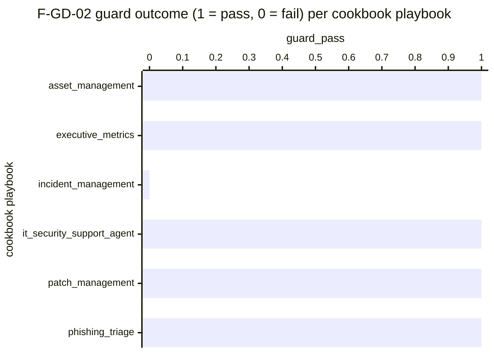

# Reference visualisation — `kpi.gdpr_lawful_basis_section_coverage@v1`

This is the committed reference-visualisation artifact for the GDPR
data-flow lawful-basis section-coverage KPI. It exists so the G-04
catalog definition-of-done (a *committed* reference visualisation,
not a narrated one) is closed; downstream compile targets (n8n /
Temporal / LangGraph) read the same metric YAML and render the
executable form in their own dashboard surface. The artifact here is
the contract for the chart shape, not the executable chart.

## Chart kind

Two-panel composition. The headline panel is a single gauge-style
horizontal bar reading the `ratio` of cookbook playbooks whose
sibling GDPR data-flow document passes the F-GD-02 guard on the
evaluation commit. The drill-down panel is a horizontal bar chart,
one bar per cookbook playbook discovered under
`content/playbooks/`, plotting the playbook outcome encoded as `1`
(guard passes — every canonical section present and non-empty per
the template) or `0` (guard fires at least one of
`missing_doc` / `missing_section` / `empty_section` /
`unexpected_section`). Bars at `1` contribute the headline ratio;
bars at `0` do not. Slicing by finding kind is a useful drill-down
dimension but is not part of the canonical contract — the contract
is the per-playbook outcome series and the headline ratio.

- **Headline (ratio):** the `ratio` aggregate across per-cookbook
  guard outcomes on the evaluation commit. Because the KPI is
  `higher_is_better`, a reading of `1.00` is the floor (target
  value) and any reading below `1.00` is an open sovereignty
  exposure on the cookbook surface.
- **Drill-down x-axis:** one row per cookbook-playbook directory
  discovered under `content/playbooks/`, labelled by the playbook
  name; sorted ascending by outcome so the failing playbooks sit at
  the top — the cookbooks that pulled the ratio off `1.00`.
- **Drill-down y-axis:** guard outcome encoded as `0` (guard fired
  at least one finding on this playbook's data-flow doc) or `1`
  (guard passed — every canonical section present and non-empty).
- **Threshold overlay (drill-down):** a horizontal line at `1` —
  every bar below the line is a cookbook whose data-flow doc did
  not pass the F-GD-02 guard.

## Reference rendering (Mermaid)

The mermaid block below is the canonical reference rendering — small
enough to live in-tree and renderable directly on the public repo
surface. The numeric values are illustrative; the compile target is
the source of truth for the executable form against the F-GD-02
guard output at evaluation time.

Reading the bars in this illustrative rendering:

| cookbook playbook         | guard_pass | reading                                                              |
|---------------------------|------------|----------------------------------------------------------------------|
| asset_management          | 1          | seven canonical sections present and non-empty                       |
| executive_metrics         | 1          | seven canonical sections present and non-empty                       |
| incident_management       | 0          | one canonical section empty — F-GD-02 emits `empty_section`           |
| it_security_support_agent | 1          | seven canonical sections present and non-empty                       |
| patch_management          | 1          | seven canonical sections present and non-empty                       |
| phishing_triage           | 1          | seven canonical sections present and non-empty                       |

With one failing observation across six playbooks, the headline
`ratio` resolves to `5 / 6 ≈ 0.833` in this snapshot. Because
direction is `higher_is_better`, a lower reading is worse — the
ratio sits inside the `breach` band (`< 0.95`) and the operator
reads the cookbook surface as missing the F-GD-02 sovereignty
posture on this commit. That value is what the catalog aggregation
`measurement.aggregation: ratio` resolves to for this snapshot.

## Threshold band reference

| name   | comparator | value (ratio) | severity |
|--------|------------|---------------|----------|
| warn   | <          | 1.0           | warn     |
| breach | <          | 0.95          | high     |

The bands match the `thresholds` array on
`gdpr_lawful_basis_section_coverage.yaml`; the catalog entry is the
source of truth, this file is the visualisation surface. The `warn`
band fires on any drift; the `breach` band fires when more than 5%
of cookbook playbooks miss the F-GD-02 contract — the level at
which the cookbook surface cannot honestly be described as carrying
the documented lawful-basis register.

## Guard source-data shape

The chart's underlying observations are derived from the F-GD-02 CI
guard at `tools/lint_gdpr_lawful_basis.py`. Each cookbook playbook
contributes one `(workflow, guard_pass?)` sample computed against
the `measurement.inputs` declared on
`gdpr_lawful_basis_section_coverage.yaml`:

- **`cookbook_playbook_under_evaluation`** — single playbook
  directory name discovered under `content/playbooks/` via the
  ``tools.lint_gdpr_lawful_basis.discover_playbooks`` contract
  (non-underscore-prefixed directory carrying a `README.md`). The
  catalog entry binds to that discovery contract so the denominator
  expands automatically as new cookbook playbooks land.
- **`f_gd_02_guard_outcome`** — outcome of re-running the F-GD-02
  guard against the tree at the evaluation commit for one cookbook
  playbook. Finding kinds `missing_doc`, `missing_section`,
  `empty_section`, and `unexpected_section` all register a `0` for
  the playbook; an empty findings list registers a `1`. The
  catalog entry deliberately does not weight finding kinds because
  the guard's exit code does not — any finding is gating.

Per-playbook observations are counted once per evaluation commit;
the catalog window is `P1D` and tumbling because the data-flow docs
are committed bytes, not an operator's runtime telemetry stream.

## Operator override

Operators are expected to render this metric in their own dashboard
idiom — the catalog reference rendering above is the contract for
the chart shape (headline F-GD-02 pass ratio across cookbook
playbooks, per-playbook outcome drill-down, pass-floor overlay at
`1`), not the visual style. The compile target is the source of
truth for the executable form against the F-GD-02 guard.
