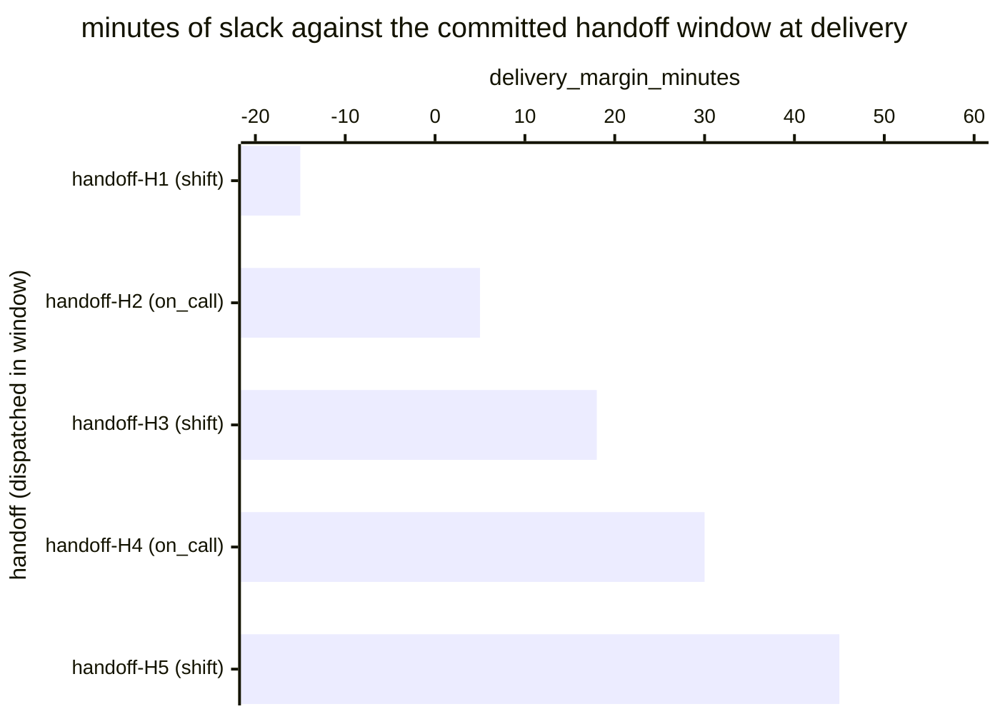

# Reference visualisation — `kpi.handoff_brief_delivery_sla@v1`

This is the committed reference-visualisation artifact for the
shift-handoff brief delivery SLA KPI. It exists so the G-04 catalog
definition-of-done (a *committed* reference visualisation, not a
narrated one) is closed; downstream compile targets (n8n / Temporal /
LangGraph) read the same metric YAML and render the executable form in
their own dashboard surface. The artifact here is the contract for the
chart shape, not the executable chart.

## Chart kind

Two-panel composition. The headline panel is a single gauge-style
horizontal bar reading the on-time-handoff rate (`ratio`) across
shift-handoff and on_call-rotation handoffs in the evaluation window.
The drill-down panel is a horizontal bar chart, one bar per handoff
dispatched in the window, plotting `delivery_margin_minutes` — minutes
between the handoff-brief delivery timestamp and the handoff's
committed time-window deadline. Positive bars are on-time slack;
negative bars are SLA misses and contribute the failing samples that
pull the ratio below `1.00`. Slicing by `handoff_kind`
(shift-handoff vs. on_call-rotation) is the canonical drill-down
dimension because each handoff kind typically carries its own
committed window.

- **Headline (ratio):** the `ratio` aggregate across in-scope
  handoffs dispatched in the window. This is the figure operators
  read first.
- **Drill-down x-axis:** `delivery_margin_minutes` — minutes
  remaining at delivery against the handoff's committed window.
  Positive values left-to-right are on-time slack; negative values
  left of zero are window misses.
- **Drill-down y-axis:** one row per dispatched handoff in the
  window, labelled by the handoff identifier and kind; sorted
  ascending so the slimmest margins (and any misses) sit at the
  top — the handoffs that are about to break the rate.
- **Threshold overlay (drill-down):** a vertical line at zero — every
  bar left of zero is a sample that failed the window and contributes
  a `1` to the denominator without contributing a `1` to the
  numerator. Operators reading the drill-down see *which* handoffs
  pulled the ratio off `1.00`.

## Reference rendering (Mermaid)

The mermaid block below is the canonical reference rendering — small
enough to live in-tree and renderable directly on the public repo
surface. The numeric values are illustrative; the compile target is
the source of truth for the executable form against operator data.

Reading the bars in this illustrative rendering:

| handoff (kind)        | delivery_margin_minutes | on-time? | reading                                                |
|-----------------------|-------------------------|----------|--------------------------------------------------------|
| handoff-H1 (shift)    | -15                     | no       | shift-handoff window missed by 15 min                  |
| handoff-H2 (on_call)  | 5                       | yes      | delivered 5 min before deadline — thin slack           |
| handoff-H3 (shift)    | 18                      | yes      | comfortable slack on shift-handoff window              |
| handoff-H4 (on_call)  | 30                      | yes      | early delivery, healthy slack                          |
| handoff-H5 (shift)    | 45                      | yes      | well under the shift-handoff window                    |

With one miss across five handoffs, the headline `ratio` resolves to
`4 / 5 = 0.80` in this snapshot. That value is what the catalog
aggregation `measurement.aggregation: ratio` resolves to for this
snapshot.

## Threshold band reference

The catalog entry at `handoff_brief_delivery_sla.yaml` is
handoff-kind-neutral and does not declare numeric warn / breach
thresholds at the unscoped baseline — the operator's handoff policy
is the source of truth for the per-kind window, and the catalog ratio
reflects the share of handoffs that hit that policy. Kind-scoped
variants (for example an on_call-rotation-only handoff SLA indicator)
declare numeric bands and live as separate catalog entries. The
catalog YAML at `content/metrics/handoff_brief_delivery_sla.yaml`
remains the source of truth for the indicator shape; this file is the
visualisation surface.

## OCSF source-data shape

The chart's underlying observations are derived from the operator's
on_call-rotation pipeline. Each in-scope handoff dispatched within the
evaluation window contributes one `delivery_margin_minutes` sample
computed against the `measurement.inputs` declared on
`handoff_brief_delivery_sla.yaml`:

- **numerator** — count of dispatched handoffs whose
  handoff-brief delivery timestamp landed earlier than (handoff
  scheduled-at + committed window). The delivery event is bound to
  the handoff step transitions declared on the catalog entry's
  `playbook_refs`:
  - `playbook.on_call_rotation@v1`
    `action--30000000-0000-4000-8000-000000000005` — handoff-brief
    delivery step on the on_call-rotation playbook;
  - `playbook.on_call_rotation@v1`
    `action--30000000-0000-4000-8000-000000000006` — handoff-brief
    acknowledgement step on the on_call-rotation playbook.
- **denominator** — count of in-scope handoffs scheduled to dispatch
  within the evaluation window per the operator's handoff policy.
  Exclude handoffs whose delivery step never fired (record-keeping
  gap) so the indicator does not silently improve when the
  on_call-rotation pipeline stalls.

The catalog entry deliberately does not pin a single OCSF telemetry
binding at the unscoped baseline: handoff briefs are carried on the
operator's own paging / on-call surface (an on-call platform's
handoff record, a SOAR shift-handoff object, or a chat-channel
handoff thread), and there is no unambiguous OCSF event class that
covers the intersection of those surfaces at the catalog level. The
deferral is named honestly — the binding is to the playbook-step
transition on the on_call-rotation playbook, not to an OCSF class. A
CORE follow-up may add an OCSF binding for on-call-surface-scoped
variants once the operator's on-call surface is declared.

The reference rendering above remains shape-valid: it reads two
timestamps per dispatched handoff (the delivery timestamp and the
window deadline) and computes a duration, regardless of which on-call
surface the operator's compile target resolves the delivery event
against.

## Operator override

Operators are expected to render this metric in their own dashboard
idiom — the catalog reference rendering above is the contract for the
chart shape (ratio headline, per-handoff delivery-margin drill-down
sliced by handoff kind, zero-line on-time overlay), not the visual
style. The compile target is the source of truth for the executable
form.
