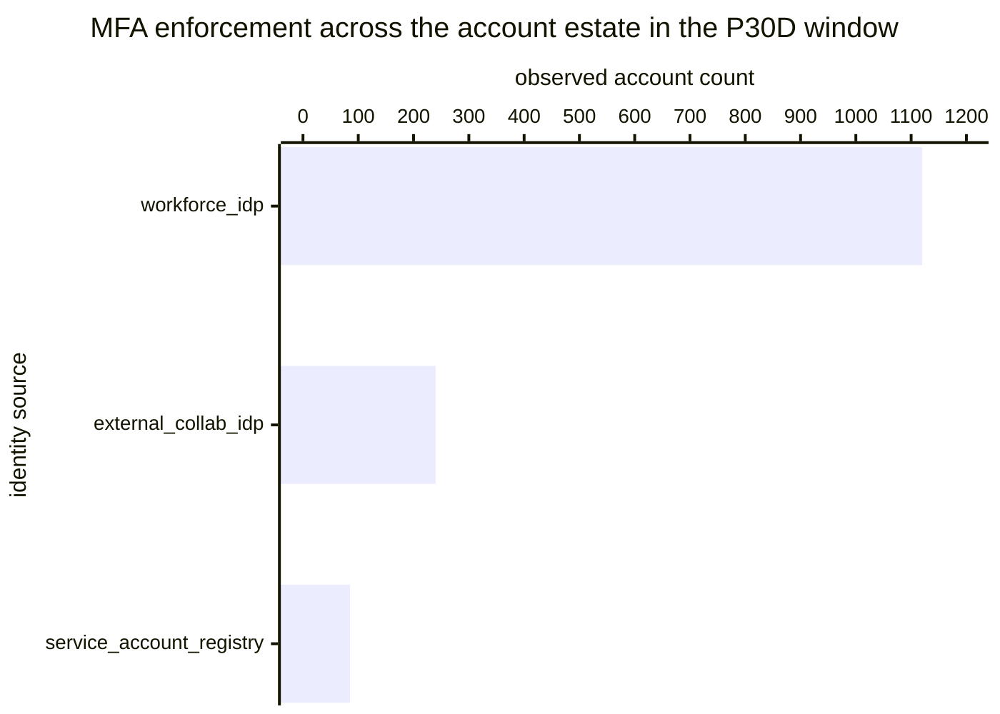

# Reference visualisation — `kpi.identity_mfa_enforcement_rate@v1`

This is the committed reference-visualisation artifact for the
identity MFA enforcement rate KPI. It exists so the G-04 catalog
definition-of-done (a *committed* reference visualisation, not a
narrated one) is closed; downstream compile targets (n8n / Temporal /
LangGraph) read the same metric YAML and render the executable form
in their own dashboard surface. The artifact here is the contract for
the chart shape, not the executable chart.

## Chart kind

Two-panel composition. The headline panel is a single ratio-headline
gauge reading the MFA enforcement ratio `|E| / |A|` — the share of
observed accounts whose authentication posture is `mfa_enforced` over
the total observed-account population in the evaluation window. The
drill-down panel is a stacked bar chart, one bar per `identity_source`
slice, plotting enforced versus gap counts so operators can see which
identity source is pulling the aggregate ratio away from target.
Because the KPI is `higher_is_better`, a rising value is the healthy
signal that the operator's MFA policy has landed across the account
estate.

- **Headline (ratio):** `|E| / |A|` across observed accounts in the
  window; the figure operators read first.
- **Drill-down x-axis:** `identity_source` slice (e.g. workforce IdP,
  external-collaborator IdP, service-account registry).
- **Drill-down y-axis:** account count, stacked (`mfa_enforced` on
  the bottom, `gap` on the top).
- **Threshold overlay:** horizontal lines on the headline gauge at
  the `warn` (0.95), `high` (0.90) and `breach` (0.80) ratio bounds
  — because the KPI is `higher_is_better`, all three bounds sit
  *below* the target and a value below any line lands inside the
  corresponding band.
- **Headline annotation:** the overall `|E| / |A|` ratio with the
  threshold band it falls in, plus the documented exception count so
  the break-glass and service-account population is visible on the
  same surface (the exceptions remain in the denominator per the
  catalog formula).

## Reference rendering (Mermaid)

The mermaid block below is the canonical reference rendering — small
enough to live in-tree and renderable directly on the public repo
surface. The numeric values are illustrative; the compile target is
the source of truth for the executable form against operator data.

Reading the bars in this illustrative rendering (assume the enforced
counts sit at workforce=1085, external=205, service=60 against the
totals above, giving `|E|=1350` and `|A|=1445`):

| identity source            | observed | enforced | gap | per-slice ratio | reading                       |
|----------------------------|----------|----------|-----|-----------------|-------------------------------|
| workforce_idp              | 1120     | 1085     | 35  | 0.969           | above warn bound              |
| external_collab_idp        | 240      | 205      | 35  | 0.854           | below high bound              |
| service_account_registry   | 85       | 60       | 25  | 0.706           | below breach bound            |

The headline `|E| / |A|` figure here is `1350/1445 = 0.934` — below
the `warn` bound (0.95) so the KPI reads warn for this snapshot; the
per-slice breakdown names the external-collaborator IdP and the
service-account registry as the two slices pulling the aggregate ratio
down and where the operator's remediation lane should focus.

## Threshold band reference

| name      | comparator | value (ratio) | severity  |
|-----------|------------|---------------|-----------|
| warn      | <          | 0.95          | warn      |
| high      | <          | 0.90          | high      |
| breach    | <          | 0.80          | critical  |

The bands match the `thresholds` array on
`identity_mfa_enforcement_rate.yaml`; the catalog entry is the
source of truth, this file is the visualisation surface.

## OCSF source-data shape

The chart's underlying observations are derived from the OCSF
`Authentication` events (`class_uid: 3002`) the operator's identity
source emits at each authentication, complemented by the OCSF
`Account Change` events (`class_uid: 3001`) the account-inventory
observation reads to bound the denominator. The `mfa_enforced`
classification is carried on the per-account posture record the
`playbook.mfa_secured_comms@v1` probe-mfa-coverage step emits — the
catalog entry binds to the OCSF class shapes, not to a vendor-specific
identity-provider API object. The bindings live at
`content/telemetry/telemetry.ocsf.authentication@v1.json` and
`content/telemetry/telemetry.ocsf.account_change@v1.json` and are
back-referenced from the metric YAML's `telemetry_refs[]` and from
each `measurement.inputs[].telemetry_ref`.

## Operator override

Operators are expected to render this metric in their own dashboard
idiom — the catalog reference rendering above is the contract for
the chart shape (enforcement-rate headline gauge with `warn` / `high` /
`breach` bounds, per-identity-source stacked bar drill-down), not the
visual style. The compile target is the source of truth for the
executable form.
