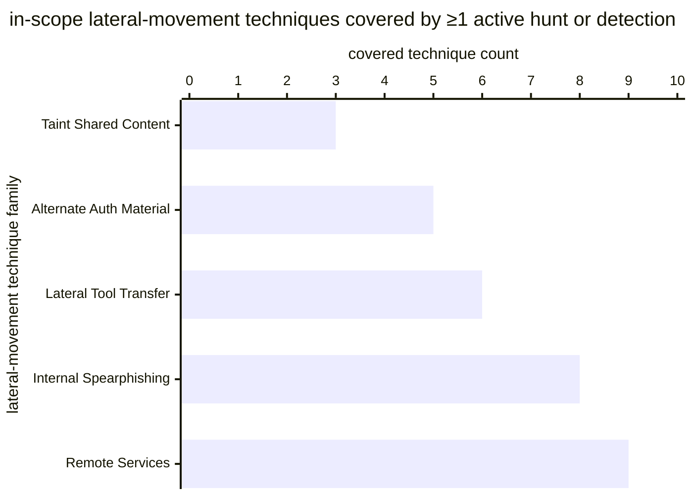

# Reference visualisation — `kpi.lateral_hunt_coverage@v1`

This is the committed reference-visualisation artifact for the
lateral-movement hunt-coverage KPI. It exists so the G-04 catalog
definition-of-done (a *committed* reference visualisation, not a
narrated one) is closed; downstream compile targets (n8n / Temporal /
LangGraph) read the same metric YAML and render the executable form in
their own dashboard surface. The artifact here is the contract for the
chart shape, not the executable chart.

## Chart kind

Stacked horizontal bar chart, one bar per lateral-movement technique
family in the operator's in-scope set, with each bar partitioned into
a covered band (techniques with at least one active hunt or detection
bound) and an uncovered band (techniques the operator has committed to
monitor but currently has no active hunt or detection for). The
overall ratio `covered_population / total_population` is the headline
figure operators read first; the per-family stacks are the supporting
drill-down that names *where* the lateral-movement coverage gap sits.

- **Headline (ratio):** the `ratio` aggregate across the in-scope
  lateral-movement technique population in the window. This is the
  figure operators read first. Because the KPI is
  `higher_is_better`, a value near 1.0 is a healthy reading and a
  falling value is the signal that lateral-movement hunt coverage
  is slipping; threshold bands draw the line between healthy, warn,
  and breach readings.
- **Drill-down x-axis:** technique count — number of in-scope
  techniques per family, partitioned by coverage state.
- **Drill-down y-axis:** one row per lateral-movement technique
  family (for example Remote Services, Internal Spearphishing,
  Lateral Tool Transfer, Use of Alternate Auth Material, Taint
  Shared Content), labelled by the family name; sorted by coverage
  ratio ascending so the worst-covered family sits at the top — the
  family the hunt programme acts on next.
- **Stack partition:** two segments per bar — `covered` (techniques
  with at least one active hunt or detection bound) and `uncovered`
  (techniques in the in-scope set with none).
- **Threshold overlays:** horizontal lines on the headline gauge at
  the `warn` (`< 0.95`) and `breach` (`< 0.8`) ratio values declared
  on `lateral_hunt_coverage.yaml`, so the operator reads the band
  the overall ratio sits in without arithmetic.

## Reference rendering (Mermaid)

The mermaid block below is the canonical reference rendering — small
enough to live in-tree and renderable directly on the public repo
surface. The numeric values are illustrative; the compile target is
the source of truth for the executable form against operator data.

Reading the bars in this illustrative rendering (assume each family
has 10 in-scope techniques, so the bar value is the `covered_population`
count out of 10):

| technique family            | covered / in-scope | ratio | reading                                       |
|-----------------------------|--------------------|-------|-----------------------------------------------|
| Remote Services             | 9 / 10             | 0.90  | inside warn band — below 0.95 target floor    |
| Internal Spearphishing      | 8 / 10             | 0.80  | at the breach floor — needs hunt expansion    |
| Lateral Tool Transfer       | 6 / 10             | 0.60  | inside breach band — below 0.8 critical floor |
| Use of Alternate Auth Material | 5 / 10          | 0.50  | inside breach band — half the family uncovered|
| Taint Shared Content        | 3 / 10             | 0.30  | inside breach band — worst-covered family     |

The headline `covered_population / total_population` figure here is
`(9+8+6+5+3) / (5·10) = 31/50 = 0.62` — inside the breach band, below
the 0.8 floor. That value is what the catalog aggregation
`measurement.aggregation: ratio` resolves to for this snapshot. The
threshold-band reading below names the band.

## Threshold band reference

| name   | comparator | value (ratio) | severity |
|--------|------------|---------------|----------|
| warn   | <          | 0.95          | warn     |
| breach | <          | 0.8           | high     |

The bands match the `thresholds` array on
`lateral_hunt_coverage.yaml`; the catalog entry is the source of
truth, this file is the visualisation surface. The catalog target is
`>= 0.95`; operators tighten or loosen this in their compile target
configuration.

## OCSF source-data shape

The chart's underlying observations are derived from the operator's
lateral-movement hunt and detection inventory. Each in-scope
technique contributes one sample computed against the
`measurement.inputs` declared on `lateral_hunt_coverage.yaml`:

- **covered_population** — count of in-scope lateral-movement
  techniques currently under at least one active hunt or detection.
  The binding to a hunt-step lifecycle is declared on the catalog
  entry's `playbook_refs`:
  - `playbook.identity_compromise@v1`
    `action--30000000-0000-4000-8000-000000000006` — the
    lateral-movement hunt step that the identity-compromise playbook
    fires as part of containment; the coverage indicator binds a
    technique as `covered` when at least one hunt or detection in
    the operator's inventory is bound to that step.
- **total_population** — count of in-scope lateral-movement
  techniques the operator believes should be under at least one
  active hunt or detection. Sourced from the operator's hunt
  inventory and scoping artifact, declared once and joined at
  evaluation time. Exclude entries where the in-scope population is
  unknown so the indicator does not silently improve on
  record-keeping gaps.

The catalog entry deliberately does not pin a single OCSF telemetry
binding at the unscoped baseline: lateral-movement hunt activity is
observable through more than one OCSF class depending on the
operator's hunt surface — typically a Detection Finding event class
against a hunt-rule surface, sometimes a Process / Authentication /
Network Activity class against the underlying telemetry, sometimes a
custom hunt-platform record outside OCSF entirely. The deferral is
named honestly — the lateral-movement hunt step transition is the
binding for the coverage lifecycle event, not an OCSF class. A CORE
follow-up may add an OCSF binding for hunt-platform-scoped variants
once the operator's hunt surface is declared.

The reference rendering above remains shape-valid: it reads a
coverage predicate per in-scope technique and a technique-population
reference, and computes a ratio, regardless of which OCSF class the
operator's compile target resolves the hunt activity against.

## Operator override

Operators are expected to render this metric in their own dashboard
idiom — the catalog reference rendering above is the contract for the
chart shape (per-family stacked horizontal bars, threshold overlays on
a companion ratio gauge, overall `covered_population / total_population`
headline), not the visual style. The compile target is the source of
truth for the executable form.
