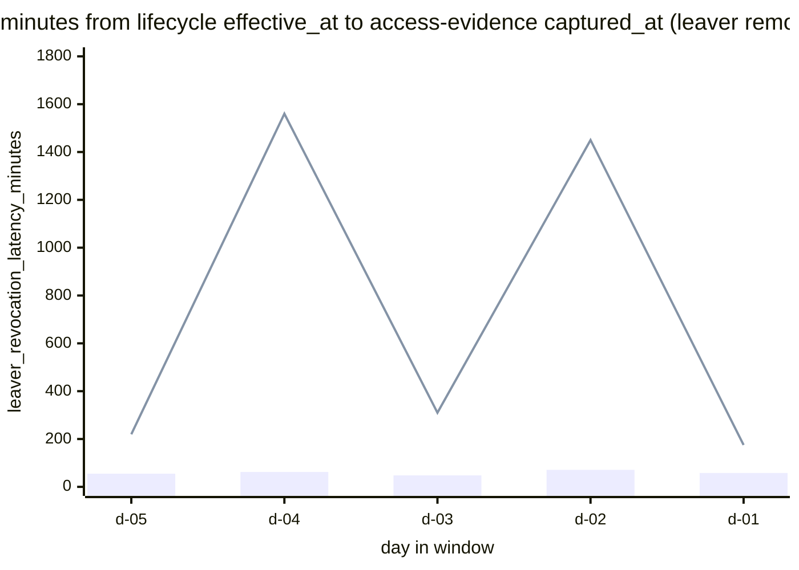

# Reference visualisation — `kri.leaver_to_revoked_time@v1`

This is the committed reference-visualisation artifact for the
leaver-to-revoked time KRI on the offboarding edge of the
identity-lifecycle family. It exists so the G-04 catalog
definition-of-done (a *committed* reference visualisation, not a
narrated one) is closed; downstream compile targets (n8n / Temporal /
LangGraph) read the same metric YAML and render the executable form
in their own dashboard surface. The artifact here is the contract for
the chart shape, not the executable chart.

## Chart kind

p50 / p95 latency histogram of `leaver_revocation_latency_minutes`
across access-evidence artifacts emitted within the evaluation
window for leaver lifecycle events, sliced by `identity_provider` on
a daily-tumbling cadence. The `p95` aggregate is the headline figure
operators read first — a slow revocation tail is the canonical
lingering-access exposure the joiner-mover-leaver control family is
designed to close; the per-day, per-provider histogram is the
supporting drill-down that names *which* identity sources are
holding revocations open past the operator's HR-source intent.

- **x-axis:** day (daily-tumbling buckets across the P30D evaluation
  window) — each bucket carries one (p50, p95) pair per
  `identity_provider` slice.
- **y-axis:** `leaver_revocation_latency_minutes` — minutes between
  `lifecycle_event.effective_at` and `artifact.captured_at` for each
  leaver access-evidence artifact whose confirm-grant-revoke step
  recorded the declared remove-set as observed-absent.
- **Threshold overlays:** horizontal reference lines at the `warn`
  (60 min) and `breach` (1440 min) threshold values from the catalog
  entry, so the operator reads the band each daily p95 sits in
  without arithmetic. The `target` (≤60 min) is the floor the warn
  band sits above.
- **Headline annotation:** the `p95` aggregate across all in-scope
  leaver access-evidence artifacts in the window, annotated as the
  metric value with the threshold band it falls in.

## Reference rendering (Mermaid)

The mermaid block below is the canonical reference rendering — small
enough to live in-tree and renderable directly on the public repo
surface. The numeric values are illustrative; the compile target is
the source of truth for the executable form against operator data.

Reading the rendering in this illustrative snapshot:

| day  | p50 (bar) | p95 (line) | band (p95) | reading                                              |
|------|-----------|------------|------------|------------------------------------------------------|
| d-05 | 55        | 220        | warn       | above 60-min warn floor, below breach                |
| d-04 | 62        | 1560       | breach     | above 1440-min breach floor — lingering revocation   |
| d-03 | 48        | 310        | warn       | inside warn band                                     |
| d-02 | 71        | 1450       | breach     | above breach floor — privileged-leaver tail          |
| d-01 | 58        | 175        | warn       | inside warn band                                     |

The headline `p95` figure across the full P30D window is the
worst-case-tail across all daily slices and identity-provider slices;
that value is what the catalog aggregation
`measurement.aggregation: p95` resolves to for this snapshot.

## Threshold band reference

| name      | comparator | value (min) | severity  |
|-----------|------------|-------------|-----------|
| warn      | >          | 60          | warn      |
| breach    | >          | 1440        | high      |

The bands match the `thresholds` array on
`leaver_to_revoked_time.yaml`; the catalog entry is the source of
truth, this file is the visualisation surface. The `target` (≤60 min)
is the floor the warn band sits above. Privileged-role-scoped
variants (for example a privileged-leaver revocation indicator)
tighten these targets and live as separate catalog entries.

## OCSF source-data shape

The chart's underlying observations are derived from the operator's
identity-lifecycle pipeline. Each leaver access-evidence artifact
emitted by the `onboarding_offboarding_tracker` playbook contributes
one `leaver_revocation_latency_minutes` sample computed from the
inputs declared in `leaver_to_revoked_time.yaml`'s
`measurement.inputs`:

- `lifecycle_event_effective_at` — declared `effective_at` field on
  the leaver lifecycle event ingested by
  `playbook.onboarding_offboarding_tracker@v1` at
  `action--20212021-0000-4000-8000-000000000002`. Telemetry shape is
  declared on the catalog entry as
  `telemetry.ocsf.account_change@v1` (OCSF Account Change), which is
  the catalog-level binding for the lifecycle event payload.
- `confirmed_capability_observation` — the confirm-grant-revoke step
  transition that records the leaver's declared remove-set as
  observed-absent on the operator's identity source, bound to
  `action--20212021-0000-4000-8000-000000000005` on the same
  playbook. Telemetry shape is the same
  `telemetry.ocsf.account_change@v1` binding (the
  confirm-grant-revoke step reads the identity-source's account-state
  observation).
- `artifact_captured_at` — `captured_at` field on the access-evidence
  artifact emitted by
  `action--20212021-0000-4000-8000-000000000006`, bound to
  `schemas/evidence/access.schema.json`. This is an in-tree artifact
  schema, not an OCSF class — the binding is the access-evidence
  artifact contract, not an OCSF event class. The deferral is honest:
  there is no unambiguous OCSF binding for the access-evidence
  artifact's `captured_at` field; the artifact schema is the binding.

The reference rendering above remains shape-valid: it reads two
timestamps per leaver access-evidence artifact and computes a
duration, regardless of which identity-source the operator's compile
target resolves the OCSF Account Change binding against.

## Operator override

Operators are expected to render this metric in their own dashboard
idiom — the catalog reference rendering above is the contract for
the chart shape (p50 / p95 daily-tumbling histogram, threshold
overlays, identity_provider slice), not the visual style. The
compile target is the source of truth for the executable form.
