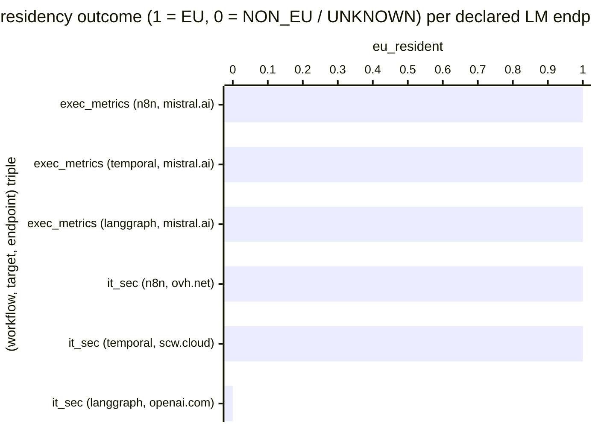

# Reference visualisation — `kpi.lm_endpoint_eu_residency_coverage@v1`

This is the committed reference-visualisation artifact for the LM
endpoint EU-residency coverage KPI. It exists so the G-04 catalog
definition-of-done (a *committed* reference visualisation, not a
narrated one) is closed; downstream compile targets (n8n / Temporal /
LangGraph) read the same metric YAML and render the executable form
in their own dashboard surface. The artifact here is the contract for
the chart shape, not the executable chart.

## Chart kind

Two-panel composition. The headline panel is a single gauge-style
horizontal bar reading the `ratio` of declared LM endpoints in the
compiled example artifacts that classify as EU-resident under the
shared guard on the evaluation commit. The drill-down panel is a
horizontal bar chart, one bar per (workflow, target, endpoint) triple
observed, plotting endpoint outcome encoded as `1` (EU — endpoint
matches the shared guard's EU allowlist or carries an `eu-*` region
prefix) or `0` (NON_EU or UNKNOWN — endpoint resolves to `us-*` /
`apac-*` / `.openai.com` / `.anthropic.com` without an EU subdomain,
or sits outside the heuristic). Bars at `1` contribute the headline
ratio; bars at `0` do not. Slicing by compile target (n8n / temporal
/ langgraph) is the canonical drill-down dimension because the
project maintains three reference compile targets as one of three
each, and the residency contract spans the ring rather than any
single target.

- **Headline (ratio):** the `ratio` aggregate across per-endpoint
  residency observations on the evaluation commit. Because the KPI
  is `higher_is_better`, a reading of `1.00` is the floor (target
  value) and any reading below `1.00` is an open sovereignty
  exposure the project carries on the commit under evaluation.
- **Drill-down x-axis:** one row per (workflow, target, endpoint)
  triple observed, labelled by the workflow name, compile target,
  and short hostname; sorted ascending so the non-EU / unknown
  samples sit at the top — the example endpoints that pulled the
  ratio off `1.00`.
- **Drill-down y-axis:** endpoint outcome encoded as `0` (NON_EU or
  UNKNOWN — the shared guard would either refuse the endpoint
  without the override env var, or could not classify it) or `1`
  (EU — the endpoint matches `EU_ALLOWLIST_SUFFIXES` or carries an
  `eu-*` region prefix).
- **Threshold overlay (drill-down):** a horizontal line at `1` —
  every bar below the line is an endpoint that did not classify as
  EU and so does not count toward coverage.

## Reference rendering (Mermaid)

The mermaid block below is the canonical reference rendering — small
enough to live in-tree and renderable directly on the public repo
surface. The numeric values are illustrative; the compile target is
the source of truth for the executable form against the example
artifacts and the shared guard's allowlist at evaluation time.

Reading the bars in this illustrative rendering:

| (workflow, target, endpoint)             | eu_resident | reading                                                            |
|------------------------------------------|-------------|--------------------------------------------------------------------|
| exec_metrics (n8n, mistral.ai)           | 1           | `api.mistral.ai` matches `EU_ALLOWLIST_SUFFIXES`                   |
| exec_metrics (temporal, mistral.ai)      | 1           | `api.mistral.ai` matches `EU_ALLOWLIST_SUFFIXES`                   |
| exec_metrics (langgraph, mistral.ai)     | 1           | `api.mistral.ai` matches `EU_ALLOWLIST_SUFFIXES`                   |
| it_sec (n8n, ovh.net)                    | 1           | `endpoints.ai.cloud.ovh.net` matches `EU_ALLOWLIST_SUFFIXES`       |
| it_sec (temporal, scw.cloud)             | 1           | `*.scw.cloud` matches `EU_ALLOWLIST_SUFFIXES` (Scaleway EU)        |
| it_sec (langgraph, openai.com)           | 0           | `.openai.com` without EU subdomain — classifies NON_EU             |

With one NON_EU observation across six endpoints, the headline
`ratio` resolves to `5 / 6 ≈ 0.833` in this snapshot. Because
direction is `higher_is_better`, a lower reading is worse — the ratio
sits inside the `breach` band (`< 0.9`) and the operator reads the
sovereignty posture as regressing on this commit. That value is what
the catalog aggregation `measurement.aggregation: ratio` resolves to
for this snapshot.

## Threshold band reference

| name   | comparator | value (ratio) | severity |
|--------|------------|---------------|----------|
| warn   | <          | 1.0           | warn     |
| breach | <          | 0.9           | high     |

The bands match the `thresholds` array on
`lm_endpoint_eu_residency_coverage.yaml`; the catalog entry is the
source of truth, this file is the visualisation surface. The `warn`
band fires on any drift from the EU floor; the `breach` band fires
when more than 10% of declared endpoints are non-EU or unknown — the
level at which the cookbook ring cannot be described as honouring the
documented FOUNDATION §3 posture.

## Guard source-data shape

The chart's underlying observations are derived from the shared
EU-resident LM endpoint guard at
``compilers/_shared/lm_endpoint_guard.py``. Each LM endpoint declared
in a compiled example contributes one
`(workflow, target, endpoint, eu_resident?)` sample computed against
the `measurement.inputs` declared on
`lm_endpoint_eu_residency_coverage.yaml`:

- **`declared_lm_endpoint`** — single LM endpoint extracted from a
  compiled example under ``examples/<target>/<workflow>/`` via the
  shared guard's ``extract_lm_endpoints`` walker. The walker pins
  the extraction shape so the catalog entry does not need to know
  about per-target endpoint representations.
- **`classification_outcome`** — residency label returned by
  ``classify_endpoint`` for that endpoint. Only ``EndpointResidency.EU``
  counts toward coverage; ``NON_EU`` and ``UNKNOWN`` both register
  as `0` in the bar chart and do not contribute to the headline
  ratio.

Per-(workflow, target, endpoint) observations are counted once per
evaluation commit; the catalog window is `P1D` and tumbling because
the example artifacts are committed bytes, not an operator's runtime
telemetry stream.

## Operator override

Operators are expected to render this metric in their own dashboard
idiom — the catalog reference rendering above is the contract for
the chart shape (headline EU-residency ratio, per-endpoint residency
drill-down sliced by compile target, EU-floor overlay at `1`), not
the visual style. The compile target is the source of truth for the
executable form against the example artifacts.
