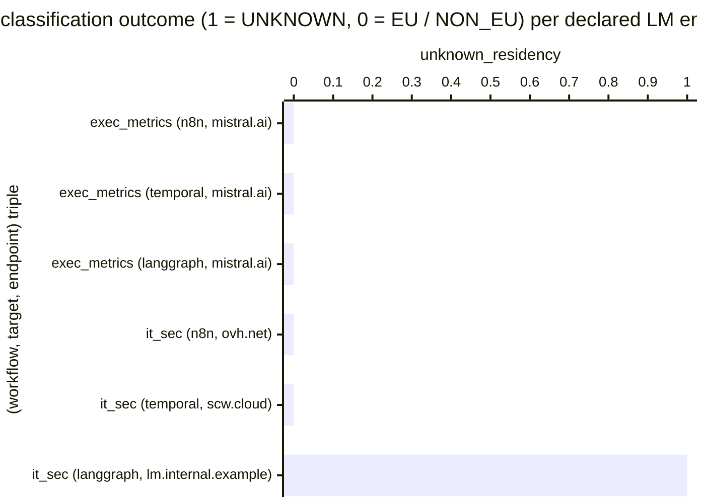

# Reference visualisation — `kri.lm_endpoint_unknown_residency_exposure@v1`

This is the committed reference-visualisation artifact for the LM
endpoint UNKNOWN-residency exposure KRI. It exists so the G-04 catalog
definition-of-done (a *committed* reference visualisation, not a
narrated one) is closed; downstream compile targets (n8n / Temporal /
LangGraph) read the same metric YAML and render the executable form
in their own dashboard surface. The artifact here is the contract for
the chart shape, not the executable chart.

This KRI is the residual-risk pair to
`kpi.lm_endpoint_eu_residency_coverage@v1`. The coverage KPI lumps
NON_EU and UNKNOWN together as 'not covered'; this KRI separates the
UNKNOWN sub-signal so an operator reading the catalog can distinguish
a confirmed non-EU dependency (a known exception under the documented
override) from an unclassified operator-supplied / self-hosted /
private-gateway host the guard has no signal on.

## Chart kind

Two-panel composition. The headline panel is a single gauge-style
horizontal bar reading the `count` of declared LM endpoints in the
compiled example artifacts that classify as `EndpointResidency.UNKNOWN`
under the shared guard on the evaluation commit. The drill-down panel
is a horizontal bar chart, one bar per (workflow, target, endpoint)
triple observed, plotting classification outcome encoded as `1`
(UNKNOWN — the host does not match `EU_ALLOWLIST_SUFFIXES`, carries
no `eu-*` / `us-*` / `apac-*` region prefix, and does not terminate
in a known non-EU provider suffix) or `0` (EU or NON_EU — the guard
returned a known label). Bars at `1` contribute the headline count;
bars at `0` do not. Slicing by compile target (n8n / temporal /
langgraph) is the canonical drill-down dimension because the project
maintains three reference compile targets as one of three each, and
the residual-risk contract spans the ring rather than any single
target.

- **Headline (count):** the `count` aggregate of per-endpoint
  UNKNOWN-classification observations on the evaluation commit.
  Because the KRI is `lower_is_better`, a reading of `0` is the
  floor (target value) and any positive reading is an open
  residual-risk row the project carries on the commit under
  evaluation.
- **Drill-down x-axis:** one row per (workflow, target, endpoint)
  triple observed, labelled by the workflow name, compile target,
  and short hostname; sorted descending so the UNKNOWN samples sit
  at the top — the example endpoints that pulled the count off `0`.
- **Drill-down y-axis:** classification outcome encoded as `1`
  (UNKNOWN — the shared guard could not resolve the host to either
  the EU allowlist / `eu-*` prefix or a known non-EU label) or `0`
  (EU or NON_EU — the guard returned a known label).
- **Threshold overlay (drill-down):** a horizontal line at `0` —
  every bar above the line is an endpoint the guard could not
  classify and so registers as residual risk against the FOUNDATION
  §3 posture.

## Reference rendering (Mermaid)

The mermaid block below is the canonical reference rendering — small
enough to live in-tree and renderable directly on the public repo
surface. The numeric values are illustrative; the compile target is
the source of truth for the executable form against the example
artifacts and the shared guard's classifier at evaluation time.

Reading the bars in this illustrative rendering:

| (workflow, target, endpoint)                  | unknown_residency | reading                                                                       |
|-----------------------------------------------|-------------------|-------------------------------------------------------------------------------|
| exec_metrics (n8n, mistral.ai)                | 0                 | `api.mistral.ai` matches `EU_ALLOWLIST_SUFFIXES` — classifies EU              |
| exec_metrics (temporal, mistral.ai)           | 0                 | `api.mistral.ai` matches `EU_ALLOWLIST_SUFFIXES` — classifies EU              |
| exec_metrics (langgraph, mistral.ai)          | 0                 | `api.mistral.ai` matches `EU_ALLOWLIST_SUFFIXES` — classifies EU              |
| it_sec (n8n, ovh.net)                         | 0                 | `endpoints.ai.cloud.ovh.net` matches `EU_ALLOWLIST_SUFFIXES` — classifies EU  |
| it_sec (temporal, scw.cloud)                  | 0                 | `*.scw.cloud` matches `EU_ALLOWLIST_SUFFIXES` — classifies EU                 |
| it_sec (langgraph, lm.internal.example)       | 1                 | private-gateway host — no allowlist match, no region prefix → UNKNOWN         |

With one UNKNOWN observation across six endpoints, the headline
`count` resolves to `1` in this snapshot. Because direction is
`lower_is_better`, a higher reading is worse — the count sits inside
the `warn` band (`> 0`) and the operator reads the sovereignty
residual-risk row as open on this commit. That value is what the
catalog aggregation `measurement.aggregation: count` resolves to for
this snapshot.

## Threshold band reference

| name   | comparator | value (count) | severity |
|--------|------------|---------------|----------|
| warn   | >          | 0             | warn     |
| breach | >=         | 3             | high     |

The bands match the `thresholds` array on
`lm_endpoint_unknown_residency_exposure.yaml`; the catalog entry is
the source of truth, this file is the visualisation surface. The
`warn` band fires on any drift from the sovereignty floor of zero
UNKNOWN-classified endpoints; the `breach` band fires once three or
more declared endpoints sit outside the guard's classifier — the
level at which a residual-risk pattern is open across the cookbook
ring rather than a single one-off host the operator owes a
resolution for.

## Pairing with the coverage KPI

This KRI is the residual-risk pair to
`kpi.lm_endpoint_eu_residency_coverage@v1`:

- The coverage KPI counts only `EndpointResidency.EU` toward coverage
  and groups `NON_EU` and `UNKNOWN` together as 'not covered'.
- This KRI splits the `UNKNOWN` sub-signal out so the catalog
  surfaces unclassified hosts as their own residual-risk row.
- A coverage reading below `1.00` paired with a non-zero
  UNKNOWN-exposure count means the off-floor reading is driven (in
  whole or in part) by unclassified hosts. A coverage reading below
  `1.00` paired with a zero UNKNOWN-exposure count means the
  off-floor reading is driven by confirmed-non-EU hosts under the
  documented override.

The two rows are read together; neither replaces the other.

## Guard source-data shape

The chart's underlying observations are derived from the shared
EU-resident LM endpoint guard at
``compilers/_shared/lm_endpoint_guard.py``. Each LM endpoint declared
in a compiled example contributes one
`(workflow, target, endpoint, unknown?)` sample computed against
the `measurement.inputs` declared on
`lm_endpoint_unknown_residency_exposure.yaml`:

- **`declared_lm_endpoint`** — single LM endpoint extracted from a
  compiled example under ``examples/<target>/<workflow>/`` via the
  shared guard's ``extract_lm_endpoints`` walker. The walker pins
  the extraction shape so the catalog entry does not need to know
  about per-target endpoint representations.
- **`classification_outcome`** — residency label returned by
  ``classify_endpoint`` for that endpoint. Only
  ``EndpointResidency.UNKNOWN`` registers as `1` in the bar chart
  and contributes to the headline count; ``EU`` and ``NON_EU`` both
  register as `0` and do not contribute.

Per-(workflow, target, endpoint) observations are counted once per
evaluation commit; the catalog window is `P1D` and tumbling because
the example artifacts are committed bytes, not an operator's runtime
telemetry stream.

## Operator override

Operators are expected to render this metric in their own dashboard
idiom — the catalog reference rendering above is the contract for
the chart shape (headline UNKNOWN-exposure count, per-endpoint
classification drill-down sliced by compile target, sovereignty-floor
overlay at `0`), not the visual style. The compile target is the
source of truth for the executable form against the example artifacts.
