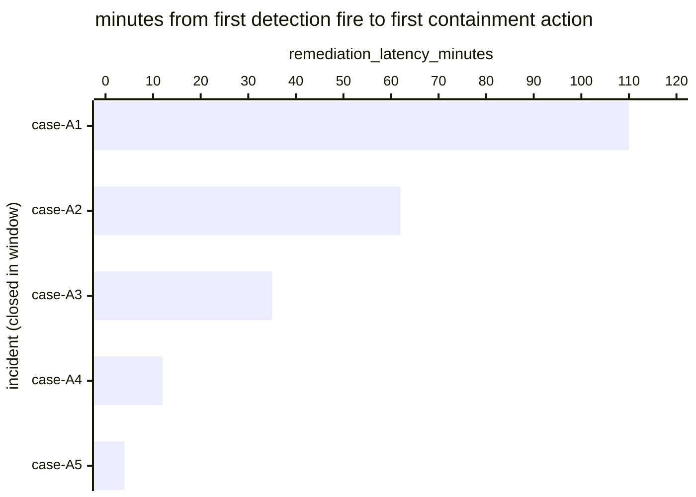

# Reference visualisation — `kpi.mttc_agentic_threat@v1`

This is the committed reference-visualisation artifact for the
agentic-threat-scoped mean-time-to-contain KPI. It exists so the G-04
catalog definition-of-done (a *committed* reference visualisation,
not a narrated one) is closed; downstream compile targets (n8n /
Temporal / LangGraph) read the same metric YAML and render the
executable form in their own dashboard surface. The artifact here is
the contract for the chart shape, not the executable chart.

## Chart kind

Horizontal bar chart, one bar per agentic-threat-rooted incident
closed within the evaluation window, sorted by
`remediation_latency_minutes` descending so the slowest containment
sits at the top. The `p95` aggregate is the headline figure operators
read first; the per-incident bars are the supporting drill-down that
names *which* agentic-threat cases pulled the tail.

- **x-axis:** `remediation_latency_minutes` — minutes between
  `first_detection_fire_timestamp` (OCSF Detection Finding, the
  agentic-threat indicator rule match) and
  `first_containment_action_timestamp` (OCSF Account Change, the first
  containment action on the implicated principal — session revocation,
  refresh / access token revocation, or IdP disable for the
  containment window) for each closed agentic-threat incident in the
  window.
- **y-axis:** one row per closed agentic-threat incident, labelled by
  the case `incident.uid`; sorted by latency descending so the
  worst-case incidents sit at the top.
- **Headline annotation:** the `p95` aggregate across closed
  agentic-threat incidents, annotated as the metric value.

The scoped variant does not redeclare numeric thresholds — operators
with NIS2 Article 21(2)(b) incident-handling obligations typically
tighten machine-speed values in their own scoped overrides against
the unscoped mean-time-to-contain baseline. The machine-speed
adversary decision cadence documented in the first wave of fully-
agentic operations argues for a much tighter containment SLA than a
human-in-loop response workflow can sustain.

## Reference rendering (Mermaid)

The mermaid block below is the canonical reference rendering — small
enough to live in-tree and renderable directly on the public repo
surface. The numeric values are illustrative; the compile target is
the source of truth for the executable form against operator data.

Reading the bars in this illustrative rendering:

| case    | remediation_latency_minutes | reading                                                            |
|---------|-----------------------------|--------------------------------------------------------------------|
| case-A1 | 110                         | slowest containment — the agentic operator had > 90 min of          |
|         |                             | dwell after the indicator fired before credential isolation landed  |
| case-A2 | 62                          | containment landed after roughly one lateral-movement burst         |
| case-A3 | 35                          | containment landed while the enumeration burst was still in flight  |
| case-A4 | 12                          | containment landed inside the self-correction window                |
| case-A5 | 4                           | near-real-time containment on the first indicator fire              |

The headline `p95` figure here is `≈ 110 min` (p95 across five
samples is the worst observed). That value is what the catalog
aggregation `measurement.aggregation: p95` resolves to for this
snapshot.

## OCSF source-data shape

The chart's underlying observations are derived from the operator's
response pipeline: each closed agentic-threat incident contributes
one `remediation_latency_minutes` sample computed from the two inputs
declared in `mttc_agentic_threat.yaml`'s `measurement.inputs`:

- `first_detection_fire` — bound to
  `telemetry.ocsf.detection_finding@v1` (OCSF Detection Finding,
  class_uid 2004). The agentic-threat Detection Finding meta-finding
  the detection layer emits when the agentic-threat indicator rule
  matches. Catalog entry is detection-vendor-neutral.
- `first_containment_action` — bound to
  `telemetry.ocsf.account_change@v1` (OCSF Account Change,
  class_uid 3001). The first Account Change event the credential-
  isolation step emits on the implicated principal (session
  revocation, refresh / access token revocation, IdP disable for the
  containment window). Bound by `playbook_step: isolate affected
  credential set` on the catalog entry — the compile target resolves
  the concrete step against the compiled agentic_threat_response
  playbook.

## Operator override

Operators are expected to render this metric in their own dashboard
idiom — the catalog reference rendering above is the contract for
the chart shape (per-incident horizontal bars, p95 headline), not the
visual style. The compile target is the source of truth for the
executable form.
