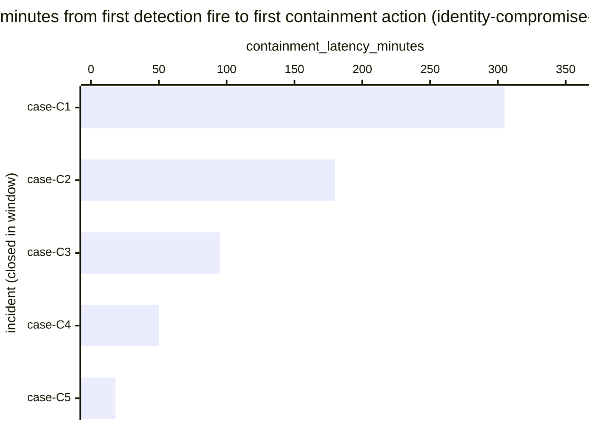

# Reference visualisation — `kpi.mttc_identity_compromise@v1`

This is the committed reference-visualisation artifact for the
identity-compromise-scoped mean-time-to-contain KPI. It exists so
the G-04 catalog definition-of-done (a *committed* reference
visualisation, not a narrated one) is closed; downstream compile
targets (n8n / Temporal / LangGraph) read the same metric YAML and
render the executable form in their own dashboard surface. The
artifact here is the contract for the chart shape, not the
executable chart.

## Chart kind

Horizontal bar chart, one bar per identity-compromise incident
closed within the evaluation window whose response playbook reached
the canonical containment step (credential revocation, session
termination, MFA reset, role removal), sorted by
`containment_latency_minutes` descending so the slowest containment
sits at the top. The `p95` aggregate is the headline figure operators
read first; the per-incident bars are the supporting drill-down that
names *which* identity-compromise cases pulled the tail at the
containment step.

- **x-axis:** `containment_latency_minutes` — minutes between
  `first_detection_fire_timestamp` and
  `first_containment_action_timestamp` for each closed
  identity-compromise incident in the window.
- **y-axis:** one row per closed identity-compromise incident,
  labelled by the case `incident.uid`; sorted by latency descending
  so the worst-case incidents sit at the top.
- **Threshold overlays:** the unscoped containment-baseline catalog
  entry (`kpi.mttr_containment@v1`) carries the warn / breach
  threshold-band shape inherited from `kpi.mttr_critical@v1` (warn
  >60 min, breach >240 min); this scoped variant inherits the
  threshold-band shape but does not redeclare numeric values —
  operators with NIS2 Art. 21(2)(b) incident-handling and Art.
  21(2)(e) access-control obligations typically tighten
  identity-specific containment targets in their own scoped
  overrides.
- **Headline annotation:** the `p95` aggregate across closed
  identity-compromise incidents at the containment step, annotated
  as the metric value.

## Reference rendering (Mermaid)

The mermaid block below is the canonical reference rendering — small
enough to live in-tree and renderable directly on the public repo
surface. The numeric values are illustrative; the compile target is
the source of truth for the executable form against operator data.

Reading the bars in this illustrative rendering, referencing the
inherited baseline thresholds for context:

| case    | containment_latency_minutes | band (vs. kpi.mttr_critical@v1) | reading                                          |
|---------|-----------------------------|---------------------------------|--------------------------------------------------|
| case-C1 | 305                         | breach                          | above 240-min breach floor — late credential revoke |
| case-C2 | 180                         | warn                            | above 60-min warn floor, below breach            |
| case-C3 | 95                          | warn                            | inside warn band                                 |
| case-C4 | 50                          | on-target                       | under 60-min target floor — session terminated fast |
| case-C5 | 18                          | on-target                       | well under target — auto-revoke path             |

The headline `p95` figure here is `≈ 305 min` — that value is what
the catalog aggregation `measurement.aggregation: p95` resolves to
for this snapshot.

## Threshold band reference

This scoped variant does not redeclare numeric thresholds; it
inherits the band shape from the unscoped containment-baseline
`kpi.mttr_containment@v1` (which in turn inherits from
`kpi.mttr_critical@v1`) and operators with NIS2 Art. 21(2)(b) /
Art. 21(2)(e) obligations typically tighten identity-specific values
in their own scoped overrides. See `mttr_containment.yaml` /
`mttr_containment.viz.md` and `mttr.yaml` / `mttr.viz.md` for the
inherited numeric bands.

## OCSF source-data shape

The chart's underlying observations are derived from the operator's
response pipeline for identity-compromise-rooted incidents. Each
closed identity-compromise incident contributes one
`containment_latency_minutes` sample computed from the two inputs
declared in `mttc_identity_compromise.yaml`'s `measurement.inputs`:

- `first_detection_fire` — the first authoritative detection firing
  of identity compromise that opened the incident record. Catalog
  entry is detection-vendor-neutral; the unscoped detection-side
  baseline (`kpi.mttd@v1`) is the place a CORE follow-up will land
  an OCSF Detection Finding binding, and this scoped variant inherits
  whatever binding lands there.
- `first_containment_action` — the first playbook step transition in
  `playbook.identity_compromise@v1` whose purpose is to revoke
  credentials, terminate sessions, reset MFA, or remove role
  bindings. Bound by `playbook_step: containment` on the catalog
  entry; the `playbook_refs[]` array anchors the canonical
  containment steps against `playbook.identity_compromise@v1`
  (`action--30000000-0000-4000-8000-000000000004`,
  `action--30000000-0000-4000-8000-000000000005`). The catalog entry
  does not pin a single OCSF class at this scope — the deferral is
  honest: the containment-action timestamp is a playbook-internal
  transition, not an OCSF-class event; an OCSF Account Change finding
  may be the closest downstream observable surface, but the catalog
  binding here is the playbook step, not OCSF.

The reference rendering above remains shape-valid: it reads two
timestamps per identity-compromise incident and computes a duration,
regardless of which OCSF classes carry the detection event or which
identity-source the operator's compile target resolves the
containment-action transition against.

## Operator override

Operators are expected to render this metric in their own dashboard
idiom — the catalog reference rendering above is the contract for
the chart shape (per-incident horizontal bars, p95 headline,
inherited-band geometry), not the visual style. The compile target
is the source of truth for the executable form.
