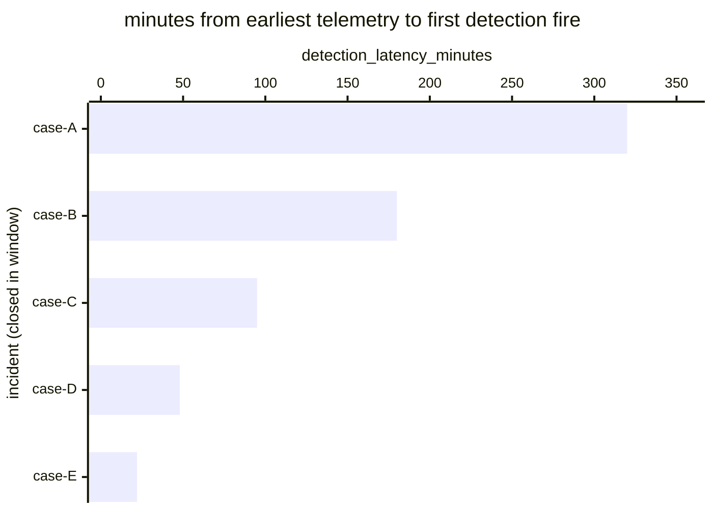

# Reference visualisation — `kpi.mttd@v1`

This is the committed reference-visualisation artifact for the
mean-time-to-detect KPI. It exists so the G-04 catalog
definition-of-done (a *committed* reference visualisation, not a
narrated one) is closed; downstream compile targets (n8n / Temporal /
LangGraph) read the same metric YAML and render the executable form
in their own dashboard surface. The artifact here is the contract for
the chart shape, not the executable chart.

## Chart kind

Horizontal bar chart, one bar per incident closed within the
evaluation window, sorted by `detection_latency_minutes` descending so
the slowest detection sits at the top. The `p95` aggregate is the
headline figure operators read first; the per-incident bars are the
supporting drill-down that names *which* incidents pulled the tail.

- **x-axis:** `detection_latency_minutes` — minutes between
  `earliest_telemetry_event_timestamp` and
  `first_detection_fire_timestamp` for each closed incident in the
  window.
- **y-axis:** one row per closed incident, labelled by the case
  `incident.uid`; sorted by latency descending so the worst-case
  incidents sit at the top.
- **Threshold overlays:** vertical lines at the `warn` (60 min) and
  `breach` (240 min) threshold values from the catalog entry, so the
  operator reads the band each incident sits in without arithmetic.
- **Headline annotation:** the `p95` aggregate across closed
  incidents, annotated as the metric value with the threshold band it
  falls in. The `target` value (60 min) is overlaid on the same axis
  as a target floor.

## Reference rendering (Mermaid)

The mermaid block below is the canonical reference rendering — small
enough to live in-tree and renderable directly on the public repo
surface. The numeric values are illustrative; the compile target is
the source of truth for the executable form against operator data.

Reading the bars in this illustrative rendering:

| case   | detection_latency_minutes | band      | reading                                              |
|--------|---------------------------|-----------|------------------------------------------------------|
| case-A | 320                       | breach    | above 240-min breach floor — slowest detection       |
| case-B | 180                       | warn      | above 60-min warn floor, below breach                |
| case-C | 95                        | warn      | inside warn band                                     |
| case-D | 48                        | on-target | under 60-min target floor                            |
| case-E | 22                        | on-target | well under target — fast detection                   |

The headline `p95` figure here is `≈ 320 min` (p95 across five
samples is the worst observed) — inside the breach band. That value
is what the catalog aggregation `measurement.aggregation: p95`
resolves to for this snapshot.

## Threshold band reference

| name      | comparator | value (min) | severity  |
|-----------|------------|-------------|-----------|
| warn      | >          | 60          | warn      |
| breach    | >          | 240         | high      |

The bands match the `thresholds` array on `mttd.yaml`; the catalog
entry is the source of truth, this file is the visualisation surface.
The `target` (≤60 min) is the floor the warn band sits above.

## OCSF source-data shape

The chart's underlying observations are derived from the operator's
detection pipeline: each closed incident contributes one
`detection_latency_minutes` sample computed from the two inputs
declared in `mttd.yaml`'s `measurement.inputs`:

- `earliest_telemetry_event` — bound at evaluation time by the
  incident's post-incident review timeline, sourced from whichever
  telemetry class carried the causal-chain event (the catalog entry
  cites `telemetry.host_process_create@v1` as the indicative shape but
  does not pin a single OCSF class — operators may pull the earliest
  event from any in-scope telemetry stream).
- `first_detection_fire` — the first authoritative detection firing
  that opened the incident record. Catalog entry is
  detection-vendor-neutral; the executable form on the compile target
  resolves this against the operator's detection store.

The catalog entry deliberately does not pin a single OCSF Detection
Finding telemetry binding at the unscoped baseline (a CORE follow-up
will add `telemetry.ocsf.detection_finding@v1` once the binding is
declared at the catalog level). The reference rendering above remains
shape-valid: it reads two timestamps per incident and computes a
duration, regardless of which OCSF classes carry them.

## Operator override

Operators are expected to render this metric in their own dashboard
idiom — the catalog reference rendering above is the contract for
the chart shape (per-incident horizontal bars, threshold overlays,
p95 headline), not the visual style. The compile target is the source
of truth for the executable form.
